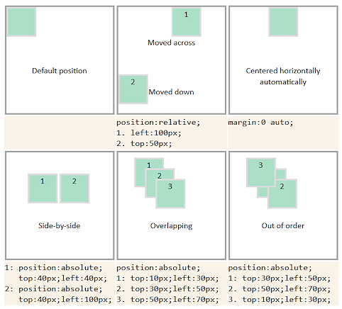

# Lection 03 - CSS, HTML, watchers

## Шрифты и текст

- Свойства текста:

```css
p {
    line-height: множитель | значение | проценты | normal | inherit;
}
```

```css
p {
    text-align: center | justify | left | right | start | end;
}
```

```css
p {
    text-decoration: blink | line-through | overline | underline | none | inherit;
}
```

```css
p {
    text-indent: значение | проценты | inherit;
}
```

```css
p {
    letter-spacing: значение | normal | inherit;
}
```

- Шрифты:

```css
@font-face {
    font-family: myFont;
    src: url(path_to_fonts/myFont.ttf);
}
```

```css
p {
    font-family: myFont, Arial, sans;
    font-weight: bold | bolder | lighter | normal | 100 | 200 | 300 | 400 | 500 | 600 | 700 | 800 | 900;
    font-style: normal | italic | oblique | inherit;
    font-size: абсолютный размер | относительный размер | значение | проценты | inherit;
}
```

```css
p {
    font-weight: bold;
    font-style: italic;
    font-size: 12px;
    line-height: 18px;
    font-family: myFont, Arial, sans;
}
```

```css
p {
    font: bold italic 12px/18px Arial, sans;
}
```

## Позиционирование элементов

- margin/padding (+/- px) & height/width

```css
p {
    margin-top: 20px;
    margin-right: 25px;
    margin-bottom: 25px;
    margin-left: 25px;
}
```

```css
p {
    margin: 20px 25px 20px 25px;
}
```

```css
p {
    margin: 20px 25px;
}
```

```css
p {
    margin: 20px auto;
}
```


```css
p {
    box-sizing: content-box | border-box | padding-box | inherit;
    height: значение | проценты | auto | inherit;
    width: значение | проценты | auto | inherit;
}
```

- position & left/right/top/bottom(+/- px) z-index

```css
div {
    position: absolute | fixed | relative | static | inherit;
}
```


```css
div {
    z-index: число | auto | inherit;
}
```



- float/display

```css
div {
    float: left | right | none | inherit;
}
```

```css
div {
    display: block | inline | inline-block | inline-table | list-item | none | run-in | table | table-caption | table-cell | table-column-group | table-column | table-footer-group | table-header-group | table-row | table-row-group;
}
```

- [flexbox](https://developer.mozilla.org/ru/docs/Web/CSS/CSS_Flexible_Box_Layout/Using_CSS_flexible_boxes/)
    
```css
#container {
    display: flex;
}
```


## Cвойства

- background

```css
p {
    background-image: url("./examples/images/logo_big.png");
    background-color: yellow;
    background-repeat: no-repeat | repeat | repeat-x | repeat-y | inherit;
    background-position: center center;
}
```

```css
p {
    background: url("./examples/images/logo_big.png") yellow no-repeat center center;
}
```

- трансформации
    
    - **matrix**
    
    Задаёт матрицу преобразований.
    
    - **rotate**
    
    Поворот элемента на заданный угол относительно точки трансформации, задаваемой свойством transform-origin.
    
    transform: rotate(<угол>)
    
    - **scale**
    
    Масштаб элемента по горизонтали и вертикали.
    
    transform: scale(sx[, sy]);
    
    Значение больше 1 увеличивает масштаб элемента, меньше 1 — уменьшает масштаб.
    
    - **scaleX**
    
    Масштабирует элемент по горизонтали.
    
    transform: scaleX(sx);
    
    - **scaleY**
    
    Масштабирует элемент по вертикали.
    
    transform: scaleY(sy);
    
    - **skewX**
    
    Наклоняет элемент на заданный угол по вертикали.
    
    transform: skewX(<угол>)
    
    - **skewY**
    
    Наклоняет элемент на заданный угол по горизонтали.
    
    transform: skewY(<угол>)
    
    - **translate**
    
    Сдвигает элемент на заданное значение по горизонтали и вертикали.
    
    transform: translate(tx[, ty])
    
    - **translateX**
    
    Сдвигает элемент по горизонтали на указанное значение. Положительное значение сдвигает вправо, отрицательное влево.
    
    transform: translateX(tx)
    
    - **translateY**
    
    Сдвигает элемент по вертикали на указанное значение. Положительное значение сдвигает вниз, отрицательное вверх.
    
    transform: translateY(ty)

```css
.myClass {
    transform: scale(.3) rotate(90deg);
}
```

## Семантика(предназначение)

- семантика до HTML5
    - div, class, span & etc
    
- семантические группы HTML5
    - мета содержимое
    - потоковое содержимое
    - секционное содержимое
    - заголовочное содержимое
    - текстовое содержимое
    - встроенное содержимое
    - интерактивное содержимое
    
- елементы
    - header (потоковое содержимое)
    - nav (потоковое содержимое, секционное содержимое)
    - article (потоковое содержимое, секционное содержимое)
    - section (потоковое содержимое, секционное содержимое)
    - aside (потоковое содержимое, секционное содержимое)
    - footer (потоковое содержимое)
    - address (потоковое содержимое)
    - main (потоковое содержимое)

### Пре/пост-процессоры

«Препроцессоры используют язык, который компилируется в CSS. А постпроцессоры реставрируют CSS код так, чтобы он работал наилучшим образом в современных браузерах.»


- шаблонизаторы ([sass](http://sass-lang.com/)/[stylus](http://stylus-lang.com/)/[less](http://lesscss.org/))
    - переменные 
    - вложенные селекторы
    - простая математика
    - массивы
    - наследование селекторов
    - примеси
    - функции
    - циклы for
    - условные операторы if ... else
    - ссылки на свойства

- PostCSS

Input:

```css
.box {
    box-sizing: border-box;
}
```

Output:

```css
.box {
    -webkit-box-sizing: border-box;
    -moz-box-sizing: border-box;
    box-sizing: border-box;
}
```

- [Инструменты postCSS](https://github.com/postcss/postcss#tools)
- [Проверка свойст](http://caniuse.com/)

## Собираем проект gulp, sass

- Установить [npm](https://www.npmjs.com/get-npm)

- Создаем структуру

```
/project
+-- /css
+-- /sass
|   +-- _variables.scss
|   +-- _mixins.scss
|   +-- page.scss
+-- index.html
+-- gulpfile.js
```

- Создаем файлы

**index.html**

```html
<!DOCTYPE html>
<html>
<head>
    <meta charset="utf-8">
    <title>Подключаем sass</title>
    <link rel="stylesheet" href="css/page.css">
</head>
<body>
    <header class="header">
        ... шапка ...

        <nav class="nav--main">
            <ul>
                <li><a href="#">Nav 1</a></li>
                <li><a href="#">Nav 2</a></li>
                <li><a href="#">Nav 3</a></li>
            </ul>
        </nav>
    </header>

    <main>
        <h1>
            Заголовок страницы
        </h1>
        
        <section class="section">
            <article class="article">
                <header class="article__header">
                    <h3 class="article__title">
                        ... шапка ...
                    </h3>
                </header>

                <p class="article__content">
                    ... контент ...
                </p>

                <p class="article__content--important">
                    ... контент ...
                </p>

                <header class="article__footer">
                    ... подвал ...
                </header>
            </article>
        </section>
    </main>

    <footer class="footer">
        ... подвал ...
    </footer>
</body>
</html>
```

**_variables.scss**

```scss
$color--black: #000;
$color--green: #008000;
$color--red: #FF0000;

$color__title: $color--green;
$color__txt: $color--black;
$color__txt--important: $color--red;
```

**_mixins.scss**

```scss
@function parseInt($n) {
    @return $n / ($n * 0 + 1);
}

@mixin rem($property, $values) {
    $px: ();
    $rem: ();

    @each $value in $values {

        @if $value == 0 or $value == auto {
            $px: append($px, $value);
            $rem: append($rem, $value);
        } @else {
            $unit: unit($value);
            $val: parseInt($value);

            @if $unit == "px" {
                $px: append($px, $value);
                $rem: append($rem, ($val  / 16 + rem));
            }

            @if $unit == "rem" {
                $px: append($px, ($val * 16 + px));
                $rem: append($rem, $value);
            }
        }
    }

    @if $px == $rem {
        #{$property}: $px;
    } @else {
        #{$property}: $px;
        #{$property}: $rem;
    }
}
```

**page.scss**

```scss
@import "./variables";
@import "./mixins";

.article {
    @include rem(font-size, 12px);
    color: $color__txt;
    
    &__title {
        @include rem(font-size, 18px);
        color: $color__title;
    }
    
    &__content {
        &--important {
            @include rem(font-size, 14px);
            color: $color__txt--important;
        }
    }
}
```

**gulpfile.js**

```js
const gulp = require('gulp'),
    sass = require('gulp-sass'),
    autoprefixer = require('gulp-autoprefixer'),
    STYLES_SRC = './sass',
    STYLES_DEST = './css';

// Compile & build 'css', using SASS source
gulp.task('styles', () => {
    let styles = gulp.src(`${STYLES_SRC}/*.scss`)
        .pipe(sass())
        .pipe(autoprefixer({
            browsers: ['last 3 versions']
        }))
        .pipe(gulp.dest(STYLES_DEST));
});

// Add styles watcher
gulp.task('styles:w', ['styles'], () => {
    gulp.watch(`${STYLES_SRC}/*.scss`, ['styles'])
        .on('change', (file) => {
            console.log(`File ${file.path} was ${file.type}, running 'styles' task...`);
        });
});
```

- Init & install пакетов проекта

```bash
npm init;
npm i --save-dev gulp gulp-sass gulp-autoprefixer;
```

- запуск

```bash
gulp styles;

gulp styles:w;
```

## ДЗ

1. Переведите предыдущее проект ДЗ на Gulp. 
3. Переведите структуру CSS на SASS. 
2. Обновите основной gulp так что бы css на выходе была сжата и оптимизированна

### Справочники
- [Проверка свойст](http://caniuse.com/)
- [Sass](http://sass-lang.com/)
- [Stylus](http://stylus-lang.com/)
- [Less](http://lesscss.org/)
- [Инструменты postCSS](https://github.com/postcss/postcss#tools)
- [Flexbox](https://developer.mozilla.org/ru/docs/Web/CSS/CSS_Flexible_Box_Layout/Using_CSS_flexible_boxes/)
- [npm](https://www.npmjs.com/get-npm)
- [webpack](https://github.com/Zlodej43sm/frontend__worker__webpack)
- [gulp](https://github.com/Zlodej43sm/frontend__worker__gulp)