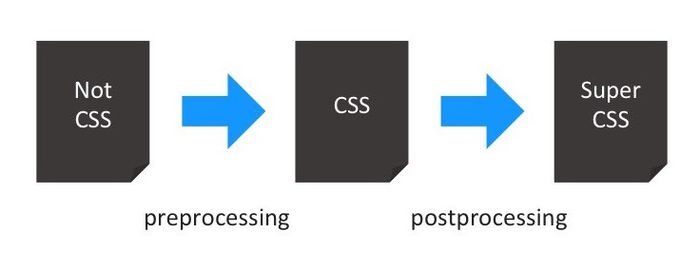

# Lection 03 - CSS, HTML, watchers

### Консоль

### Шрифты и текст
- fonts:
    - полная запись
    - короткая запись
- Свойства текста:
    - text-align
    - text-indent
    - text-decoration
    - letter-spacing
    - line-height

### Позиционирование элементов
- margin/padding (+/- px)
- height/width
- left/right/top/bottom(+/- px) z-index
- float
- [flexbox](https://developer.mozilla.org/ru/docs/Web/CSS/CSS_Flexible_Box_Layout/Using_CSS_flexible_boxes/)
    - Flex-контейнер
    
    ```css
    #container {
      display: flex;
    }
    ```
    
    - Оси
    
        
    
        - flex-direction устанавливает главную ось.
        - justify-content определяет расположение элементов вдоль главной оси в текущем ряду.
        - align-items расположение элементов вдоль перекрёстной оси в текущем ряду.
        - align-self устанавливает, как отдельный flex-элемент выровнен по перекрёстной оси, переопределяя значения, установленные с помощью align-items.

### Cвойства
- background
```css
.myClass {
    background: url("./examples/images/logo_big.png") yellow no-repeat center center;
}
```
- трансформации
```css
.myClass {
    transform: scale(.3) rotate(90deg);
}
```
- переходы
- анимации
- градиенты
```css
body {
    background: linear-gradient(to right, red, orange, yellow, green, blue, indigo, violet);
}
```
- закругление углов


```css
.myClass {
    /* top-left | top-right | bottom-right | bottom-left */
    border-radius: 20px 20px 20px 20px;
}
```

### Семантика(предназначение)
- семантика до HTML5
    - div, class, span & etc
- семантические группы HTML5
    - мета содержимое
    - потоковое содержимое
    - секционное содержимое
    - заголовочное содержимое
    - текстовое содержимое
    - встроенное содержимое
    - интерактивное содержимое
- елементы
    - header (потоковое содержимое)
    - nav (потоковое содержимое, секционное содержимое)
    - article (потоковое содержимое, секционное содержимое)
    - section (потоковое содержимое, секционное содержимое)
    - aside (потоковое содержимое, секционное содержимое)
    - footer (потоковое содержимое)
    - address (потоковое содержимое)
    - main (потоковое содержимое)

### BEM
- block -> element -> modifier

### Пре/пост-процессоры

«Препроцессоры используют язык, который компилируется в CSS. А постпроцессоры реставрируют CSS код так, чтобы он работал наилучшим образом в современных браузерах.»


- шаблонизаторы ([sass]('http://sass-lang.com/')/[stylus](http://stylus-lang.com/)/[less](http://lesscss.org/))
    - переменные 
    - вложенные селекторы
    - простая математика
    - массивы
    - наследование селекторов
    - примеси
    - функции
    - циклы for
    - условные операторы if ... else
    - ссылки на свойства

input:
```
<%= $var_link_color %>      = red;
<%= $var_link_hover_color %>= blue;
<%= $var_background_color %>= black;

<%= clickable %> {
    color: <%= $var_link_hover_color %> ;
    background-color: <%= $var_background_color %>;
}
a {
    color: <%= $var_link_color %>;
    
    &:hover {
        <%= include clickable %>
    }
}
```
Используем один из шаблонизаторов (stylus).
```stylus
border-radius(n) {
    -webkit-box-sizing: n;
    -moz-box-sizing: n;
    box-sizing: n;
}

.box {
    box-sizing(border-box);
}
```

Output:
```css
.box {
    -webkit-box-sizing: border-box;
    -moz-box-sizing: border-box;
    box-sizing: border-box;
}
```
- PostCSS
Input:
```css
.box {
    box-sizing: border-box;
}
```

Output:
```css
.box {
    -webkit-box-sizing: border-box;
    -moz-box-sizing: border-box;
    box-sizing: border-box;
}
```
- [Инструменты postCSS](https://github.com/postcss/postcss#tools)
- [Проверка свойст](http://caniuse.com/)

### Собираем проект webpack, PostCSS, stylus

## Справочники
- [Git ссылка на лекцию](https://github.com/Zlodej43sm/lections/tree/master/03.layout_styles_watcher)
- [Проверка свойст](http://caniuse.com/)
- [Sass]('http://sass-lang.com/')
- [Stylus](http://stylus-lang.com/)
- [Less](http://lesscss.org/)
- [Инструменты postCSS](https://github.com/postcss/postcss#tools)
- [Flexbox](https://developer.mozilla.org/ru/docs/Web/CSS/CSS_Flexible_Box_Layout/Using_CSS_flexible_boxes/)