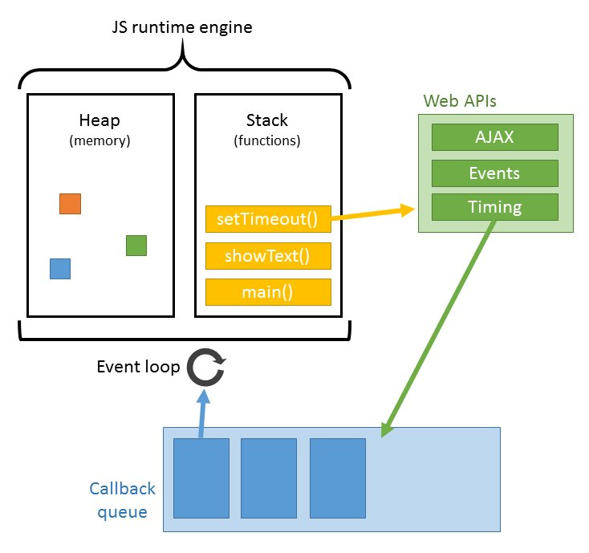

# Lection 04

## Так что же такое JS?

- JS является реализацией языка **ECMAScript** (стандарт **ECMA-262**).
 Расширения языка: **JavaScript**, **JScript** и **ActionScript**.

- что такое скрипты?

- как работает (интерпретатор)?

    - компиляция
    
    - интерпретация
    
- среда выполнения

## Что (не)умеет?

- контекст выполнения

- браузер

- безопасность

- песочница

## В чём же уникальность?

- полная интеграция с **HTML/CSS**.

- поддерживается всеми распространёнными браузерами.

## Основные движки

- **Chrome**/**Firefox**/**Internet Explorer**

- **Trident** — проприетарный движок Microsoft Internet Explorer; используется многими программами для Microsoft Windows (например, мини-браузерами в программах Winamp и RealPlayer).

- **Gecko** — открытый движок проекта Mozilla; используется в большом числе программ, основанных на коде Mozilla (браузере Firefox, почтовом клиенте Thunderbird, наборе программ SeaMonkey).

- **KHTML** — разработан в рамках проекта KDE, используется в браузере Konqueror и послужил основой для WebKit.

- **WebKit** — движок для браузера Apple Safari, включенного в операционную систему Mac OS X, и браузера Google Chrome. Встроен в библиотеку Qt.

- **Presto** — проприетарный движок, разработанный Opera Software; являлся базой для браузера Opera до перехода на Blink, а также лицензирован для использования рядом сторонних компаний.

- **Blink** — движок браузера Google Chrome с 28 версии и Opera c 15 версии. Является ответвлением WebKit.

- **Edge** — новый движок от компании Microsoft для её нового браузера Microsoft Edge. Является ответвлением Trident.

## Под капотом

- реализация памяти

- кол-во потоков

- event loop



**Стек** и **куча** — это абстракции, которые помогают вам определить, когда требуется выделение и освобождение памяти. Выделение памяти в стеке является локальным по отношению к вызову функции, и имеет ограниченный размер. Куча, с другой стороны, работает медленнее, а выделение памяти в куче осуществляется в программе явно.

## Как подключить

```html
<!DOCTYPE HTML>
<html>
<head>
    <meta charset="utf-8">
    <script src="./scripts.js"></script>
    <script src="./scripts_01.js"></script>
</head>

<body>
  <p>Начало документа...</p>
  
  <script>
    alert( 'Привет, Мир!' );
  </script>

  <p>...Конец документа</p>
</body>
</html>
```

- **defer**/**async**


```html
<head>
    <meta charset="utf-8">
</head>

<body>
    <p>Начало документа...</p>
    
    <script defer src="./scripts.js"></script>
    <script async src="./scripts_02.js"></script>
    <script defer src="./scripts_01.js"></script>

    <p>...Конец документа</p>
</body>
</html>
```

## Структура кода

- строки 

```javascript
alert('Привет');
alert('Мир');
```

- разделитель ";"

```javascript
alert('Привет')
alert('Мир')
[1, 2, 3].forEach();
```
- комментарии "//, /**/"

```javascript
/*
* 1 line
* 2 line
*/
alert('Привет');

// one line
alert('Мир');
```
- директива **use strict**

```js
'use strict';
 
...
```

- **ECMAScript 5**

## Переменные

- имя может состоять из: букв, цифр, символов $ и _

- первый символ не должен быть цифрой, или -

- регистр

```javascript
var myName = 'Alec';
```

- константы

```javascript
var IS_ACTIVE = true;

var status = IS_ACTIVE;
```

- правила именования

    - резерв var, class, return, export и др.
    
    - Нет транслиту. Только английский.
    
    - Использовать короткие имена только для переменных местного значения
    
    - camelCase
    
    - Имя переменной должно максимально чётко соответствовать хранимым в ней данным.
    
    - 'Лишняя' переменная – добро, а не зло.

## Шесть типов данных, typeof

### Примитивы

- **number**

    ```js
    var n = 123;

    n = 12.12;
    ```
    
    - Infinity 'alert( 1 / 0 ); // Infinity'
    
    - NaN 'alert( "нечисло" * 2 )'
    
- **string**

```js
    var n = 'String 0';

    n = "String 1";
```

- **boolean**

    ```js
    var isReady = true;

    isReady = false;
    ```
    - true
    - false
 
- **null**

- **undefined**

```js
var n; //undefined

n = null;
```

** В явном виде **undefined** обычно не присваивают, так как это противоречит его смыслу. Для записи в переменную «пустого» или «неизвестного» значения используется **null**.

### Object

- function

- array

```js
var myGroup = { name: "Best of the best" };
```

### Typeof

```js
var x;

typeof x;

typeof(x);

typeof undefined // "undefined"

typeof 0 // "number"

typeof true // "boolean"

typeof "foo" // "string"

typeof {} // "object"

typeof null // "object"  (1)

typeof function() {} // "function"  (2)
```

(1) официально признанная ошибка в языке
(2) подвид объектов

## Основные операторы и операнды

- Унарный

```js
var x = 1;

x = -x;
```
- Бинарный

```javascript
var x = 1,
    y = 3;

alert( y - x );
```
- сложение строк, бинарный +

Если хотя бы один аргумент является строкой, то второй будет также преобразован к строке!

```js
alert( '1' + 2 ); // "12"
alert( 2 - '1' ); // 1
alert( 6 / '2' ); // 3
```

- Преобразование к числу, унарный плюс +

```js
var apples = "2";
var oranges = "3";

alert( apples + oranges ); // "23", так как бинарный плюс складывает строки
```

```js
var apples = "2";
var oranges = "3";

alert( +apples + +oranges ); // 5, число, оба операнда предварительно преобразованы в числа
```

- [приоритеты](https://developer.mozilla.org/en-US/docs/Web/JavaScript/Reference/Operators/Operator_Precedence)

```javascript
var x = 2 * 2 + 1;
var a, b, c;

a = b = c = 2 + 2;
```

- присваивание

```javascript
var a = 1;
var b = 2;

var c = 3 - (a = b + 1); 
```

```javascript
var n = 2;

n *= 3 + 5;
```

- [взятие остатка %](https://ru.wikipedia.org/wiki/%D0%94%D0%B5%D0%BB%D0%B5%D0%BD%D0%B8%D0%B5_%D1%81_%D0%BE%D1%81%D1%82%D0%B0%D1%82%D0%BA%D0%BE%D0%BC)

- инкремент/декремент: ++, --
 
    - префиксная форма ++i
    
    ```js
    var i = 1;
    var a = ++i; // (*)
    
    alert(a); // 2
    ```
    
    - постфиксная форма i++
    
    ```js
    var i = 1;
    var a = i++; // (*)
    
    alert(a); // 1
    ```
* инкремент/декремент можно применить только к переменной. Код 3++ даст ошибку.

- побитовые операторы(побитовые операторы рассматривают аргументы как 32-разрядные целые числа и работают на уровне их внутреннего двоичного представления)
    
    ```
    & //AND(и)
    
    | //OR(или)
    
    ^ //XOR(побитовое исключающее или)
    
    ~ //NOT(не)
    
    << //LEFT SHIFT(левый сдвиг)
    
    >> //RIGHT SHIFT(правый сдвиг)
    
    >>> //ZERO-FILL RIGHT SHIFT(правый сдвиг с заполнением нулями)
    ```
    
- сокращённая арифметика с присваиванием

```js
var n = 2;

n = n + 5;
n = n * 2;
```

```js
var n = 2;

n += 5; // теперь n = 7 (работает как n = n + 5)
n *= 2; // теперь n = 14 (работает как n = n * 2)

alert( n ); // 14
```

```js
var n = 2;

n *= 3 + 5;

alert( n ); // 16  (n = 2 * 8)
```

- оператор запятая

```javascript
var a = (5, 6);

alert( a );

for (a, b = 3, c = a*b; a < 10; a++) {}
```

- операторы сравнения

    - Больше/меньше: a > b, a < b 
    
    - Больше/меньше или равно: a >= b, a <= b
    
    - Равно a == b. Для сравнения используется два символа равенства '='. Один символ a = b означал бы присваивание
    
    - «Не равно». В математике он пишется как ≠, в JavaScript – знак равенства с восклицательным знаком перед ним !=
    
- логические значения

    - true – имеет смысл «да», «верно», «истина»
    
    - false – означает «нет», «неверно», «ложь» 
    
    ```js
    alert( 2 > 1 ); // true, верно
    alert( 2 == 1 ); // false, неверно
    alert( 2 != 1 ); // true
    ```
  
    ```js
    var a = true; // присваивать явно
    
    var b = 3 > 4; // или как результат сравнения
  
    alert( b ); // false
    
    alert( a == b ); // (true == false) неверно, выведет false
    ```
    
- сравнение строк

Аналогом «алфавита» во внутреннем представлении строк служит кодировка, у каждого символа – свой номер (код). JavaScript использует кодировку [Unicode](https://ru.wikipedia.org/wiki/%D0%AE%D0%BD%D0%B8%D0%BA%D0%BE%D0%B4)

```js
alert( 'a' > 'A' ); // true

'a'.charCodeAt(0);

alert( "3" > "14" ); //true
alert( +"3" > +"14" ); //false
```

- сравнение разных типов

При сравнении значений разных типов, используется числовое преобразование. Оно применяется к обоим значениям.

```js
alert( '2' > 1 ); // true, сравнивается как 2 > 1
alert( '01' == 1 ); // true, сравнивается как 1 == 1
alert( false == 0 ); // true, false становится числом 0
alert( true == 1 ); // true, так как true становится числом 1.
```


- строгое равенство 

```
===
!==
```

В обычном операторе == есть «проблема» – он не может отличить 0 от false:

```js
alert( 0 == false ); // true
```
   
Та же ситуация с пустой строкой:

```js
alert( '' == false ); // true
```

Это естественное следствие того, что операнды разных типов преобразовались к числу.
   
- сравнение с **null** и **undefined**

Значения **null** и **undefined** равны == друг другу и не равны чему бы то ни было ещё. Это жёсткое правило буквально прописано в спецификации языка.
При преобразовании в число **null** становится 0, а **undefined** становится **NaN**

```js
alert( null > 0 ); // false
alert( null == 0 ); // false
alert(null >= 0); // true
``` 

Сравнение честно приводит к числу, получается ноль. А при проверке равенства значения **null** и **undefined** обрабатываются особым образом: они равны друг другу, но не равны чему-то ещё.

Значение **undefined** вообще нельзя сравнивать:

```js
alert( undefined > 0 ); // false (1)
alert( undefined < 0 ); // false (2)
alert( undefined == 0 ); // false (3)
```

### Взаимодействие с пользователем: alert, prompt, confirm 

Модальное - означает, что посетитель не может взаимодействовать со страницей

- **alert**

```js
alert( "Привет" );
```

- **prompt**

```js
var years = prompt('Сколько вам лет?', 100);

alert('Вам ' + years + ' лет!')
```
- **confirm**

```js
var isAdmin = confirm("Вы - администратор?");

alert( isAdmin );
```

## А как же ошибки!  

- консоль 

```js
var a = function(b) {
        return 3 + b;
    };

console.log(a(7));

```

```js
var a = function(b) {
        debugger;
        return 3 + b;
    };

a();
```

## Code style

- [jsbeautifier](http://jsbeautifier.org/)


## Заключение

- Однопотоковый интерпритируемый язык

- Возможности зависят от окружения, в котором запущен JavaScript.

- Полная интеграция с HTML/CSS. Поддерживается всеми распространёнными браузерами и включён по умолчанию.

- Шесть типов данных, typeof

- Основные операторы

## ДЗ

1. Напишите скрипт который будет спрашивать возвраст в модальном окне, проверять его, и если больше 18 выводить окно с вопросом готовы ли посетить сайт. В случае если пользователь нажимает "да" то выводить сообщение - 'ваш возвраст {введеное значение}', если "нет" то выводить сообщение "До свидание".

2. Подключите скрипт к вашей странице

3. Не забываем про Code style

## Справочники
- [jsbeautifier](http://jsbeautifier.org/)
- [ECMAScript](http://www.ecma-international.org/publications/standards/Ecma-262.htm)
- [Mozilla Developer Network](https://developer.mozilla.org/en-US/)
- [MSDN](http://msdn.microsoft.com/)
- [Приоритеты](https://developer.mozilla.org/en-US/docs/Web/JavaScript/Reference/Operators/Operator_Precedence)
- [Взятие остатка %](https://ru.wikipedia.org/wiki/%D0%94%D0%B5%D0%BB%D0%B5%D0%BD%D0%B8%D0%B5_%D1%81_%D0%BE%D1%81%D1%82%D0%B0%D1%82%D0%BA%D0%BE%D0%BC)
- [Unicode](https://ru.wikipedia.org/wiki/%D0%AE%D0%BD%D0%B8%D0%BA%D0%BE%D0%B4)


