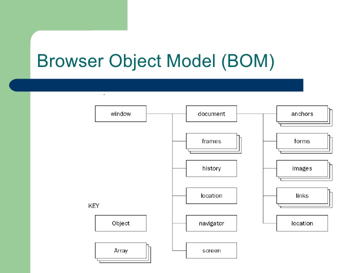

# Lection 05

## Условные конструкции

- **if** (оператор if (...) вычисляет и преобразует выражение в скобках к логическому типу)

    - **false**

        - **0**
        
        - **""**
        
        - **null** 
        
        - **undefined**
        
        -  **NaN**
        
        - **false**
    
    - **true**

        - остальные значения

```js
var age = prompt('Сколько вам лет?', '');

if (age <= 18) {
    alert( 'Вам нет 18!!!' );
}
```

- **else** 

```js
var age = prompt('Сколько вам лет?', '');

if (age <= 18) {
    alert( 'Вам нет 18!!!' );
} else {
    alert( 'Вам все можно' );
}
```

-  **else if** 

```js
var age = prompt('Сколько вам лет?', '');

if (age <= 18) {
    alert( 'Вам нет 18!!!');
} else if(age <= 21) {
    alert( 'Вам почти все можно');
} else {
    alert( 'Вам все можно');
}
```

- Оператор **?** (тернарный оператор)

```
(условие) ? значение1 : значение2
```


```js
var access;
var age = prompt('Сколько вам лет?', '');

if (age > 18) {
  access = true;
} else {
  access = false;
}

alert(access);
```

```js
var access;
var age = prompt('Сколько вам лет?', '');

access = (age > 18) ? true : false;
```

## Логические операторы

- `||`

```js
result = a || b;
```

```js
var hour = 12,
  isWeekend = true;

if (hour < 10 || hour > 18 || isWeekend) {
  alert( 'Офис до 10 или после 18 или в выходной закрыт' );
}
```

```js
var x,
    isCondition = false;

isCondition || (x = 1);

alert(x); // 1
```

- **&&**

```js
var hour = 12,
  minute = 30;

if (hour === 12 && minute === 30) {
  alert( 'Время 12:30' );
}
```

- **!**

```js
alert( !!"строка" ); // true
alert( !!null ); // false
```

## Преобразование типов для примитивов

Всего есть три преобразования:

 1. **строковое** преобразование.
 
 2. **числовое** преобразование.
 
 3. преобразование **к логическому значению**.

- **строковое**

строковое преобразование происходит, когда требуется представление чего-либо в виде строки.

```js
var a = true;

alert( a ); // "true"
console.log( String(null) === "null" ); // true
console.log( 1 + "null"); // "1null"
```

- **числовое**

численное преобразование происходит в математических функциях и выражениях, а также при сравнении данных различных типов (кроме сравнений **===**, **!==**).

```js
var a = +"123"; // 123
var a = Number("123"); // 123, тот же эффект

console.log( "\n" == false );
console.log( "1" == true );
```

- **логическое** (преобразование к **true/false** происходит в логическом контексте, таком как **if (value)**, и при применении логических операторов)

    - **undefined**, **null** - **false**.

    - числа - все **true**, кроме **0**, **NaN** -- **false**.
    
    - строки - все **true**, кроме пустой строки **""** -- **false**.
    
    - объекты - всегда **true**

```js
console.log( 0 == "\n0\n" );
```

## Циклы while, for, switch

Для многократного повторения одного участка кода – предусмотрены циклы(интерация).

- Цикл **while**

```
while (условие) {
  // код, тело цикла
}
```

```js
var i = 0;

while (i < 3) {
  console.log(i);
  i++;
}
```

- Цикл **do...while**

```
do {
  // тело цикла
} while (условие);
```

```js
var i = 0;

do {
  console.log(i);
  i++;
} while (i < 3);
```

- Цикл **for**

```
for (начало; условие; шаг) {
  // код, тело цикла
}
```

```js
for (var i = 0; i < 3; i++) {
  console.log(i);
}
```

- **for...in**

```js
var myObject = {
    age: 18,
    heigth: 178,
    weigth: 78
}

for (var key in myObject) {
     console.log(myObject[key]);
}
```

- **break**

выйти из цикла можно не только при проверке условия но и, вообще, в любой момент. Эту возможность обеспечивает директива **break**.

```js
var sum = 0;

while (true) {
    var value = +prompt("Введите число", '');
    
    if (!value) break; // (*)
    
    sum += value;
}

console.log( 'Сумма: ' + sum );
```

- **continue**

директива **continue** прекращает выполнение текущей итерации цикла.

```js
for (var i = 0; i < 10; i++) {
    if (i % 2 == 0) continue;
    
    console.log(i);
}
```

- Метки для **break/continue**

```js
outer: for (var i = 0; i < 3; i++) {
    for (var j = 0; j < 3; j++) {
        var input = prompt('Значение в координатах ' + i + ',' + j, '');
        
        // если отмена ввода или пустая строка -
        // завершить оба цикла
        if (!input) break outer; // (*)
    }
}

console.log('Готово!');
```

- **switch**

конструкция switch заменяет собой сразу несколько **if**.

```
switch(x) {
    case 'value1':  // if (x === 'value1')
        ...
        [break]
    
    case 'value2':  // if (x === 'value2')
        ...
        [break]
    
    default:
        ...
        [break]
}
```

```js
var arg = prompt("Введите arg?");

switch (arg) {
    case '0':
    case '1':
        alert( 'Один или ноль' );
    
    case '2':
        alert( 'Два' );
        break;
    
    case 3:
        alert( 'Никогда не выполнится' );
    
    default:
        alert('Неизвестное значение: ' + arg)
}
```

## Функции

- повторение одного и то же действия

- выбор имени функции

    - имя функции следует тем же правилам, что и имя переменной (отличие – оно должно быть глаголом, т.к. функция – это действие)

- объявление

```js
function showMessage() {
    alert( 'Привет всем присутствующим!' );
}
```

- локальные/глобальные переменные

```js
function showMessage() {
    var msg = 'Привет';
    
    alert( msg + ' всем присутствующим!' );
}
```

```js
var msg = 'Пока';

function showMessage() {
    var msg = 'Привет';
    
    alert( msg + ' всем присутствующим!' );
}
```

- аргументы по умолчанию, arguments(параметры)

```js
function showMessage(m, t) {
    var msg = 'Внимание, важность ' + (t || 0) + ' ' + m;
    
    alert( msg );
}

showMessage('проверка', 1, 3)
```

- возврат значения

```js
var age = prompt('Ваш возраст?');

function checkAge(age) {
    if (age > 18) {
        return true;
    } else {
        return confirm('Родители разрешили?');
    }
}

if (checkAge(age)) {
    alert( 'Доступ разрешен' );
} else {
    alert( 'В доступе отказано' );
}
```

- функциональные выражения(в JS функция является значением, таким же как строка или число)

```js
function sayHi() {   // (1)
    alert( "Привет" );
}

var func = sayHi;    // (2)

func(); // Привет    // (3)

sayHi = null;
sayHi(); 
```

- **Function Declaration** (функция, объявленная в основном потоке кода)

```js
sayHi('Вася');

function sayHi(person) {
    alert( "Привет, " + person );
}

sayHi('Петя');

```

- **Function Expression** (объявление функции в контексте какого-либо выражения, например присваивания)

```js
sayHi('Вася');

var sayHi = function(person) {
    alert( "Привет, " + person );
};

sayHi('Петя');
```

*функции, объявленные как **Function Declaration**, создаются интерпретатором до выполнения кода.

- **Анонимные функции**

```javascript
    function ask(question, yes, no) {
        if (confirm(question)) {
            yes()
        } else {
            no();
        }
    }
    
    ask(
        "Вы согласны?",
        function() { alert("Вы согласились."); },
        function() { alert("Вы отменили выполнение."); }
    );
```

*анонимная функция — особый вид функций, которые объявляются в месте использования и не получают уникального идентификатора для доступа к ним.

- **new Function**

```javascript
var sum = new Function('a, b', 'return a+b; ');
var result = sum(1, 2);

alert( result ); // 3
```

*пример использования – динамическая компиляция шаблонов на JavaScript

## Рекурсия

- рекурсия, функция вызывает сама себя

```js
function myFn(n) {
    if (n > 1) {
        return 2 * myFn(n - 1);
    } else {
        return n;
    }
}
```

- максимальная глубина рекурсии в браузерах ограничена, точно можно рассчитывать на 10000 вложенных вызовов, но некоторые интерпретаторы допускают и больше.

*рекурсию используют, когда вычисление функции можно свести к её более простому вызову, а его – ещё к более простому, и так далее, пока значение не станет очевидно

### Контекст выполнения

```js
function myFn(n) {
    debugger;
    
    if (n > 1) {
        return 2 * myFn(n - 1);
    } else {
        return n;
    }
}

myFn(7);
````

*любая рекурсия может быть переделана в цикл. Как правило, вариант с циклом будет эффективнее.

## Именованное функциональное выражение (Named Function Expression)

- позволить изнутри функции вызвать саму себя.

```js
var f = function myFn(n) {
    if (n > 1) {
        return 2 * myFn(n - 1);
    } else {
        return n;
    }
};

var a = f;

f = null;

a(7);
```

## BOM



- объект **navigator** содержит общую информацию о браузере и операционной системе.

```js
navigator.userAgent
navigator.platform
```

- объект **location** содержит информацию о текущем URL страницы и позволяет перенаправить посетителя на новый URL.

- функции **alert**/**confirm**/**prompt**


## Заключение

- условные конструкции

- логические операторы

- преобразование типов для примитивов

- циклы **while**, **for**, **switch**

- функции

- рекурсия

- контекст выполнения (**execution context**)

- именованное функциональное выражение (**Named Function Expression**)

- **BOM**

## ДЗ

Добавить на страницу модальное окно проверки логина.
 
1) если логин совпадет с одним из списка - **admin**, **user** то предложить ввести пароль

    * если пароль совпадет с одним из списка  - **123**, **777**, **333**, то вывести сообщение - Добро пожаловать {имя пользователя}!
  
    * если пароль введен неверно то выводить сообщение - Пароль неверный
  
2) если в поле логина ввести **guest** то выводить 'Добро пожаловать гость!' и не спрашивать пароль
 
3) в случае если введено любое другое значение, выводить сообщение 'Пользователя {введенный текст логина} нет в системе'
 
*Логику постараться описать отдельными функциями.