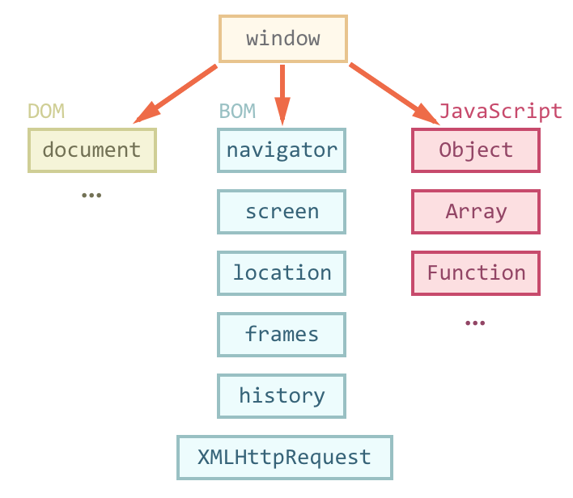
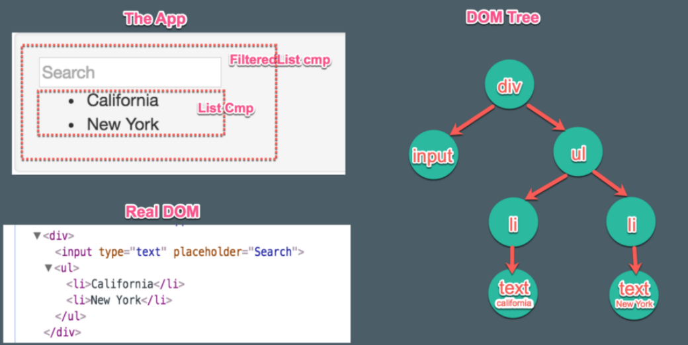

# Lection 06

## Свойства и методы

Все типы данных в **JS** содержат набор вспомогательных функций и значений, доступных  **через точку**.
 
Исключение:

-  **null** 

- **undefined**

Функции - **методы**.

```js
var str = "Привет, мир!";

console.log( str.toUpperCase() ); // "ПРИВЕТ, МИР!"
```

Значения – **свойства**.
 
```js
var str = "Привет, мир!";

console.log( str.length ); // 12
```

## Работа с числами

- Метод числа **toFixed**

```js
var n = 12.345;

n.toFixed(2); // "12.35"
```


- Глобальный метод  **parseInt**

```js
parseInt('12px'); // 12, ошибка на символе 'p'

parseInt('a123'); // NaN”
```

- Глобальный метод  **parseFloat**

```js
parseFloat('12.3.4'); // 12.3, ошибка на второй точке
```

Библиотека **Math**

- **Math.floor**

```js
Math.floor(3.1);  // 3
```

- **Math.ceil**

```js
Math.ceil(3.1);   // 4
```

- **Math.round**

```js
Math.round(3.5);  // 4

Math.round(3.1);  // 3
```

- Да тут просто! 

```js
0.1 + 0.2 == 0.3;
```

Теперь мы знаем о числах все, ну почти все!

*Двоичное значение бесконечных дробей хранится только до определенного знака, поэтому возникает неточность.
формат **[IEEE 754](https://ru.wikipedia.org/wiki/IEEE_754-2008)**, включая Java, C, PHP, Ruby, Perl.

## Строки

- Содержимое строки нельзя изменить

- Символ строки **charAt**, **""[]**

```js
"".charAt(0); // пустая строка

""[0]; // undefined
```

- Работа с регистром **toLowerCase**, **toUpperCase**

```js
'Test'.toLowerCase();

'Test'.toUpperCase();
```

- Поиск **indexOf**, **lastIndexOf**

```js
var str = "Мир, Привет мир";

str.indexOf("мир", 2);

str.lastIndexOf("мир", 2);
```

- Поиск **slice(start [, end])**  (не включая **end**)

```js
"Привет мир".slice(-2);

"Привет мир".slice(1, -1); 
```

## Объекты как ассоциативные массивы

> Ассоциативный массив – структура данных, в которой можно хранить любые данные в формате ключ - значение.

Назначение:

– структура, пригодная для хранения любых данных

– возможности для объектно-ориентированного программирования

[Свойства & методы обьекта](https://developer.mozilla.org/ru/docs/Web/JavaScript/Reference/Global_Objects/Object)

- создание

```js
var o = new Object();

var o = {};
```

```js
var person = {},
    someAgeVar = 'age'

person.name = 'Alec';
person['surname example'] = 'Pov';
person[someAgeVar] = 18;
person.alertUser = function() {
    alert(this.name + ' ' + person['surname example'] + '. Age:' + person[someAgeVar]);
};
```

- удаление

```js
delete person.age;
```

- проверка 

```js
!!person.name;
!!person.lalala;
 "name" in person;
```

- объявление со свойствами(литеральный)

```js
var person = {
    name: 'Alec',
    surname: 'Pov',
    1: 17
};
```

- перебор свойств

```js
for (var key in person) {
    
    debugger;
    
    return person[key];
}
```

*Порядок перебора соответствует порядку объявления для нечисловых ключей, а числовые – сортируются (в современных 
браузерах).

- хранение и копирование "по ссылке"

## Массивы

> Массив – разновидность объекта, которая предназначена для хранения пронумерованных значений и предлагает дополнительные методы для удобного манипулирования такой коллекцией.

- ключи - цифры

- дополнительные методы и свойство  **length**.

[Свойства & методы массива](https://developer.mozilla.org/ru/docs/Web/JavaScript/Reference/Global_Objects/Array)

- создание

```js
var a = [];
var a = new Array();
```

```js
var fruits = ["Яблоко", "Апельсин", "Слива"];

fruits.length;
fruits[0];
fruits[1];
fruits[2];
```

- Начало массива **shift**, **unshift**

```js
var fruits = ["Яблоко", "Апельсин", "Груша"];

fruits.shift();

fruits.unshift('Мандарин');
```

- Конец массива **pop**, **push**

```js
var fruits = ["Яблоко", "Апельсин", "Груша"];

fruits.pop();
fruits.push('Мандарин'); 
```

*Методы push/pop выполняются быстро, а shift/unshift – медленно.

- **splice**, изменяет содержимое массива, удаляя существующие элементы и/или добавляя новые.

```js
array.splice(start, deleteCount[, item1[, item2[, ...]]])
```

```js
var myFish = ['ангел', 'клоун', 'мандарин', 'хирург'];

// удаляет 0 элементов с индекса 2 и вставляет элемент 'барабанщик'
var removed = myFish.splice(2, 0, 'барабанщик');
// myFish равен ['ангел', 'клоун', 'барабанщик', 'мандарин', 'хирург']
// removed равен [], никакие элементы не были удалены

// удаляет 1 элемент с индекса 3
removed = myFish.splice(3, 1);
// myFish равен ['ангел', 'клоун', 'барабанщик', 'хирург']
// removed равен ['мандарин']

// удаляет 1 элемент с индекса 2 и вставляет элемент 'телескоп'
removed = myFish.splice(2, 1, 'телескоп');
// myFish равен ['ангел', 'клоун', 'телескоп', 'хирург']
// removed равен ['барабанщик']

// удаляет 2 элемента с индекса 0 и вставляет элементы 'попугай', 'анемон' и 'голубая'
removed = myFish.splice(0, 2, 'попугай', 'анемон', 'голубая');
// myFish равен ['попугай', 'анемон', 'голубая', 'телескоп', 'хирург']
// removed равен ['ангел', 'клоун']

// удаляет 2 элемента с индекса 3
removed = myFish.splice(3, Number.MAX_VALUE);
// myFish равен ['попугай', 'анемон', 'голубая']
// removed равен ['телескоп', 'хирург']
```

- **slice**, возвращает новый массив, содержащий копию части исходного массива.

```js
arr.slice([begin[, end]])
```

```js
// Пример: цитрусовые среди фруктов
var fruits = ['Банан', 'Апельсин', 'Лимон', 'Яблоко', 'Манго'];
var citrus = fruits.slice(1, 3);

// citrus содержит ['Апельсин', 'Лимон']
```

- **join**, **split**

```js
arr.join([separator])
arr.split([separator, limitation])
```

```js
var a = ['Ветер', 'Дождь', 'Огонь'];
a.join();    // 'Ветер,Дождь,Огонь'
a.join('-'); // Ветер-Дождь-Огонь'
```

```js
var str = 'Маша, Петя, Марина, Василий';

str.split(','); // ['Маша', 'Петя', 'Марина', 'Василий']
str.split(',', 2); // ['Маша', 'Петя']
```

- **concat**

```js
var new_array = old_array.concat(value1[, value2[, ...[, valueN]]])
```

```js
var num1 = [1, 2, 3],
    num2 = [4, 5, 6],
    num3 = [7, 8, 9];

var nums = num1.concat(num2, num3);

console.log(nums); // Результат: [1, 2, 3, 4, 5, 6, 7, 8, 9]
```

- **reverse**

```js
var myArray = ['один', 'два', 'три'];
myArray.reverse();

console.log(myArray) // ['три', 'два', 'один']
```

- **filter**

```js
arr.filter(callback[, thisArg])
```

```js
function isBigEnough(value) {
  return value >= 10;
}
var filtered = [12, 5, 8, 130, 44].filter(isBigEnough);
// массив filtered равен [12, 130, 44]
```

- **map**

```js
var new_array = arr.map(function callback(currentValue, index, array) { 
    // Возвращает элемент для new_array 
}[, thisArg])
```

```js
var numbers = [1, 4, 9];
var doubles = numbers.map(function(num) {
  return num * 2;
});
// теперь doubles равен [2, 8, 18], а numbers всё ещё равен [1, 4, 9]
```

- **sort** [Быстрая сортировка](http://algolist.manual.ru/sort/quick_sort.php)

*Порядок cортировки по умолчанию соответствует порядку кодовых точек Unicode.

```js
arr.sort([compareFunction])
```

 - Если **compareFunction(a, b)** меньше **0**, сортировка поставит **a** по меньшему индексу, чем **b**, то есть, **a** идёт первым.
 
 - Если **compareFunction(a, b)** вернёт **0**, сортировка оставит **a** и **b** неизменными по отношению друг к другу, но отсортирует их по отношению ко всем другим элементам.
 
 - Если **compareFunction(a, b)** больше **0**, сортировка поставит **b** по меньшему индексу, чем **a**.
 
 - Функция **compareFunction(a, b)** должна всегда возвращать одинаковое значение для определённой пары элементов **a** и **b**. Если будут возвращаться непоследовательные результаты, порядок сортировки будет не определён.
 
 
```js
function compare(a, b) {
  if (a меньше b по некоторому критерию сортировки) {
    return -1;
  }
  
  if (a больше b по некоторому критерию сортировки) {
    return 1;
  }
  // a должно быть равным b
  return 0;
}
```

```js
var items = [
  { name: 'Edward', value: 21 },
  { name: 'Sharpe', value: 37 },
  { name: 'And', value: 45 },
  { name: 'The', value: -12 },
  { name: 'Magnetic', value: 0 },
  { name: 'Zeros', value: 37 }
];

items.sort(function (a, b) {
  if (a.name > b.name) {
    return 1;
  }
  if (a.name < b.name) {
    return -1;
  }
  // a должно быть равным b
  return 0;
});
```

- сортировка отображения

```js
// массив для сортировки
var list = ['Дельта', 'альфа', 'ЧАРЛИ', 'браво'];

// временное хранилище позиции и сортируемого значения
var map = list.map(function(e, i) {
  return { index: i, value: e.toLowerCase() };
});

// сортируем карту, содержащую нормализованные значения
map.sort(function(a, b) {
  return +(a.value > b.value) || +(a.value === b.value) - 1;
});

// контейнер для результирующего порядка
var result = map.map(function(e) {
  return list[e.index];
});
```

- Перебор элементов **for**, **forEach**

```js
arr.forEach(function callback(currentValue, index, array) {
    //your iterator
}[, thisArg]);
```

```js
for (var i = 0; i < fruits.length; i++) {
  alert( fruits[i] );
}

fruits.forEach(function (v) {  })
```

- последовательная обработка каждого элемента массива с сохранением промежуточного результата **reduce**, 
**reduceRight**

```js
arr.reduce(callback[, initialValue]);

callback(previousValue, currentItem, index, arr);
```

```js
var sum = [0, 1, 2, 3].reduce(function (a, b) {
  return a + b;
}, 0);
```

```js
var names = ['Alice', 'Bob', 'Tiff', 'Bruce', 'Alice'];

var countedNames = names.reduce(function (allNames, name) { 
  if (name in allNames) {
    allNames[name]++;
  }
  else {
    allNames[name] = 1;
  }
  return allNames;
}, {});
// countedNames is:
// { 'Alice': 2, 'Bob': 1, 'Tiff': 1, 'Bruce': 1 }
```

### Многомерные массивы

```js
var matrix = [
  [1, 2, 3],
  [4, 5, 6],
  [7, 8, 9]
];

alert( matrix[1][1] ); // 5
```

### Псевдомассив

- числовые ключи 

- length

```js
function sayHi() {
  for (var i = 0; i < arguments.length; i++) {
    alert( 'Привет, ' + arguments[i] );
  }
}

sayHi('Alice', 'Bob', 'Tiff', 'Bruce', 'Alice');
```

### Особенности работы length

- встроенные методы для работы с массивом автоматически обновляют его длину length.

- длина(length) – не количество элементов массива, а последний индекс + 1.

```js
var arr = [];

arr[1000] = true;

alert(arr.length); // 1001
```

- при уменьшении **length** массив укорачивается.

```js
var arr = [1, 2, 3, 4, 5];

arr.length = 2; // укоротить до 2 элементов

alert( arr ); // [1, 2]
```

## DOM введение


 
- **DOM**-модель – это внутреннее представление **HTML**-страницы в виде дерева
 
- Все элементы страницы, включая теги, текст, комментарии, являются узлами **DOM**
 
- У элементов **DOM** есть свойства и методы, которые позволяют изменять их.


 
```js
var elId = document.getElementById('id'),
    elSel = document.querySelector('selector'),
    elSelAll = document.querySelectorAll('selector');

console.dir(elSel.innerHTML);
```

## Заключение

- Свойства, методы

- Работа с числами 

- Работа со строками

- Объекты как ассоциативные массивы

- Массивы

- DOM введение

## ДЗ

Сделать страницу сохранения пользователей.

- Посетитель заходит на страницу, появляется окно с вопросом - 'Какое кол-во пользователей вы хотите добавить?',  

- Указанное кол-во раз появляется окно, где через запятую указывается **имя**, **возвраст**, **профессия**.

- Данные записываются в массив типа `[{name: 'Петя', age: 12 ... }, ..., { ... }]`

- После появляется окно где можно указать по какому полю(ключу) сортировать
 
- Результат в отсотированном виде, выводится в специальном **div** c **id** **result**.

**Дополнительное задание.**

Если в поле сортировки ввести **Sum {имя поля}**:

- **{имя поля} = age** вывести суммарный возвраст
 
- **{имя поля} != age** вывести все значения введенного поля отсортированные через запятую.

## Справочники
- [IEEE 754](https://ru.wikipedia.org/wiki/IEEE_754-2008)
- [Свойства & методы обьекта](https://developer.mozilla.org/ru/docs/Web/JavaScript/Reference/Global_Objects/Object)
- [Свойства & методы массива](https://developer.mozilla.org/ru/docs/Web/JavaScript/Reference/Global_Objects/Array)
- [Быстрая сортировка](http://algolist.manual.ru/sort/quick_sort.php)