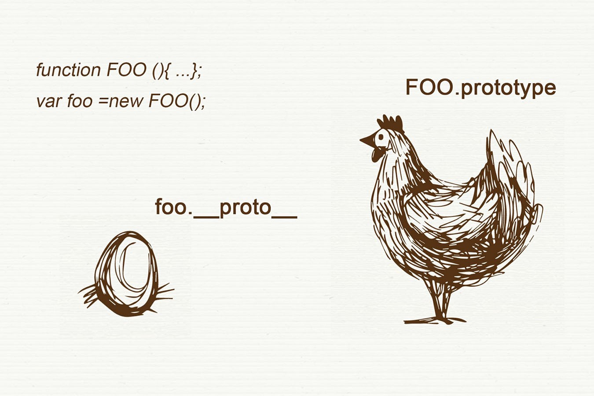
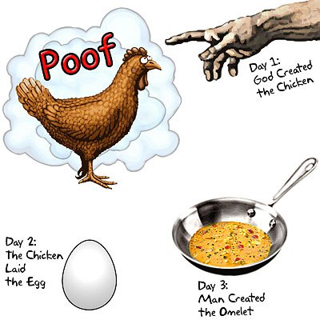
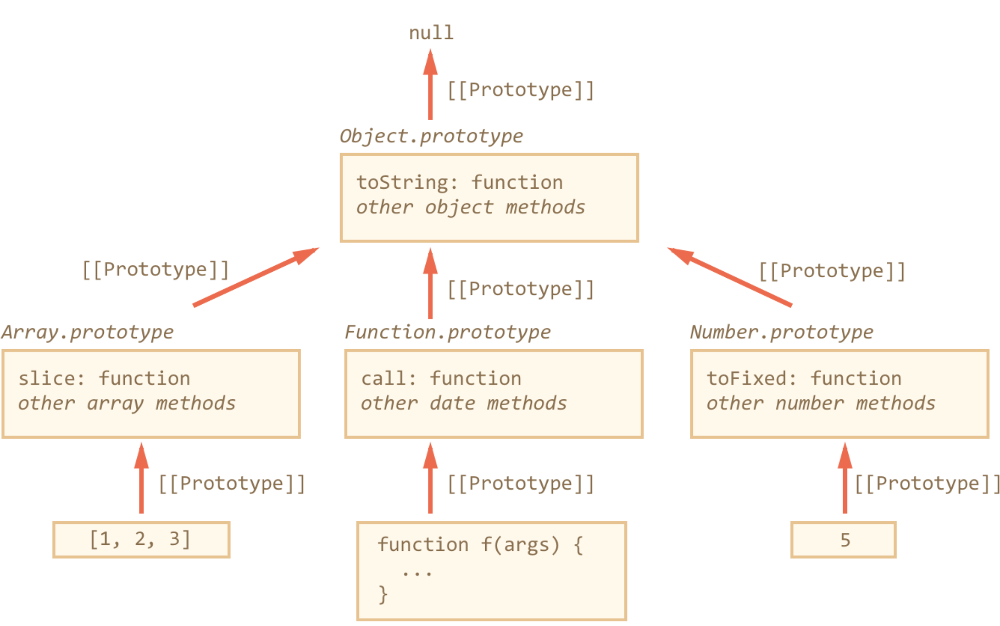
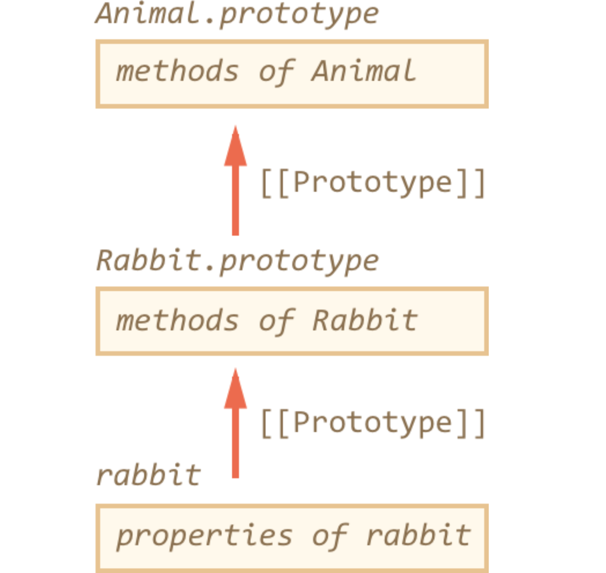

# Lection 09

## Расширим кругозор

>Метапеременные — это слова-заменители, которые применяются в технических текстах для обозначения чего-либо, что может стоять на их месте, метапеременные часто используются в программировании.  @Wiki

Есть две легендарных метапеременных — это **foo** и **bar**

- короткие

- одинаковой длины
 
- отличаются друг от друга
 
- легко произносятся

## Прототип объекта

>**prototype** - свойство функции-конструктора, которая устанавливает, что войдёт в свойство **__proto__** на построенном объекте.



**Просто объекты**

```js
var knowledgesProgress = {
        lvl: 50
    },
    knowledgesProgressFoo = {
        getProgress: function() {
            var msg = this.lvl < 50 ? 'Need more brains' : 'Im super smart';
            
            console.log(msg);
        }
    };
    
// foo.__proto__
knowledgesProgress.__proto__ = knowledgesProgressFoo;

console.dir(knowledgesProgress);
knowledgesProgress.getProgress();
```

**Cложно объекты**

```js
var knowledgesProgress = new KnowledgesProgress();

function KnowledgesProgress() {
    this.lvl= 50;
}

//Foo.prototype
KnowledgesProgress.prototype.getProgress = function() {
    var msg = this.lvl < 50 ? 'Need more brains' : 'Im super smart';
                                                       
    console.log(msg);
}
```

**Грубо, но наглядно**




**Важно!**

- объекты в можно организовать в цепочки 

- свойство не найденное в одном объекте, автоматически ищется в другом


```javascript
var animal = {
  eats: true
};

var rabbit = {
  jumps: true
};

rabbit.__proto__ = animal;

// в rabbit можно найти оба свойства
alert( rabbit.jumps ); // true
alert( rabbit.eats ); // true
```

### obj.hasOwnProperty(prop)

Обычный цикл for..in не делает различия между свойствами объекта и его прототипа.

```javascript
var animal = {
  eats: true
};

var rabbit = {
  jumps: true,
  __proto__: animal
};

for (var key in rabbit) {
  alert( key + " = " + rabbit[key] ); // выводит и "eats" и "jumps"
}
```

Вызов obj.hasOwnProperty(prop) возвращает true, если свойство prop принадлежит самому объекту obj, иначе false.

```javascript
var animal = {
  eats: true
};

var rabbit = {
  jumps: true,
  __proto__: animal
};

alert( rabbit.hasOwnProperty('jumps') ); // true: jumps принадлежит rabbit

alert( rabbit.hasOwnProperty('eats') ); // false: eats нет 

for (var key in rabbit) {
    if (!rabbit.hasOwnProperty(key)) continue; // пропустить
    
    alert( key + " = " + rabbit[key] ); // выводит "jumps"
}
```

### Object.create(null)

Зачастую объекты используют для хранения произвольных значений по ключу, как коллекцию:

```javascript
var data = {};
data.text = "Привет";
data.age = 35;
// ...
```

В каждом обьекте есть встроенные функции

```javascript
var data = {};
alert(data.toString); // функция, хотя мы её туда не записывали
```

Это может быть неприятным сюрпризом и приводить к ошибкам, если названия свойств приходят от посетителя и могут быть произвольными.

```javascript
var data = {};

// выведет toString только если оно записано в сам объект
alert(data.hasOwnProperty('toString') ? data.toString : undefined);
```

```javascript
var data = Object.create(null);
data.text = "Привет";

alert(data.text); // Привет
alert(data.toString); // undefined
```

Object.create(null) не имеет прототипа, а значит в нём нет лишних свойств.

Итого:
 - В JavaScript есть встроенное «наследование» между объектами при помощи специального свойства __proto__.
 - При установке свойства rabbit.__proto__ = animal говорят, что объект animal будет «прототипом» rabbit.
 - При чтении свойства из объекта, если его в нём нет, оно ищется в __proto__. Прототип задействуется только при чтении свойства. Операции присвоения obj.prop = или удаления delete obj.prop совершаются всегда над самим объектом obj.

### Создание прототипов объекта через конструктор

B реальных проектах объекты обычно создаются функцией-конструктором через new. Посмотрим, как указать прототип в этом
 случае.

```javascript
var animal = {
  eats: true
};

function Rabbit(name) {
  this.name = name;
  this.__proto__ = animal;
}

var rabbit = new Rabbit("Кроль");

alert( rabbit.eats ); // true, из прототипа”
```

Чтобы новым объектам автоматически ставить прототип, конструктору ставится свойство prototype.

При создании объекта через new, в его прототип __proto__ записывается ссылка из prototype функции-конструктора.

```javascript
var animal = {
  eats: true
};

function Rabbit(name) {
  this.name = name;
}

Rabbit.prototype = animal;

var rabbit = new Rabbit("Кроль"); //  rabbit.__proto__ == animal

alert( rabbit.eats ); // true
```

- Свойство constructor

```javascript
function Rabbit() {}

Rabbit.prototype = {
  constructor: Rabbit
};
```

```javascript
function Rabbit(name) {
  this.name = name;
  alert( name );
}

var rabbit = new Rabbit("Кроль");

var rabbit2 = new rabbit.constructor("Крольчиха");
```

Свойство constructor легко потерять.

```javascript
Rabbit.prototype = { jumps: true }
```

```javascript
Rabbit.prototype = {
  jumps: true,
  constructor: Rabbit
};

// сохранится встроенный constructor
Rabbit.prototype.jumps = true
```

Для произвольной функции – назовём её Person, верно следующее:

 - Прототип __proto__ новых объектов, создаваемых через new Person, можно задавать при помощи свойства Person.prototype.
 - Значением Person.prototype по умолчанию является объект с единственным свойством constructor, содержащим ссылку на Person. Его можно использовать, чтобы из самого объекта получить функцию, которая его создала. Однако, JavaScript никак не поддерживает корректность этого свойства, поэтому программист может его изменить или удалить.
 - Object.create(proto) создает пустой обьект prototype которого равен заданному

### Встроенные "классы" в JavaScript

В JavaScript есть встроенные объекты: Date, Array, Object и другие. Они используют прототипы и демонстрируют организацию «псевдоклассов» на JavaScript, которую мы вполне можем применить и для себя.

```javascript
var obj = {};
alert( obj ); // "[object Object]" ?”
```

 - Запись obj = {} является краткой формой obj = new Object, где Object – встроенная функция-конструктор для объектов.
 - При выполнении new Object, создаваемому объекту ставится __proto__ по prototype конструктора, который в данном случае равен встроенному Object.prototype.
 - В дальнейшем при обращении к obj.toString() – функция будет взята из Object.prototype.
 
 Точно такой же подход используется в массивах Array, функциях Function и других объектах. Встроенные методы для них находятся в Array.prototype, Function.prototype и т.п

 

Поэтому говорят, что "все объекты наследуют от Object", а если более точно, то от Object.prototype.

Kлассом, называют функцию-конструктор вместе с её prototype. Такой способ объявления классов называют «прототипным 
стилем ООП.

### Изменение встроенных прототипов

```javascript
Object.prototype.each = function(f) {
  for (var prop in this) {
    var value = this[prop];
    f.call(value, prop, value); // вызовет f(prop, value), this=value
  }
}

// Попробуем! (внимание, пока что это работает неверно!)
var user = {
  name: 'Вася',
  age: 25
};

user.each(function(prop, val) {
  alert( prop ); // name -> age -> (!) each
});
```

```javascript
// пропускать свойства из прототипа
if (!this.hasOwnProperty(prop)) continue;
```

```javascript
Object.prototype.each = function(f) {
  for (var prop in this) {
    var value = this[prop];
    f.call(value, prop, value);
  }
};

// поправить объявление свойства, установив флаг enumerable: false
Object.defineProperty(Object.prototype, 'each', {
  enumerable: false
});

// Теперь все будет в порядке
var obj = {
  name: 'Вася',
  age: 25
};

obj.each(function(prop, val) {
  alert( prop ); // name -> age
});
```

 - Достоинства

Методы в прототипе автоматически доступны везде, их вызов прост и красив.

 - Недостатки
 
Новые свойства, добавленные в прототип из разных мест, могут конфликтовать между собой. Представьте, что вы подключили две библиотеки, которые добавили одно и то же свойство в прототип, но определили его по-разному. Конфликт неизбежен.

Изменения встроенных прототипов влияют глобально, на все-все скрипты, делать их не очень хорошо с архитектурной точки зрения.

### Класс через прототип

 - Функциональное ООП:

```javascript
function Machine() {
  var enabled = false;

  this.enable = function() {
    enabled = true;
  };

  this.disable = function() {
    enabled = false;
  };
}

var m = new Machine();
```

Прототипное ООП:

```javascript
function Machine(power) {
  this._enabled = false;
}

Machine.prototype.enable = function() {
    this._enabled = true;
};

Machine.prototype.disable = function() {
    this._enabled = false;
};

var m = new Machine();
```

В чем же разница?

Функциональный стиль записывает в каждый объект и свойства и методы, а прототипный – только свойства. Поэтому прототипный стиль – быстрее и экономнее по памяти.

При создании методов через прототип, мы теряем возможность использовать локальные переменные как приватные свойства, у них больше нет общей области видимости с конструктором.

### Наследование Array от Object

 - Методы массивов Array хранятся в Array.prototype.
 - Array.prototype имеет прототипом Object.prototype.
 
```javascript
console.dir([1,2,3])
```

### Наследование в наших классах

Применим тот же подход для наших классов: объявим класс Rabbit, который будет наследовать от Animal.

Вначале создадим два этих класса по отдельности, они пока что будут совершенно независимы.

```javascript
function Animal(name) {
  this.name = name;
  this.speed = 0;
}

Animal.prototype.run = function(speed) {
  this.speed += speed;
  alert( this.name + ' бежит, скорость ' + this.speed );
};

Animal.prototype.stop = function() {
  this.speed = 0;
  alert( this.name + ' стоит' );
};
```

```javascript
function Rabbit(name) {
  this.name = name;
  this.speed = 0;
}

Rabbit.prototype.jump = function() {
  this.speed++;
  alert( this.name + ' прыгает' );
};

var rabbit = new Rabbit('Кроль');

Rabbit.prototype.__proto__ = Animal.prototype; // IE10- Nooooooooo!!!
```

```javascript
function Rabbit(name) {
  this.name = name;
  this.speed = 0;
}

// задаём наследование
Rabbit.prototype = Object.create(Animal.prototype);

// и добавим свой метод (или методы...)
Rabbit.prototype.jump = function() { ... }; 
```



```javascript
// 1. Конструктор Animal
function Animal(name) {
  this.name = name;
  this.speed = 0;
}

// 1.1. Методы -- в прототип
Animal.prototype.stop = function() {
  this.speed = 0;
  alert( this.name + ' стоит' );
}

Animal.prototype.run = function(speed) {
  this.speed += speed;
  alert( this.name + ' бежит, скорость ' + this.speed );
};

// 2. Конструктор Rabbit
function Rabbit(name) {
  this.name = name;
  this.speed = 0;
}

// 2.1. Наследование
Rabbit.prototype = Object.create(Animal.prototype);
Rabbit.prototype.constructor = Rabbit;

// 2.2. Методы Rabbit
Rabbit.prototype.jump = function() {
  this.speed++;
  alert( this.name + ' прыгает, скорость ' + this.speed );
}
```

Вызов конструктора родителя

```javascript
function Animal(name) {
  this.name = name;
  this.speed = 0;
}

function Rabbit(name) {
  this.name = name;
  this.speed = 0;
}

function Rabbit(name) {
  Animal.apply(this, arguments);
}
```

Вызов метода родителя внутри своего

```javascript
Rabbit.prototype.run = function() {
   // вызвать метод родителя, передав ему текущие аргументы
   Animal.prototype.run.apply(this, arguments);
   this.jump();
 }
```

 - Для наследования нужно, чтобы «склад методов потомка» (Child.prototype) наследовал от «склада метода родителей» (Parent.prototype).

```javascript
Rabbit.prototype = Object.create(Animal.prototype);
```
    
- Для того, чтобы наследник создавался так же, как и родитель, он вызывает конструктор родителя в своём контексте, используя apply(this, arguments), вот так
   
```javascript
function Rabbit(...) {
    Animal.apply(this, arguments);
}
```

 - При переопределении метода родителя в потомке, к исходному методу можно обратиться, взяв его напрямую из прототипа:
 
 ```javascript
// --------- Класс-Родитель ------------
// Конструктор родителя пишет свойства конкретного объекта
function Animal(name) {
  this.name = name;
  this.speed = 0;
}

// Методы хранятся в прототипе
Animal.prototype.run = function() {
  alert(this.name + " бежит!")
}

// --------- Класс-потомок -----------
// Конструктор потомка
function Rabbit(name) {
  Animal.apply(this, arguments);
}

// Унаследовать
Rabbit.prototype = Object.create(Animal.prototype);

// Желательно и constructor сохранить
Rabbit.prototype.constructor = Rabbit;

// Методы потомка
Rabbit.prototype.run = function() {
  // Вызов метода родителя внутри своего
  Animal.prototype.run.apply(this);
  alert( this.name + " подпрыгивает!" );
};

// Готово, можно создавать объекты
var rabbit = new Rabbit('Кроль');
rabbit.run();
```
   
Зачастую вызов конструктора имеет какие-то побочные эффекты, например влияет на документ. Если конструктор родителя имеет какое-то поведение, которое нужно переопределить в потомке, то в функциональном стиле это невозможно.

Иначе говоря, в функциональном стиле в процессе создания Rabbit нужно обязательно вызывать Animal.apply(this, arguments), чтобы получить методы родителя – и если этот Animal.apply кроме добавления методов говорит: «Му-у-у!», то это проблема:

```javascript
function Animal() {
  this.walk = function() {
    alert('walk')
  };
  alert( 'Му-у-у!' );
}

function Rabbit() {
  Animal.apply(this, arguments); // как избавиться от мычания, но получить walk?
}
```

Поэтому прототипный подход стоит предпочитать функциональному как более быстрый и универсальный.

### Заключение

### ДЗ

Переделать предыдущее задание в прототипном стиле + добавить новый компонент Articles, и для всех компонентов добавить 
свойство order которое определяет в каком порядке и после какого элемента будет отрендерен блок, если order 
одинаковый то блок ставится после блока с таким же order, если order не указан то по умолчанию он равен 0.

При вызове функции renderPage() все компоненты рендерятся в порядке order и добавляются к body.

1. Создайте класс Component, компонент имеет методы:
 - setView - установить html view
 - setOrder - установить свойство position
 - render - отрендерить текущий  html view с параметрами
 - delete - удалить текуий компонент
 
2. Наследуя от класса Component создайте 4 компонента:
 - componentHeader
 - componentMenu - расширяет базовый метод render, добавляя renderSubItem - рендерит пункты  подменю и вставляет их в 
 родительский пункт меню 
 - componentArticles - расширяет базовый метод render, добавляя renderArticle - рендерит статьи и добавляет в компонент body
 - componentFooter
 
3. Методы и как работает:
```javascript
    var componentHeader = new Component({parent: 'header', url: 'путь к лого',  title: 'заголовок'}),
        componentMenu = new Component({parent: 'nav'}),
        componentArticles = new Component({parent: 'main'}),
        componentFooter = new Component({parent: 'footer', text: 'Корирайты'});

    componentArticles.setView(
        '<section>{article}</section>',
         [
             {name: 'Статья 1', url: 'www', text: 'Some text for you'},
             {name: 'Статья 2', url: 'www', text: 'Some text for you'},
             {name: 'Статья 3', url: 'www', text: 'Some text for you'}
         ]
     );

    componentMenu.setView(
        '<ul>{li}</ul>',
         [
             {name: 'Главная', url: 'www'},
             {name: 'O нас', url: 'www', items: [
                 {name: 'Кто мы', url: 'www'},
                 {name: 'Где мы', url: 'www'},
                 {name: 'Откуда', url: 'www'}
             ]},
             {name: 'Контакты', url: 'www'}
         ]
     );
    
    componentHeader.setView('<h1>  {title}</h1>');
    componentFooter.setView('<p><small>{text}</small</p>');
    
    componentMenu.setOrder(1);
    componentArticles.setOrder(2);
    componentFooter.setOrder(3);
    
    renderPage();
    //componentHeader.render() - <header><h1>  заголовок</h1></header>
    //componentMenu.render() - <nav><ul><li><a href="www">O нас</a><ul><li><a href="www">Кто мы</a></li></ul></li>...</ul></nav>
    //componentArticles.render() - <main><section><article><h2><a href="www">Статья 1</a></h2><p>Some text for you</p></article>...</section></main>
    //componentFooter.render() - <footer><p>Корирайты</p></footer>
    
    componentFooter.delete() //удалить текуий компонент 
```

Подсказки.

replace, appendChild, innerHTML, forEach, map, sort, for (;;;), apply, prototype
