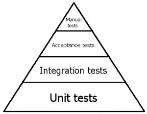
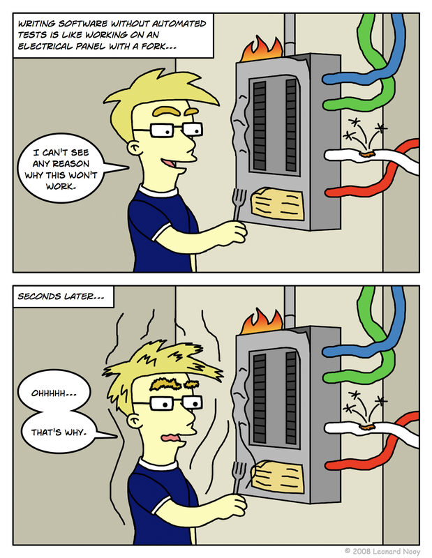
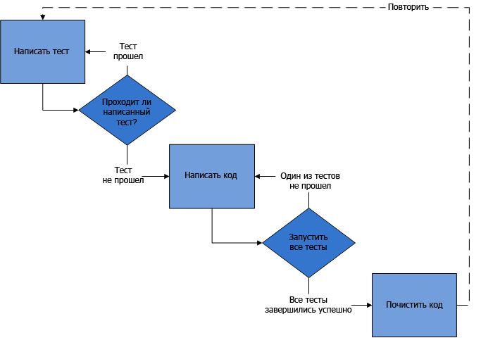

## Unit тестирование

Даже если вы никогда в жизни не думали, что занимаетесь тестированием, вы это делаете. Вы собираете свое приложение, нажимаете кнопку и проверяете, соответствует ли полученный результат вашим ожиданиям.

Все это, называется интеграционным тестированием.

Современные приложения достаточно сложны и содержат множество зависимостей. Интеграционное тестирование проверяет, что несколько компонентов системы работают вместе правильно. 

Оно выполняет свою задачу, но сложно для автоматизации. 

Модульное тестирование, или юнит-тестирование (англ. unit testing) — процесс в программировании, позволяющий проверить на корректность отдельные модули исходного кода программы.(wiki)

Идея состоит в том, чтобы писать тесты для каждой нетривиальной функции или метода. Это позволяет достаточно быстро проверить, не привело ли очередное изменение кода к регрессии, то есть к появлению ошибок в уже оттестированных местах программы, а также облегчает обнаружение и устранение таких ошибок.



Таким образом, юнит-тестирование – это первый бастион на борьбе с багами. За ним еще интеграционное, приемочное и, наконец, ручное тестирование, в том числе «свободный поиск».

Нужно ли все это вам? С моей точки зрения ответ: «не всегда». 

## Цели тестирования

При написании функции мы обычно представляем, что она должна делать, какое значение на каких аргументах выдавать.

В процессе разработки мы время от времени проверяем, правильно ли работает функция. Самый простой способ проверить – это запустить её, например в консоли, и посмотреть результат.

Если что-то не так, поправить, опять запустить – посмотреть результат… И так «до победного конца».

Но такие ручные запуски – очень несовершенное средство проверки.

Когда проверяешь работу кода вручную – легко его «недотестировать».

Например, пишем функцию f. Написали, тестируем с разными аргументами. Вызов функции f(a) работает, а вот f(b) не работает. Поправили код – стало работать f(b), вроде закончили. Но при этом забыли заново протестировать f(a) – упс, вот и возможная ошибка в коде.

Автоматизированное тестирование – это когда тесты написаны отдельно от кода, и можно в любой момент запустить их и проверить все важные случаи использования.

### Не нужно писать тесты, если

- Вы делаете простой сайт-визитку из 5 статических html-страниц и с одной формой отправки письма. На этом заказчик, скорее всего, успокоится, ничего большего ему не нужно. Здесь нет никакой особенной логики, быстрее просто все проверить «руками»

- Вы занимаетесь рекламным сайтом/простыми флеш-играми или баннерами – сложная верстка/анимация или большой объем статики. Никакой логики нет, только представление

- Вы делаете проект для выставки. Срок – от двух недель до месяца, ваша система – комбинация железа и софта, в начале проекта не до конца известно, что именно должно получиться в конце. Приложение будет работать 1-2 дня на выставке

- Вы всегда пишете код без ошибок, обладаете идеальной памятью и даром предвидения. Ваш код настолько крут, что изменяет себя сам, вслед за требованиями клиента. Иногда код объясняет клиенту, что его требования — не нужно реализовывать

В первых трех случаях по объективным причинам (сжатые сроки, бюджеты, размытые цели или очень простые требования) вы не получите выигрыша от написания тестов.

Последний случай рассмотрим отдельно. Я знаю только одного такого человека, и если вы не узнали себя на фото ниже, то у меня для вас плохие новости.


Любой долгосрочный проект без надлежащего покрытия тестами обречен рано или поздно быть переписанным с нуля



В своей практике я много раз встречался с проектами старше года. Они делятся на три категории:
 - Без покрытия тестами. Обычно такие системы сопровождаются спагетти-кодом и уволившимися ведущими разработчиками. Никто в компании не знает, как именно все это работает. Да и что оно в конечном итоге должно делать, сотрудники представляют весьма отдаленно.
 
 - С тестами, которые никто не запускает и не поддерживает. Тесты в системе есть, но что они тестируют, и какой от них ожидается результат, неизвестно. Ситуация уже лучше. Присутствует какая-никакая архитектура, есть понимание, что такое слабая связанность. Можно отыскать некоторые документы. Скорее всего, в компании еще работает главный разработчик системы, который держит в голове особенности и хитросплетения кода.
 
 - С серьезным покрытием. Все тесты проходят. Если тесты в проекте действительно запускаются, то их много. Гораздо больше, чем в системах из предыдущей группы. И теперь каждый из них – атомарный: один тест проверяет только одну вещь. Тест является спецификацией метода класса, контрактом: какие входные параметры ожидает этот метод, и что остальные компоненты системы ждут от него на выходе. Таких систем гораздо меньше. В них присутствует актуальная спецификация. Текста немного: обычно пара страниц, с описанием основных фич, схем серверов и getting started guide’ом. В этом случае проект не зависит от людей. Разработчики могут приходить и уходить. Система надежно протестирована и сама рассказывает о себе путем тестов.

Проекты первого типа – крепкий орешек, с ними работать тяжелее всего. Обычно их рефакторинг по стоимости равен или превышает переписывание с нуля.

Бездумное написание тестов не только не помогает, но вредит проекту. Если раньше у вас был один некачественный продукт, то написав тесты, не разобравшись в этой теме, вы получите два. И удвоенное время на сопровождение и поддержку.


### Как нужно писать тесты

Для того чтобы темная сторона кода не взяла верх, нужно придерживаться следующих основных правил. 

Ваши тесты должны:

 - Быть достоверными
 - Не зависеть от окружения, на котором они выполняются
 - Легко поддерживаться
 - Легко читаться и быть простыми для понимания (даже новый разработчик должен понять что именно тестируется)
 - Соблюдать единую конвенцию именования
 - Запускаться регулярно в автоматическом режиме

### Выберите логическое расположение тестов
Только так. Ваши тесты должны быть частью контроля версий. В зависимости от типа вашего решения, они могут быть организованы по-разному. Общая рекомендация: если приложение монолитное, положите все тесты в папку Tests; если у вас много разных компонентов, храните тесты в папке каждого компонента. 

### Выберите способ именования проектов с тестами
Одна из лучших практик: добавьте к каждому проекту его собственный тестовый проект.
У вас есть части системы <PROJECT_NAME>.Core, <PROJECT_NAME>.Bl и <PROJECT_NAME>.Web? Добавьте еще <PROJECT_NAME>.Core.Tests, <PROJECT_NAME>.Bl.Tests и <PROJECT_NAME>.Web.Tests

### Что тестировать, а что – нет?

Нет:
 - Простой код без зависимостей. Скорее всего здесь и так все ясно. Его можно не тестировать.
 - Сложный код с большим количеством зависимостей. Хм, если у вас есть такой код, тут пахнет God Object’ом и сильной связностью. Скорее всего, неплохо будет провести рефакторинг.

Что у нас остается:
 - Cложный код без зависимостей. Это некие алгоритмы или бизнес-логика. Отлично, это важные части системы, тестируем их.
 - Не очень сложный код с зависимостями. Этот код связывает между собой разные компоненты. Тесты важны, чтобы уточнить, как именно должно происходить взаимодействие.
 
 **Каждый тест должен проверять только одну вещь.** Если процесс слишком сложен (например, покупка в интернет магазине), разделите его на несколько частей и протестируйте их отдельно.
 
 Если вы не будете придерживаться этого правила, ваши тесты станут нечитаемыми, и вскоре вам окажется очень сложно их поддерживать.

## TDD техника
Разработка через тестирование(Test-driven development) подразумевает, что перед написанием кода необходимо: 
 - создать тест, который будет тестировать несуществующий код, тест соответственно не пройдет
 - написать код и убедиться, что тест прошел
 - почистить код
 - повторить



 **Добавление теста**
 
При разработке через тестирование, добавление каждой новой функциональности (англ. feature) в программу начинается с написания теста. Неизбежно этот тест не будет проходить, поскольку соответствующий код ещё не написан. (Если же написанный тест прошёл, это означает, что либо предложенная «новая» функциональность уже существует, либо тест имеет недостатки.) Чтобы написать тест, разработчик должен чётко понимать предъявляемые к новой возможности требования. Для этого рассматриваются возможные сценарии использования и пользовательские истории. Новые требования могут также повлечь изменение существующих тестов. Это отличает разработку через тестирование от техник, когда тесты пишутся после того, как код уже написан: она заставляет разработчика сфокусироваться на требованиях до написания кода — тонкое, но важное отличие.

 **Запуск всех тестов: убедиться, что новые тесты не проходят**
 
На этом этапе проверяют, что только что написанные тесты не проходят. Этот этап также проверяет сами тесты: написанный тест может проходить всегда и соответственно быть бесполезным. Новые тесты должны не проходить по объяснимым причинам. Это увеличит уверенность (хотя не будет гарантировать полностью), что тест действительно тестирует то, для чего он был разработан.

 **Написать код**
 
На этом этапе пишется новый код так, что тест будет проходить. Этот код не обязательно должен быть идеален. Допустимо, чтобы он проходил тест каким-то неэлегантным способом. Это приемлемо, поскольку последующие этапы улучшат и отполируют его.

Важно писать код, предназначенный именно для прохождения теста. Не следует добавлять лишней и, соответственно, не тестируемой функциональности.

 **Запуск всех тестов: убедиться, что все тесты проходят**
 
 Если все тесты проходят, программист может быть уверен, что код удовлетворяет всем тестируемым требованиям. После этого можно приступить к заключительному этапу цикла.
 
 **Рефакторинг**
 
 Когда достигнута требуемая функциональность, на этом этапе код может быть почищен. Рефакторинг — процесс изменения внутренней структуры программы, не затрагивающий её внешнего поведения и имеющий целью облегчить понимание её работы, устранить дублирование кода, облегчить внесение изменений в ближайшем будущем.
 
 **Повторить цикл**
 
Описанный цикл повторяется, реализуя всё новую и новую функциональность. Шаги следует делать небольшими, от 1 до 10 изменений между запусками тестов. Если новый код не удовлетворяет новым тестам или старые тесты перестают проходить, программист должен вернуться к отладке.
 
Тесты должны писаться для тестируемой функциональности. Считается, что это имеет два преимущества. Это помогает убедиться, что приложение пригодно для тестирования, поскольку разработчику придется с самого начала обдумать то, как приложение будет тестироваться. Это также способствует тому, что тестами будет покрыта вся функциональность. Когда функциональность пишется до тестов, разработчики и организации склонны переходить к реализации следующей функциональности, не протестировав существующую.
 
Идея проверять, что вновь написанный тест не проходит, помогает убедиться, что тест реально что-то проверяет. Только после этой проверки следует приступать к реализации новой функциональности. Этот приём, известный как «красный/зеленый/рефакторинг», называют «мантрой разработки через тестирование». Под красным здесь понимают не прошедшие тесты, а под зелёным — прошедшие.
 
Отработанные практики разработки через тестирование привели к созданию техники «разработка через приёмочное тестирование» (англ. Acceptance Test-driven development, ATDD), в котором критерии, описанные заказчиком, автоматизируются в приемочные тесты, используемые потом в обычном процессе разработки через модульное тестирование (англ. unit test-driven development, UTDD). Этот процесс позволяет гарантировать, что приложение удовлетворяет сформулированным требованиям. При разработке через приёмочное тестирование, команда разработчиков сконцентрирована на четкой задаче: удовлетворить приемочные тесты, которые отражают соответствующие требования пользователя.
 
Приёмочные (функциональные) тесты (англ. customer tests, acceptance tests) — тесты, проверяющие функциональность приложения на соответствие требованиям заказчика. Приёмочные тесты проходят на стороне заказчика. Это помогает ему быть уверенным в том, что он получит всю необходимую функциональность.

### Слабые места

 - Существуют задачи, которые невозможно (по крайней мере, на текущий момент) решить только при помощи тестов. В частности, TDD не позволяет механически продемонстрировать адекватность разработанного кода в области безопасности данных и взаимодействия между процессами. Безусловно, безопасность основана на коде, в котором не должно быть дефектов, однако она основана также на участии человека в процедурах защиты данных. Тонкие проблемы, возникающие в области взаимодействия между процессами, невозможно с уверенностью воспроизвести, просто запустив некоторый код.
 
 - Разработку через тестирование сложно применять в тех случаях, когда для тестирования необходимо прохождение функциональных тестов. Примерами может быть: разработка интерфейсов пользователя, программ, работающих с базами данных, а также того, что зависит от специфической конфигурации сети. Разработка через тестирование не предполагает большого объёма работы по тестированию такого рода вещей. Она сосредотачивается на тестировании отдельно взятых модулей, используя mock-объекты для представления внешнего мира.
 
 - Требуется больше времени на разработку и поддержку, а одобрение со стороны руководства очень важно. Если у организации нет уверенности в том, что разработка через тестирование улучшит качество продукта, то время, потраченное на написание тестов, может рассматриваться как потраченное впустую.
 
 - Модульные тесты, создаваемые при разработке через тестирование, обычно пишутся теми же, кто пишет тестируемый код. Если разработчик неправильно истолковал требования к приложению, и тест, и тестируемый модуль будут содержать ошибку.
 
 - Большое количество используемых тестов может создать ложное ощущение надежности, приводящее к меньшему количеству действий по контролю качества.
 
 - Тесты сами по себе являются источником накладных расходов. Плохо написанные тесты, например, содержат жёстко вшитые строки с сообщениями об ошибках или подвержены ошибкам, дороги при поддержке. Чтобы упростить поддержку тестов, следует повторно использовать сообщения об ошибках из тестируемого кода.
 
 - Уровень покрытия тестами, получаемый в результате разработки через тестирование, не может быть легко получен впоследствии. Исходные тесты становятся всё более ценными с течением времени. Если неудачные архитектура, дизайн или стратегия тестирования приводят к большому количеству непройденных тестов, важно их все исправить в индивидуальном порядке. Простое удаление, отключение или поспешное изменение их может привести к необнаруживаемым пробелам в покрытии тестами. 

## BDD техника

Мы рассмотрим методику тестирования, которая входит в BDD – Behavior Driven Development. Подход BDD давно и с успехом используется во многих проектах.

Тесты BDD – это три в одном: И тесты, И документация, И примеры использования.

**Поток разработки таков:**

 1) Пишется спецификация, которая описывает самый базовый функционал.
 
 2) Делается начальная реализация.
 
 3) Для проверки соответствия спецификации мы задействуем фреймворк (в нашем случае Mocha). Фреймворк запускает все тесты it и выводит ошибки, если они возникнут. При ошибках вносятся исправления.
 
 4) Спецификация расширяется, в неё добавляются возможности, которые пока, возможно, не поддерживаются реализацией.
 
 5) Идём на пункт 2, делаем реализацию. И так «до победного конца».
 
Разработка ведётся итеративно: один проход за другим, пока спецификация и реализация не будут завершены.

**Разработка pow: спецификация**

Допустим, мы хотим разработать функцию pow(x, n), которая возводит x в целую степень n, для простоты n≥0.

Ещё до разработки мы можем представить себе, что эта функция будет делать, и описать это по методике BDD.

Это описание называется спецификация (или, как говорят в обиходе, «спека») и выглядит так:

```javascript
describe("pow", function() {

  it("возводит в n-ю степень", function() {
    assert.equal(pow(2, 3), 8);
  });

});
```

У спецификации есть три основных строительных блока, которые вы видите в примере выше:

**describe(название, function() { ... })**

Задаёт, что именно мы описываем, используется для группировки «рабочих лошадок» – блоков it. В данном случае мы описываем функцию pow.

**it(название, function() { ... })**

В названии блока it человеческим языком описывается, что должна делать функция, далее следует тест, который проверяет это.

**assert.equal(value1, value2)**

Код внутри it, если реализация верна, должен выполняться без ошибок.

Различные функции вида assert.* используются, чтобы проверить, делает ли pow то, что задумано. Пока что нас интересует только одна из них – assert.equal, она сравнивает свой первый аргумент со вторым и выдаёт ошибку в случае, когда они не равны. В данном случае она проверяет, что результат pow(2, 3) равен 8.

Есть и другие виды сравнений и проверок, которые мы увидим далее.

В нашем случае первый шаг уже завершён, начальная спецификация готова, хорошо бы приступить к реализации. Но перед этим проведём «нулевой» запуск спецификации, просто чтобы увидеть, что уже в таком виде, даже без реализации – тесты работают.


**Пример в действии**
   
Для запуска тестов нужны соответствующие JavaScript-библиотеки.
   
Мы будем использовать:
   
[Mocha](http://mochajs.org/) – эта библиотека содержит общие функции для тестирования, включая describe и it.

[Chai](http://chaijs.com/) – библиотека поддерживает разнообразные функции для проверок. Есть разные «стили» проверки результатов, с которыми мы познакомимся позже, на текущий момент мы будем использовать лишь assert.equal.

[Sinon](http://chaijs.com/) – для эмуляции и хитрой подмены функций «заглушками», понадобится позднее.

Эти библиотеки позволяют тестировать JS не только в браузере, но и на сервере Node.JS. Здесь мы рассмотрим браузерный вариант, серверный использует те же функции.
   
 Пример HTML-страницы для тестов: 

```html
<!DOCTYPE html>
<html>

<head>
  <meta charset="utf-8">

  <!-- подключаем стили Mocha, для отображения результатов -->
  <link rel="stylesheet" href="https://cdnjs.cloudflare.com/ajax/libs/mocha/2.1.0/mocha.css">
  <!-- подключаем библиотеку Mocha -->
  <script src="https://cdnjs.cloudflare.com/ajax/libs/mocha/2.1.0/mocha.js"></script>
  <!-- настраиваем Mocha: предстоит BDD-тестирование -->
  <script>
    mocha.setup('bdd');
  </script>

  <!-- подключаем chai -->
  <script src="https://cdnjs.cloudflare.com/ajax/libs/chai/2.0.0/chai.js"></script>
  <!-- в chai есть много всего, выносим assert в глобальную область -->
  <script>
    var assert = chai.assert;
  </script>
</head>

<body>

  <script>
    function pow(x, n) {
      /* код функции, пока что пусто */
    }
  </script>

  <!-- в этом скрипте находятся спеки -->
  <script src="test.js"></script>

  <!-- в элементе с id="mocha" будут результаты тестов -->
  <div id="mocha"></div>

  <!-- запустить тесты! -->
  <script>
    mocha.run();
  </script>
</body>

</html>
```

### Исправление спецификации

Функция, конечно, ещё не готова, но тесты проходят.

Здесь мы видим ситуацию, которая (и не обязательно при ленивом программисте!) бывает на практике – да, есть тесты, они проходят, но функция (увы!) работает неправильно.

С точки зрения BDD, ошибка при проходящих тестах – вина спецификации.

В первую очередь не реализация исправляется, а уточняется спецификация, пишется падающий тест.

Сейчас мы расширим спецификацию, добавив проверку на pow(3, 4) = 81.

Здесь есть два варианта организации кода:

```javascript
describe("pow", function() {
    it("возводит в n-ю степень", function() {
        assert.equal(pow(2, 3), 8);
        assert.equal(pow(3, 4), 81);
    });
});
```

```javascript
it("при возведении 2 в 3ю степень результат 8", function() {
    assert.equal(pow(2, 3), 8);
});

it("при возведении 3 в 4ю степень равен 81", function() {
    assert.equal(pow(3, 4), 81);
});
```

### Уточнение реализации

Придётся написать нечто более реальное, чтобы тесты проходили:

```javascript
function pow(x, n) {
  var result = 1;

  for (var i = 0; i < n; i++) {
    result *= x;
  }

  return result;
}
```

Чтобы быть уверенными, что функция работает верно, желательно протестировать её на большем количестве значений. Вместо того, чтобы писать блоки it вручную, мы можем сгенерировать тесты в цикле for:

```javascript
describe("pow", function() {

  function makeTest(x) {
    var expected = x * x * x;
    it("при возведении " + x + " в степень 3 результат: " + expected, function() {
      assert.equal(pow(x, 3), expected);
    });
  }

  for (var x = 1; x <= 5; x++) {
    makeTest(x);
  }

});
```

### Вложенный describe

Функция makeTest и цикл for, очевидно, нужны друг другу, но не нужны для других тестов, которые мы добавим в дальнейшем. Они образуют единую группу, задача которой – проверить возведение в n-ю степень.

Будет правильно выделить их, при помощи вложенного блока describe:

```javascript
describe("pow", function() {

  describe("возводит x в степень n", function() {

    function makeTest(x) {
      var expected = x * x * x;
      it("при возведении " + x + " в степень 3 результат: " + expected, function() {
        assert.equal(pow(x, 3), expected);
      });
    }

    for (var x = 1; x <= 5; x++) {
      makeTest(x);
    }

  });

  // ... дальнейшие тесты it и подблоки describe ...
});
```

Вложенный describe объявит новую «подгруппу» тестов, блоки it которой запускаются так же, как и обычно, но выводятся с подзаголовком.

### before/after и beforeEach/afterEach

В каждом блоке describe можно также задать функции before/after, которые будут выполнены до/после запуска тестов, а также beforeEach/afterEach, которые выполняются до/после каждого it.

Например:

```javascript
describe("Тест", function() {

  before(function() { alert("Начало тестов"); });
  after(function() { alert("Конец тестов"); });

  beforeEach(function() { alert("Вход в тест"); });
  afterEach(function() { alert("Выход из теста"); });

  it('тест 1', function() { alert('1'); });
  it('тест 2', function() { alert('2'); });

});
```

Как правило, beforeEach/afterEach (before/after) используют, если необходимо произвести инициализацию, обнулить счётчики или сделать что-то ещё в таком духе между тестами (или их группами).

### Расширение спецификации

Базовый функционал pow описан и реализован, первая итерация разработки завершена. Теперь расширим и уточним его.

Как говорилось ранее, функция pow(x, n) предназначена для работы с целыми неотрицательными n.

В JavaScript для ошибки вычислений служит специальное значение NaN, которое функция будет возвращать при некорректных n.

Добавим это поведение в спецификацию:

```javascript
describe("pow", function() {

  // ...

  it("при возведении в отрицательную степень результат NaN", function() {
    assert(isNaN(pow(2, -1)));
  });

  it("при возведении в дробную степень результат NaN", function() {
    assert(isNaN(pow(2, 1.5)));
  });

});
```

### Другие assert

Обратим внимание, в спецификации выше использована проверка не assert.equal, как раньше, а assert(выражение). Такая проверка выдаёт ошибку, если значение выражения при приведении к логическому типу не true.

Она потребовалась, потому что сравнивать с NaN обычным способом нельзя: NaN не равно никакому значению, даже самому себе, поэтому assert.equal(NaN, x) не подойдёт.

Кстати, мы и ранее могли бы использовать assert(value1 == value2) вместо assert.equal(value1, value2). Оба этих assert проверяют одно и тоже.

Однако, между этими вызовами есть отличие в деталях сообщения об ошибке.

При «упавшем» assert в примере выше мы видим "Unspecified AssertionError", то есть просто «что-то пошло не так», а при assert.equal(value1, value2) будут дополнительные подробности: expected 8 to equal 81.

Поэтому рекомендуется использовать именно ту проверку, которая максимально соответствует задаче.

Вот самые востребованные assert-проверки, встроенные в Chai:

 - assert(value) – проверяет что value является true в логическом контексте.
 - assert.equal(value1, value2) – проверяет равенство value1 == value2.
 - assert.strictEqual(value1, value2) – проверяет строгое равенство value1 === value2.
 - assert.notEqual, assert.notStrictEqual – проверки, обратные двум предыдущим.
 - assert.isTrue(value) – проверяет, что value === true
 - assert.isFalse(value) – проверяет, что value === false
 
…более полный список – в документации

В нашем случае хорошо бы использовать проверку assert.isNaN, и такой метод существует, но сейчас мы рассматриваем самый общий метод assert(...). В этом случае для того, чтобы сделать сообщение об ошибке понятнее, желательно добавить к assert описание.

Все вызовы assert позволяют дополнительным последним аргументом указать строку с описанием ошибки, которое выводится, если assert не проходит.

Добавим описание ошибки в конец наших assert'ов:

```javascript
describe("pow", function() {

  // ...

  it("при возведении в отрицательную степень результат NaN", function() {
    assert(isNaN(pow(2, -1)), "pow(2, -1) не NaN");
  });

  it("при возведении в дробную степень результат NaN", function() {
    assert(isNaN(pow(2, 1.5)), "pow(2, 1.5) не NaN");
  });

});
```

Теперь результат теста гораздо яснее говорит о том, что не так:
 
В коде тестов выше можно было бы добавить описание и к assert.equal, указав в конце: assert.equal(value1, value2, "описание"), но с равенством обычно и так всё понятно, поэтому мы так делать не будем.

### Итого

Итак, разработка завершена, мы получили полноценную спецификацию и код, который её реализует.

Задачи выше позволяют дополнить её, и в результате может получиться что-то в таком духе:

```javascript
describe("pow", function() {

  describe("возводит x в степень n", function() {

    function makeTest(x) {
      var expected = x * x * x;
      it("при возведении " + x + " в степень 3 результат: " + expected, function() {
        assert.equal(pow(x, 3), expected);
      });
    }

    for (var x = 1; x <= 5; x++) {
      makeTest(x);
    }

  });

  it("при возведении в отрицательную степень результат NaN", function() {
    assert(isNaN(pow(2, -1)), "pow(2, -1) не NaN");
  });

  it("при возведении в дробную степень результат NaN", function() {
    assert(isNaN(pow(2, 1.5)), "pow(2, -1.5) не NaN");
  });

  describe("любое число, кроме нуля, в степени 0 равно 1", function() {

    function makeTest(x) {
      it("при возведении " + x + " в степень 0 результат: 1", function() {
        assert.equal(pow(x, 0), 1);
      });
    }

    for (var x = -5; x <= 5; x += 2) {
      makeTest(x);
    }

  });

  it("ноль в нулевой степени даёт NaN", function() {
    assert(isNaN(pow(0, 0)), "0 в степени 0 не NaN");
  });

});
```


**Эту спецификацию можно использовать как:**

 - Тесты, которые гарантируют правильность работы кода.
 - Документацию по функции, что она конкретно делает.
 - Примеры использования функции, которые демонстрируют её работу внутри it.
 
Имея спецификацию, мы можем улучшать, менять, переписывать функцию и легко контролировать её работу, просматривая тесты.

Особенно важно это в больших проектах.

Бывает так, что изменение в одной части кода может повлечь за собой «падение» другой части, которая её использует. Так как всё-всё в большом проекте руками не перепроверишь, то такие ошибки имеют большой шанс остаться в продукте и вылезти позже, когда проект увидит посетитель или заказчик.

Чтобы избежать таких проблем, бывает, что вообще стараются не трогать код, от которого много что зависит, даже если его ну очень нужно переписать. Жизнь пробивается тонкими росточками там, где должен цвести и пахнуть новый функционал.

Код, покрытый автотестами, являет собой полную противоположность этому!

Даже если какое-то изменение потенциально может порушить всё – его совершенно не страшно сделать. Ведь есть масса тестов, которые быстро и в автоматическом режиме проверят работу кода. И если что-то падает, то это можно будет легко локализовать и поправить.

Кроме того, код, покрытый тестами, имеет лучшую архитектуру.

Конечно, это естественное следствие того, что его легче менять и улучшать. Но не только.

Чтобы написать тесты, нужно разбить код на функции так, чтобы для каждой функции было чётко понятно, что она получает на вход, что делает с этим и что возвращает. Это означает ясную и понятную структуру с самого начала.

Конечно, в реальной жизни всё не так просто. Зачастую написать тест сложно. Или сложно поддерживать тесты, поскольку код активно меняется. Сами тесты тоже пишутся по-разному, при помощи разных инструментов.

## В чем же разница

Все началось с того, что у одного чела, Дэна Норта, не хватило фантазии ответить, входе своих тренингов по TDD, на один простой вопрос: а какие тесты мы должны вообще написать, чтобы было достаточно для покрытия функциональности?

И тут, к нему пришло прозрение: а давайте напишем в заголовках тестов, не что мы проверяем, а то, что мы ожидаем от работы еще не реализованной функциональности. Т.е. вместо того, чтобы заголовок теста звучал как: протестировать_что_sqrt_от_16_равно_4(), появились тесты:
 - должен_вычислять_квадратный_корень_для_положительных_чисел()
 - должен_вычислять_квадратный_корень_для_отрицательных_чисел()
и т.д.

Конечно же, и в этом случае, некоторых тестов может не хватать, но, теперь можно посмотреть в код тестов и выявить, какого кейса не хватает. Когда написано почти-человеческим языком, а не магией чисел — как-то читать легче.

Да, вы заметили, что заголовки теста теперь стали неким подобием спецификации/требованиями к классу или методу? Так оно и есть. И Бдышь! Так, около 2006-го года появилась идея BDD.

Кроме этой простой идеи с именами тестов, Дэн также описал то, что тесты написанные в таком духе, помогают и другим участникам команды лучше понимать функциональность, и в итоге, даже между собой разговаривать на «общепонятном языке» (ubiquitous language).

И вот вам еще один резкий поворот. Есть крылатая фраза «BDD is TDD done right». Которую многие понимают, как «BDD — это круто, а ваш TDD — фуфло». На самом же деле: BDD — это попытка сформулировать лучшие практики TDD. Т.е. BDD пересекается с TDD, предлагая хорошие практики решения некоторых проблем.

### Заключение

### ДЗ

Взять последние 4 ДЗ противоположной комманды разработчиков, и покрыть их тестами, при этом придумать и написать как можно больше полезных кейсов, но без фанатизма.

### Справочники
- [Mocha](http://mochajs.org/)
- [Chai](http://chaijs.com/)
- [Sinon](http://chaijs.com/)