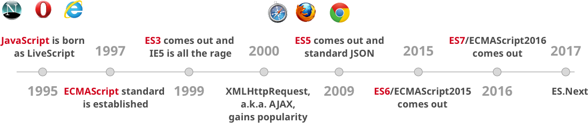

# Lection 13

## Что такое [QUnit](http://qunitjs.com/)

### Утверждения

> Утверждение - это выражение, которое прогнозирует возвращаемый результат при выполнении вашего кода. Если прогноз неверный, то утверждение имеет значение **false**, что позволяет сделать выводы о наличии ошибок.

- строительный блок модульного тестирования - утверждение

- **example__qunit.html**

```html
<!DOCTYPE html>
<html>
<head>
    <meta http-equiv="Content-Type" content="text/html; charset=utf-8" />
    <title>Комплект для тестов QUnit</title>
    <link rel="stylesheet" href="https://code.jquery.com/qunit/qunit-2.4.1.css">
    <script src="https://code.jquery.com/qunit/qunit-2.4.1.js"></script>
    <!-- Файл вашего проекта  -->
    <script type="text/javascript" src="js/test.js"></script>
    <!-- Файл ваших тестов -->
    <script type="text/javascript" src="js/qunit_test.js"></script>
</head>
<body>
    <h1 id="qunit-header">Комплект для тестов QUnit</h1>

    <h2 id="qunit-banner"></h2>

    <div id="qunit-testrunner-toolbar"></div>

    <h2 id="qunit-userAgent"></h2>

    <ol id="qunit-tests"></ol>
</body>
</html>
```

- **js/test.js**

```js
function isEven(val) {
    return val % 2 === 0;
}
```

- **js/qunit_test.js**

```js
QUnit.test('isEven()', function(assert) {
    assert.ok(isEven(0), 'Ноль - четное число');
    assert.ok(isEven(2), 'Два - тоже');
    assert.ok(isEven(-4), 'И отрицательное четыре - тоже четное число');
    assert.ok(!isEven(1), 'Один - нечетное число');
    assert.ok(!isEven(-7), 'Как и отрицательное семь - нечетное число');
    assert.ok(isEven(3), 'Три - четное число');

});
```

### Структура утверждений

Размещать все утверждения в одном тесте - очень плохая идея

- сложно поддерживать

- можно запутаться в оценке результатов выполнения

**Решение - отдельные модули**

```js
QUnit.module('Модуль A');
QUnit.test('Тест', function() {});
QUnit.test('Еще один тест', function() {});


QUnit.module('Модуль B');
QUnit.test('Тест', function() {});
QUnit.test('Еще один тест', function() {});
```

## ES6



> Стандарт [ES6](http://www.ecma-international.org/publications/standards/Ecma-262.htm) был принят в июне 2015. Пока что большинство браузеров реализуют его частично, текущее состояние реализации различных возможностей можно посмотреть [здесь](https://kangax.github.io/compat-table/es6/).


**Все просто** - один конкретный движок JS, например V8 (Chrome)

- добавили директиву **use strict**

- погнали...


**Все сложно** - кросс-браузерная поддержка

- транспайлер

- погнали...

**[Babel.JS](http://babeljs.io/)** – это транспайлер, переписывающий код на ES5+ в код на предыдущем стандарте ES5.

Он состоит из двух частей:

 - cобственно транспайлер, который переписывает код.

 - полифилл, который добавляет методы.

[ES6 список фич](http://es6-features.org/#Constants)

### let, const и блочная область видимости

- **общее**

    - область видимости

        - только блок `{...}`

    - нет всплытия(hoisting)

- `let`

    - вместо  `var` -> стандарт ES6 рекомендует использовать `let`

    - в рамках блока объявление один раз

```js
let a = 2;

{
    let a = 3;
    console.log(a); // 3
}

console.log(a); // 2
```

- `const`

    - одновременно с объявлением переменной должно быть присвоено значение

    - только для чтения

        - идентификатор переменной не может быть переприсвоен

    - рекомендуется использовать ПРОПИСНЫЕ_БУКВЫ

```js
{
    const ARR = [5, 6];

    ARR.push(7);

    console.log(ARR); // [5,6,7]

    ARR = 10; // TypeError
    ARR[0] = 3; // значение можно менять

    console.log(ARR); // [3,6,7]
}
```

#### Блочная область видимости для Functions

- функция обьявленная в блоке

    - область видимости как в `let` и `const`

```js
{
    function foo () { return 1 };

    foo() === 1;

    {
        function foo () { return 2 };
        foo() === 2;
    }

    foo() === 1;
}
```

### Стрелочные функции

- делают код короче

```js
// Классическое функциональное выражение
let addition = function(a, b) {
    return a + b;
};

// Стрелочная функция
let addition = (a, b) => a + b;

let additionWithLongBody = (a, b) => {
    return a + b;
};
```

- не имеют своего `this`

```js
function Person() {
    this.age = 0;

    setInterval(function growUp() {
        this.age++;
    }, 1000);
}

var p = new Person();
```

```js
function Person() {
    this.age = 0;

    setInterval(() => {
        this.age++;
    }, 1000);
}

let p = new Person();
```

### Параметры по умолчанию

```js
let getFinalPrice = (price, tax = 0.7) => price + price * tax;

getFinalPrice(500); // 850, так как значение tax не задано
getFinalPrice(500, 0.2); // 600, значение tax по-умолчанию заменяется на 0.2
```

### Spread / Rest оператор

- `...` оператор называют как `spread` или `rest`, в зависимости от того, как и где он используется

- `spread`, в любом итерируемом объекте(iterable), разбивает на индивидуальные элементы

```js
function foo(x, y, z) {
    console.log(x, y, z);
}

let arr = [1, 2, 3];

foo(...arr); // 1 2 3
```

```js
let params = [ "hello", true, 7 ],
    other = [ 1, 2, ...params ];
```

-  `rest`, объединение набора значений в один массив

```js
function foo(...args) {
    console.log(args);
}

foo(1, 2, 3, 4, 5); // [1, 2, 3, 4, 5]
```

### Строковые шаблоны и разделители

> **ES6** предоставяляет более простой способ вставки значения переменной или результата выражения (интерполяция), которые рассчитываются автоматически

- `${ ... }` используется для вычисления значения переменной/выражения

-  обратные кавычки используются как разделитель для таких случаев

```js
let user = 'Кевин';

console.log(`Привет, ${user}!`);
```

```js
let customer = { name: "Foo" },
    card = { amount: 7, product: "Bar", unitprice: 42 },
    message = `Hello ${customer.name},
        want to buy ${card.amount} ${card.product} for
        a total of ${card.amount * card.unitprice} bucks?`;

console.log(message);
```

### Восьмеричный и двоичный литералы

```js
let oValue = 0o10;
console.log(oValue); // 8

let bValue = 0b10;
console.log(bValue); // 2

0b111110111 === 503;
0o767 === 503;
```

### Расширение возможностей литералов объекта

```js
function getCar(make, model, value) {
    return {
        // с синтаксисом короткой записи можно
        // пропускать значение свойства, если оно
        // совпадает с именем переменной, значение
        // которой мы хотим использовать
        make,  // аналогично make: make
        model, // аналогично model: model
        value, // аналогично value: value

        // вычисляемые свойства теперь работают в
        // литералах объекта
        ['make' + make]: true,

        // Короткая запись метода объекта пропускает
        // ключевое слово `function` и двоеточие. Вместо
        // "depreciate: function() {}" можно написать:
        depreciate() {
            this.value -= 2500;
        }
    };
}

let car = getCar('Kia', 'Sorento', 40000);
console.log(car);
// {
//     make: 'Kia',
//     model:'Sorento',
//     value: 40000,
//     makeKia: true,
//     depreciate: function()
// }
```

### Деструктуризация массивов и объектов

> Деструктуризация помогает избежать использования вспомогательных переменных при взаимодействии с объектами и массивами.

```js
function foo() {
    return [1, 2, 3];
}

let arr = foo(); // [1,2,3]

let [a, b, c] = foo();

console.log(a, b, c); // 1 2 3

function bar() {
    return {
        x: 4,
        y: 5,
        z: 6
    };
}

let { x: a, y: b, z: c } = bar();

console.log(a, b, c); // 4 5 6
```

- deep matching

```js
let obj = {
        x: 4,
        y: {
            h: 5
        },
        z: 6
    },
    { x: a, y: { h: b }, z: c } = obj;
```

- object and array matching, default values

```js
let obj = { a: 1 },
    list = [ 1 ],
    { a, b = 2 } = obj,
    [ x, y = 2 ] = list;
```

- parameter context matching

```js
function f ([ name, val ]) {
    console.log(name, val)
}

function g ({ name: n, val: v }) {
    console.log(n, v)
}

function h ({ name, val }) {
    console.log(name, val)
}

f([ "bar", 42 ])
g({ name: "foo", val:  7 })
h({ name: "bar", val: 42 })
```

### Ключевое слово super для объектов

```js
let parent = {
    foo() {
        console.log("Привет от Родителя!");
    }
};

let child = {
    foo() {
        super.foo();
        console.log("Привет от Ребёнка!");
    }
};

Object.setPrototypeOf(child, parent);
child.foo(); // Привет от Родителя!
             // Привет от Ребёнка!
```

### Map и WeakMap

**Map**

- перебор осуществляется в порядке вставки

- ключом может быть произвольное значение

```js
let myMap = new Map();

let keyString = "строка",
    keyObj = {},
    keyFunc = function() {};

// устанавливаем значения
myMap.set(keyString, "значение, связанное со 'строка'");
myMap.set(keyObj, "значение, связанное с keyObj");
myMap.set(keyFunc, "значение, связанное с keyFunc");

myMap.size; // 3

// получаем значения
myMap.get(keyString);    // "значение, связанное со 'строка'"
myMap.get(keyObj);       // "значение, связанное с keyObj"
myMap.get(keyFunc);      // "значение, связанное с keyFunc"
```

```js
let map = new Map([
    ['1',  'str1'],
    [1,    'num1'],
    [true, 'bool1']
]);
```

- `map.add(key)`

- `map.delete(key)`, удаляет запись с ключом `key`, возвращает `true`, если такая запись была, иначе `false`

- `map.clear()` , удаляет все записи, очищает `map`

- `map.has(key)`, возвращает `true`, если ключ есть, иначе `false`

**Итерация**

- `map.keys()`, возвращает итерируемый объект для ключей,

- `map.values()`, возвращает итерируемый объект для значений,

- `map.entries()`, возвращает итерируемый объект для записей `[ключ, значение]`, он используется по умолчанию в `for..of`

- `forEach`

```js
let recipeMap = new Map([
    ['огурцов',   '500 гр'],
    ['помидоров', '350 гр'],
    ['сметаны',   '50 гр']
]);

// цикл по ключам
for(let fruit of recipeMap.keys()) {
    alert(fruit); // огурцов, помидоров, сметаны
}

// цикл по значениям
for(let amount of recipeMap.values()) {
    alert(amount); // 500 гр, 350 гр, 50 гр
}

// цикл по записям [ключ,значение]
for(let entry of recipeMap) { // то же что и recipeMap.entries()
    alert(entry); // огурцов,500 гр , и т.д., массивы по 2 значения
}
```

**WeakMap**

- каждый ключ должен быть объектом

- особый вид `Map` не препятствующий сборщику мусора удалять свои элементы

- объект присутствует только в `WeakMap` –> удаляется из памяти

**Зачем?**

- основное место для хранения и использования объектов находится где-то в другом месте кодаs

- здесь мы хотим хранить для них  "вспомогательные" данные, существующие лишь пока жив объект

**Пример**

- у нас есть элементы на странице или, к примеру, пользователи

- хотим хранить для них вспомогательную информацию, например обработчики событий или просто данные, но действительные лишь пока объект, к которому они относятся, существует.

- если поместить такие данные в `WeakMap`, а объект сделать ключом, то они будут автоматически удалены из памяти, когда удалится элемент

```js
// текущие активные пользователи
let activeUsers = [
    {name: "Вася"},
    {name: "Петя"},
    {name: "Маша"}
];

// вспомогательная информация о них,
// которая напрямую не входит в объект юзера,
// и потому хранится отдельно
let weakMap = new WeakMap();

weakMap.set(activeUsers[0], 1);
weakMap.set(activeUsers[1], 2);
weakMap.set(activeUsers[2], 3);
weakMap.set('Katya', 4); //Будет ошибка TypeError: "Katya" is not a non-null object

alert( weakMap.get(activeUsers[0]) ); // 1

activeUsers.splice(0, 1); // Вася более не активный пользователь

// weakMap теперь содержит только 2 элемента
activeUsers.splice(0, 1); // Петя более не активный пользователь

// weakMap теперь содержит только 1 элемент
```

**Итого**

- только объекты в качестве ключей

- нет свойства `size`

- нельзя перебрать элементы итератором или `forEach`

- нет метода `clear()`

### Set и WeakSet

**Set**

- коллекция уникальных значений

```js
let mySet = new Set([1, 1, 2, 2, 3, 3]);

mySet.size; // 3
mySet.has(1); // true
mySet.add('строки');
mySet.add({ a: 1, b:2 });
```

- в остальном тот-же `Map`

**WeakSet**

- в остальном тот-же `WeakMap`

### Тип данных Symbol

- уникальный и неизменяемый тип данных

**Зачем?**

Создание уникального идентификатора, к которому нельзя получить доступ.

```js
let sym = Symbol("опциональное описание");

console.log(typeof sym); // symbol
```

```js
let o = {
    val: 10,
    [Symbol("случайный")]: "Я - символ",
};

console.log(Object.getOwnPropertyNames(o));

// извлечь символьные свойства объекта
console.log(Object.getOwnPropertySymbols(o));
```

### for...of против for...in

- `for...of` используется для перебора в цикле итерируемых объектов, например, массивов

```js
let nicknames = ['di', 'boo', 'punkeye'];

nicknames.size = 3;

for (let nickname of nicknames) {
    console.log(nickname);
}
```

- `for...in` используется для перебора в цикле всех доступных для перебора (enumerable) свойств объекта

```js
let nicknames = ['di', 'boo', 'punkeye'];

nicknames.size = 3;

for (let nickname in nicknames) {
    console.log(nickname);
}
```


### Итераторы

- обращается к элементам коллекции по одному

    - сохраняя память о своей текущей позиции в этой коллекции

- `next()`, который возвращает следующий элемент в последовательности

    - возвращает объект с двумя свойствами: `done` (окончен ли перебор) и `value` (значение)


- `Symbol.iterator` определяет итератор для объекта по-умолчанию

    - при каждой необходимости перебора в цикле для объекта (например, в начале цикла for..of), его метод итератора вызывается без аргументов, и возвращённый итератор используется для того, чтобы получить значения для перебора

```js
let arr = [11,12,13],
    itr = arr[Symbol.iterator]();

itr.next(); // { value: 11, done: false }
itr.next(); // { value: 12, done: false }
itr.next(); // { value: 13, done: false }

itr.next(); // { value: undefined, done: true }
```

- можно написать собственный итератор через определение `obj[Symbol.iterator]()`

```js
let fibonacci = {
    [Symbol.iterator]() {
        let pre = 0, cur = 1
        return {
           next () {
               [ pre, cur ] = [ cur, pre + cur ]
               return { done: false, value: cur }
           }
        }
    }
}

for (let n of fibonacci) {
    if (n > 1000)
        break
    console.log(n)
}
```

### Генераторы

- позволяет функции создавать много значений в течение некоторого периода времени

- возвращает итерируемый объект(генератор) при своём вызове

- записывается с помощью знака * после ключевого слова `function`

    - в теле функции должно присутствовать ключевое слово `yield`

```js
function *infiniteNumbers() {
    let n = 1;

    while (true) {
        yield n++;
    }
}

let numbers = infiniteNumbers();

numbers.next(); // { value: 1, done: false }
numbers.next(); // { value: 2, done: false }
numbers.next(); // { value: 3, done: false }
```

- при вызове `yield` возвращённое значение становится следующим значением в последовательности

```js
function *range (start, end, step) {
    while (start < end) {
        yield start
        start += step
    }
}

for (let i of range(0, 10, 2)) {
    console.log(i) // 0, 2, 4, 6, 8
}
```

- вычисляют свои возвращённые значения по запросу

    - эффективно представлять последовательности, затратные с точки зрения вычислений, или даже бесконечные последовательности

### Промисы

- это объект, который ждёт выполнения асинхронной операции, после выполнения принимает одно из двух состояний

    - `fulfilled` (`resolved`, успешное выполнение)

    - `rejected` (выполнено с ошибкой).


- `new Promise()`, принимает обработчик с двумя функциями как параметрами

    - `resolve`, представляет собой функцию для вызова вместе с будущим значением, когда оно будет готово

    - `reject`, является функцией, которая вызывается для отказа от выполнения промиса, если он не может определить будущее значение

```js
let p = new Promise(function(resolve, reject) {
    if (/* условие */) {
        resolve(/* значение */);  // fulfilled successfully (успешный результат)
    } else {
        reject(/* reason */);  // rejected (ошибка)
    }
});
```

- обладает методом `then`, в котором есть два коллбэка

    - вызывается в случае, промис успешно выполнен (`resolved`)

    - вызывается, если промис выполнен с ошибкой (`rejected`)

```js
p.then(
    (val) => console.log("Промис успешно выполнен", val),
    (err) => console.log("Промис выполнен с ошибкой", err)
);
```

- при возвращении значения от `then` коллбэки передадут значение следующему коллбэку `then`

```js
let hello = new Promise(function(resolve, reject) {
    resolve("Привет");
});

hello
    .then((str) => `${str} Мир`)
    .then((str) => `${str}!`)
    .then((str) => console.log(str)); // Привет Мир!
```

- при возвращении промиса,

    - успешно обработанное значение промиса пройдёт к следующему коллбэку, для того, чтобы эффективно соединить их вместе

```js
let p = new Promise(function(resolve, reject) {
    resolve(1);
});

let eventuallyAdd1 = (val) => {
    return new Promise(function(resolve, reject){
        resolve(val + 1);
    });
}

p
    .then(eventuallyAdd1)
    .then(eventuallyAdd1)
    .then((val) => console.log(val));
```

* техника помогает избежать ада с коллбэками ("callback hell").

### Модули

- поддержка экспорта/импорта значений из/в модули без глобального загрязнения пространства имен

```js
//  lib/math.js
export function sum (x, y) { return x + y }
export var pi = 3.141593

//  someApp.js
import * as math from "lib/math"
console.log("2π = " + math.sum(math.pi, math.pi))

//  otherApp.js
import { sum, pi } from "lib/math"
console.log("2π = " + sum(pi, pi))
```

```js
//  lib/mathplusplus.js
export * from "lib/math"
export var e = 2.71828182846
export default (x) => Math.exp(x)

//  someApp.js
import exp, { pi, e } from "lib/mathplusplus"
console.log("e^{π} = " + exp(pi))
```

### Классы

> Cинтаксический сахар для существующего в JavaScript прототипного наследования.

- синтаксис

```js
class Shape {
    constructor (id, x, y) {
        this.id = id;
        this.move(x, y);
    }

    move (x, y) {
        this.x = x;
        this.y = y;
    }
}
```

- наследование

```js
class Rectangle extends Shape {
    constructor (id, x, y, width, height) {
        super(id, x, y);
        this.width  = width;
        this.height = height;
    }
}

class Circle extends Shape {
    constructor (id, x, y, radius) {
        super(id, x, y);
        this.radius = radius;
    }
}
```

- полиморфизм

```js
class Shape {
    …
    toString () {
        return `Shape(${this.id})`;
    }
}

class Rectangle extends Shape {
    constructor (id, x, y, width, height) {
        super(id, x, y);
        …
    }

    toString () {
        return "Rectangle > " + super.toString();
    }
}

class Circle extends Shape {
    constructor (id, x, y, radius) {
        super(id, x, y);
        …
    }

    toString () {
        return "Circle > " + super.toString();
    }
}
```

- `static`

```js
class Rectangle extends Shape {
    …
    static defaultRectangle () {
        return new Rectangle("default", 0, 0, 100, 100);
    }
}

class Circle extends Shape {
    …
    static defaultCircle () {
        return new Circle("default", 0, 0, 100);
    }
}

let defRectangle = Rectangle.defaultRectangle(),
    defCircle = Circle.defaultCircle();
```

- `get` и `set`

```js
class Rectangle {
    constructor (width, height) {
        this._width  = width;
        this._height = height;
    }
    set width  (width)  { this._width = width;               }
    get width  ()       { return this._width;                }
    set height (height) { this._height = height;             }
    get height ()       { return this._height;               }
    get area   ()       { return this._width * this._height; }
}

let r = new Rectangle(50, 20);

r.area === 1000;
```

- объявления классов не поднимаются наверх (not hoisted)

## Заключение

- QUnit

- ES6

## ДЗ

- доделайть предыдущее ДЗ

- ES6

## Справочники

- [Qunit](http://qunitjs.com/)

- [ES-2015](http://www.ecma-international.org/publications/standards/Ecma-262.htm)

- [Babel.JS](http://babeljs.io/)

- [ES6 список фич](http://es6-features.org/#Constants)