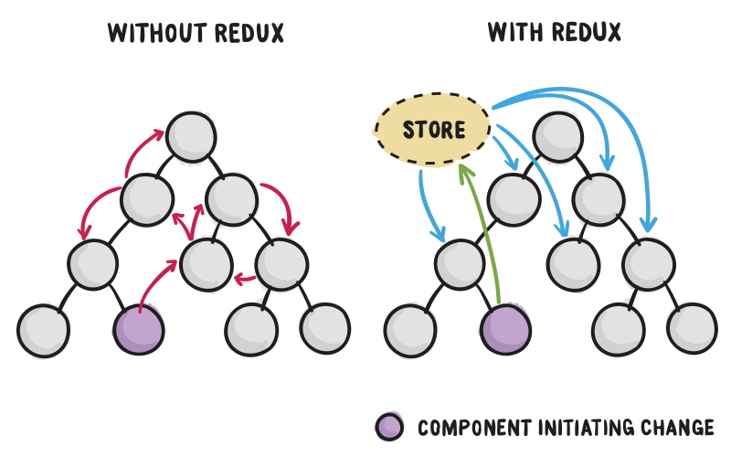
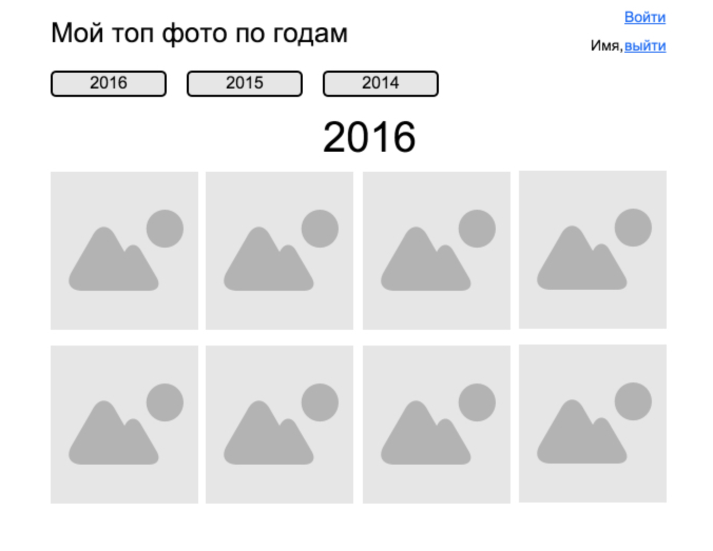

# React l.03

## Современный web

- модульность

- компиляция на лету

- исходные файлы минимилизированны и сжаты в один

- и много много всего...

### [webpack](https://webpack.js.org/)

- ставим **webpack**

```bash
npm init
npm i webpack webpack-dev-middleware webpack-hot-middleware --save-dev
```

- создаем **webpack.config.js**

```js
const webpack = require('webpack');

module.exports = {
    devtool: 'cheap-module-eval-source-map',
    context: __dirname,
    entry: [
        'react-hot-loader/patch',
        'webpack-hot-middleware/client?quiet=true',
        'babel-polyfill',
        './src/index'
    ],
    output: {
        path: __dirname,
        publicPath: '/static/',
        filename: 'bundle.js'
    },
    plugins: [
        new webpack.HotModuleReplacementPlugin(),
        new webpack.NoEmitOnErrorsPlugin()
    ],
    module: {
        rules: [
            {
                test: /\.js$/,
                loader: 'babel-loader',
                options: {
                    ignore: './node_modules/'
                }
            }
        ]
    }
};
```

### server + React + Hot Reload 

- установим **express**

```bash
npm i express react-hot-loader --save-dev
```

- создаем **server.js**

```js
const webpack = require('webpack'),
    webpackDevMiddleware = require('webpack-dev-middleware'),
    webpackHotMiddleware = require('webpack-hot-middleware'),
    conf = require('./webpack.config'),
    compiler = webpack(conf),
    app = new (require('express'))(),
    port = 3000;

app
    .use(
        webpackDevMiddleware(
            compiler,
            {
                noInfo: true,
                publicPath: conf.output.publicPath
            }
        ),
        webpackHotMiddleware(compiler)
    )
    .get(
        "*",
        (req, res) => res.sendFile(`${__dirname}/index.html`)
    )
    .listen(port, e => {
        if (e) return console.error(e);

        console.info(`==> 🌎 Listening on port ${port}. Open up http://localhost:${port}/ in your browser.`)
    });
```

- создаем **index.html**

```html
<!DOCTYPE html>
<html>
    <head>
        <title>Redux tutorial</title>
    </head>
    
    <body>
        <div id="root">
        </div>
        <script src="/static/bundle.js"></script>
    </body>
</html>
```

- запускаем

```js
...
"scripts": {
    "start": "node server.js"
}
...
```

```bash
npm start
```

### [babel](http://babeljs.io/)

- ставим **[babel](http://babeljs.io/)**

```bash
npm i babel-core babel-loader --save-dev
```

- ставим пресеты (предустановки)

```bash
// Для поддержки ES6/ES2015
npm install babel-preset-es2015 --save-dev
npm install babel-preset-env --save-dev

// Для поддержки JSX
npm install babel-preset-react --save-dev

// Для поддержки ES7
npm install babel-preset-stage-0 --save-dev

// Polyfill
npm install babel-polyfill --save

// Время сборки
npm install babel-runtime --save
npm install babel-plugin-transform-runtime --save-dev
```

- настройки для **babel**,  **.babelrc**

```json
{
    "presets": ["env", "stage-0", "react"],
    "plugins": ["transform-runtime", "react-hot-loader/babel"]
}
```

- создаем **src/index.js**

```bash
npm i react react-dom prop-types --save
```

```js
import React from 'react';
import { render } from 'react-dom';
import { AppContainer } from 'react-hot-loader';
import App from './containers/App';

const renderApp = AppRoutes => {
    render(
        <AppContainer>
            <AppRoutes />
        </AppContainer>,
        document.getElementById('root')
    );
};

renderApp(App);

if (module.hot) {
    module.hot.accept('./containers/App', () => {
        const newRoutes = require('./containers/App').default;

        renderApp(newRoutes);
    });
}
```

- создадим **containers/App.js**

```js
import React, { Component } from 'react';
import PropTypes from 'prop-types';

export default class App extends Component {
    render() {
        return <div>Привет из App</div>;
    }
}
```

### ESLint

- решает синтаксические ошибки

- повышает производительность

- единый стиль программирования

**Поехали!!!**

```bash
npm i babel-eslint eslint eslint-plugin-react --save-dev
```

- задаём правила **.eslintrc**

```json
{
    "extends": "eslint:recommended",
    "parser": "babel-eslint",
    "env": {
        "browser": true,
        "node": true
    },
    "plugins": [
        "react"
    ],
    "rules": {
        "no-debugger": 0,
        "no-console": 0,
        "new-cap": 0,
        "strict": 0,
        "no-underscore-dangle": 0,
        "no-use-before-define": 0,
        "eol-last": 0,
        "quotes": [2, "single"],
        "jsx-quotes": [1, "prefer-single"],
        "react/jsx-no-undef": 1,
        "react/jsx-uses-react": 1,
        "react/jsx-uses-vars": 1
    }
}
```

**0** - правило выключено

**1** - правило выдаст предупреждение

**2** - правило выдаст ошибку

**[Все правила](https://www.npmjs.com/package/eslint-plugin-react)**

- ставим нужный лоадер

```bash
npm i eslint-loader --save-dev
```

- обновляем конфиг

```js
const webpack = require('webpack');

module.exports = {
    devtool: 'cheap-module-eval-source-map',
    context: __dirname,
    entry: [
        'react-hot-loader/patch',
        'webpack-hot-middleware/client?quiet=true',
        'babel-polyfill',
        './src/index'
    ],
    output: {
        path: __dirname,
        publicPath: '/static/',
        filename: 'bundle.js'
    },
    plugins: [
        new webpack.HotModuleReplacementPlugin(),
        new webpack.NoEmitOnErrorsPlugin()
    ],
    module: {
        rules: [
            {
                test: /\.js$/,
                loader: 'babel-loader',
                options: {
                    ignore: './node_modules/',
                    plugins: ['transform-runtime']
                }
            },
            {
                test: /\.js$/,
                enforce: 'pre',
                loader: 'eslint-loader',
                options: {
                    ignore: './node_modules/'
                }
            }
        ]
    }
};
```

### React dev tools

- **$0**

- **$r**

## Основы Redux

**Инструмент управления**

— состоянием данных

- состоянием интерфейса

**Redux приложение это**

- состояние (**state**) приложения в одном месте

- однонаправленный поток данных(**data flow**)

    - все данные в приложении следуют одному паттерну жизненного цикла

    - логика приложения более предсказуемая и легкая для понимания
    
    - способствует большей упорядоченности данных (**data normalization**)
    
    - нет изолированным копиям одних и тех же данных, которые ничего не знают друг о друге.



## ТЗ

**Создать одностраничное приложение**

- логин

    - получить фото

    - отрисовать кнопки по годам

        - показать фото соответсвующее году



### Структура проекта

```
+-- src/
|   +-- actions/
|   +-- components/
|   +-- constants/
|   +-- containers/
|   +-- reducers/
|   +-- store/
|   +-- index.js
+-- index.html
+-- package.json
+-- server.js
+-- webpack.config.js
```

### Архитектура приложения

**Дизайн**

- в шапке

    - слева заголовок и кнопки по годам

    - справа ссылка войти/выйти

- ниже

    - фото соответствующего года

    - отсортированное по количеству лайков(дате добавления, имени и тд)


**Пример данных**

- **state**

```
app: {
    page: {
        year: 2016,
        photos: [photo, photo, photo...]
    },
    user: {
        name: 'Имя',
        ...
    }
}
```

- **store**, объединяет действия (**actions**) и редьюсер (**reducer**)

    - **getState()** - позволяет получить состояние приложения
    
    - **dispatch(actions)** - позволяет обновлять состояния, путем вызова действия
    
    - **subcribe(listener)** - регистрирует слушателей

## Actions

- простой объект

- **type**, обязательное поле

- **payload**, данные

**Note:** [Flux соглашение](https://github.com/acdlite/flux-standard-action)

- создадим **action**

```
{
    type: 'ЗАГРУЗИ_ФОТО',
    payload: 2016
}
```

```
{
    type: 'ФОТО_ЗАГРУЖЕНЫ_УСПЕШНО',
    payload: [массив фото]
}
```

- вызвать **action**, **ActionsCreator** (создатель действия)

```js
const GET_PHOTO_REQUEST = 'GET_PHOTO_REQUEST';
const GET_PHOTO_SUCCESS = 'GET_PHOTO_SUCCESS';
```

```js
function getPhotos(year) {
  return {
    type: GET_PHOTO_REQUEST,
    payload: year
  }
}

//Эй, приложение что-то произошло в 2015! И я знаю, что именно!
getPhotos(2015);
```

**Note:** обычно тип действия, описывают как константу

## [Reducer](https://redux.js.org/docs/basics/Reducers.html)

**Actions**

- описывает факт, что что-то произошло

**Reducers**

- как состояние приложения должно измениться в ответ


```
pageActions: Пришло 123 фото
Reducer (page): Ок, нужно положить эти 123 фото в page.photos
```

```js
function page(state = initialState, action) {
    switch (action.type) {
        case GET_PHOTO_SUCCESS:
            return { ...state, photos: action.payload }
        default:
            return state
        }
    }
```

**Note:** в редьюсере, всегда должны возвращать новый объект, а не измененный предыдущий

```
<Page photos={reducerPage.photos} />
```

```
this.props.photo
```

## Точка входа

- установим **redux**, **react-redux**

```bash
npm i redux react-redux --save
```

- **src/index.js**

```js
import 'babel-polyfill';
import React from 'react';
import { render } from 'react-dom';
import { Provider } from 'react-redux';
import App from './containers/App';
import configureStore from './store/configureStore'
import { AppContainer } from 'react-hot-loader';

const store = configureStore(),
    renderApp = AppMain => {
        render(
            <AppContainer>
                <Provider store={store}>
                    <AppMain />
                </Provider>
            </AppContainer>,
            document.getElementById('root')
        );
    };

renderApp(App);

if (module.hot) {
    module.hot.accept('./containers/App', () => {
        const newAppMain = require('./containers/App').default;

        renderApp(newAppMain);
    });
}
```

* **[Provider](https://github.com/reactjs/react-redux/blob/master/docs/api.md#provider-store)**

## Настройка Store

- **Store** хранит состояние приложения. Единственный путь изменить store - это отправить действие (dispatch action).

- **Store** - это простой обьект:
    - **getState()**
    
    - **dispatch(action)**
    
    - **subscribe(listener)**
    
    - **replaceReducer(nextReducer)**

- создадим **src/store/configureStore.js**

```js
import { createStore } from 'redux';
import rootReducer from '../reducers';

export default function configureStore(initialState) {
    const store = createStore(rootReducer, initialState);
    
    if (module.hot) {
        module.hot.accept('../reducers', () => {
            const nextRootReducer = require('../reducers');
            
            store.replaceReducer(nextRootReducer);
        });
    }
    
    return store;
}
```

- [createStore](https://redux.js.org/docs/api/createStore.html)

    - анонимная функцию в качестве редьюсера

    - объект в качестве начального состояния

## Создание Reducer

- создадим **src/reducers/index.js**

```js
const initialState = {
  user: 'Unknown User'
};

export default function userState(state = initialState) {
  return state;
}
```

## Связывание данных

- подключаем **connect** в **src/containers/App.js**

```js
import React, { Component } from 'react';
import { connect } from 'react-redux'

class App extends Component {
    render() {
        return <div>Привет из App,  { this.props.user }!!!</div>;
    }
}


function mapStateToProps (state) {
    return {
        user: state.user
    }
}

export default connect(mapStateToProps)(App);
```

**Note:** подключили **React** компонент к **Redux store**

- проверим **src/reducers/index.js**

```js
const initialState = {
    name: 'Redux',
    surname: 'Reactovich',
    age: 273
};

export default function userState(state = initialState) {
    return state;
}
```

- обновим **src/containers/App.js**

```js
import React, { Component } from 'react';
import { connect } from 'react-redux'

class App extends Component {
    render() {
        const { name, surname, age } = this.props.user;

        return <div>
            <p>Привет из App, {name} {surname}!</p>
            <p>Тебе уже {age} ?</p>
        </div>
    }
}

function mapStateToProps (state) {
    return {
        user: state
    }
}

export default connect(mapStateToProps)(App);
```

## Заключение

- что применяется в современном web

- основы Redux

- actions

- reducers

## ДЗ

Самостоятельно сделать шаблон приложения:

- используя семантику 

- добавить стили и классы(BEM) используя SASS(добавить [sass-loader](https://github.com/webpack-contrib/sass-loader) в webpack.config)

- изучить [reducer](https://redux.js.org/docs/basics/Reducers.html), [Provider](https://github.com/reactjs/react-redux/blob/master/docs/api.md#provider-store), [createStore](https://redux.js.org/docs/api/createStore.html)

- **must have [redux getting started](https://egghead.io/courses/getting-started-with-redux)**

## Справочники

- [webpack](https://webpack.js.org/)

- [Screencast webpack](https://learn.javascript.ru/screencast/webpack)

- [babel](http://babeljs.io/)

- [esLint](https://eslint.org/)

- [esLint plugin](https://www.npmjs.com/package/eslint-plugin-react)

- [redux](https://redux.js.org/index.html)

- [Flux соглашение](https://github.com/acdlite/flux-standard-action)

- [reducer](https://redux.js.org/docs/basics/Reducers.html)

- [Object spread syntax](https://github.com/tc39/proposal-object-rest-spread)

- [Provider](https://github.com/reactjs/react-redux/blob/master/docs/api.md#provider-store)

- [createStore](https://redux.js.org/docs/api/createStore.html)

- [redux getting started](https://egghead.io/courses/getting-started-with-redux)