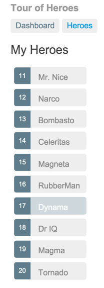

# Lection l.22

## Angular p.01

## Курс молодого бойца или [TypeScripts](http://www.typescriptlang.org/)

>**TypeScript** — язык программирования, представленный **Microsoft** в 2012 году и позиционируемый как средство разработки веб-приложений, расширяющее возможности **JavaScript** [@Wiki](https://ru.wikipedia.org/wiki/TypeScripts)

**Что за зверь TypeScript?**

- является обратно совместимым с **JS**

- отличается от **JS**

    - явное статическогое назначение типов
    
    - поддержка использования полноценных классов (как в традиционных объектно-ориентированных языках)
     
    - поддержка подключения модулей
        
        - повысит скорость разработки
         
        - облегчит читаемость
         
        - рефакторинг
        
        - повторное использования кода

        - помочь осуществлять поиск ошибок на этапе разработки и компиляции
        
        - ускорит выполнение программ

### Строгая типизация

- позволяет более полно описывать свойства и методы обьектов и классов

    - проверка всех, входящих в метод или функцию, аргументов
    
```js
function checkAllMyArgsAgain(check, me, please) {
    if(check && me && please) {
        if(check instanceof CheckObject){
            console.log('Урааааа!');
        } else {
            console.log('И снова исключение...')
        }
        
        if(me){ } // И так далее.......
    }
}
```

Вариант с **TypeScript**

```typescript
function checkAllMyArgsAgain(check: CheckObject, me: MeObject, please: string): string {
    return 'Какая проверка аргументов? Вы о чем? ';
}
```

### Читабельность кода

```js
function checkMe(check, me) {
     if(check && me) {
         if(check){ ... }
         if(me){ ... }
     }
}

function andCheckMe(check, me) {
     if(check && me) {
         if(check){ ... }
         if(me){ ... }
     }
}

function andCheckMeToo(check, me) {
     if(check && me) {
         if(check){ ... }
         if(me){ ... }
     }
}
```

**vs**

```typescript
function checkMe(check: CheckObject, me: MeObject) {
     console.log('Ну круто же!');
}

function andCheckMe(check: CheckObject, me: MeObject) {
     console.log('Просто песня');
}

function andCheckMeToo(check: CheckObject, me: MeObject) {
     console.log('Писать легко и с удовольствием');
}
```

### Минусы TypeScript

- строгая типизация

    - ошалел что-ли жто же было плюсом!

- компилятор

- debug

- а вдруг помрет?

#### Строгая типизация

**Этот пункт работает как во благо, так и во вред, потому что необходимо описывать**

- все типы для всех обьектов

- классов, переменных, и иже с ними

- куда большее зло

    - миграция существующих популярных **JS** решений на **TS**

        - для портированной либы необходимо описать `.d.ts`

            - хранятся все возвращаемые типы и описание всех методов

**Note:** уверен, что портирование таких монстров, как **jQuery**, потребовало немало усилий

#### Компилятор

**Он существенно уменьшает вероятность "тупой" ошибки**

- типа пропущенных запятых

- неправильно написанных имен переменных

**Убивается вся прелесть JS**

- когда большую часть решений можно было написать

    - на коленках

    - проверить в консоли браузера

**Время от времени, придется обновлять и сам компилятор**

- язык развивается, рано или поздно, появится необходимость

    - обновить существующую версию компилятора

    - возможно, и самого кода

#### Debug

- наладить в **TypeScript**

    - придется немного попотеть

#### А вдруг помрет?

**Это интересный и серьёзный вопрос**

**Cтандарты JS идут в ногу со временем и интегрируют в язык многое, что было TS**

- классы

- стрелочные функции

- и тд

**Немного лирики**

Рано или поздно, все полезные функции **TS** будут

- перенесены в стандарт языка

    - **TS** повесит плавки на гвоздь

**Или**

Вдруг ребята из **Microsoft** решат, что им это не нужно и полностью оставят **TS** на волю **open-source**?

- являясь открытым продуктом, **TS** не лишиться поддержки совсем

    - всегда найдутся энтузиасты

- **Microsoft**, как основного разработчика, многие относят к минусу, потому как репутация у гиганта весьма спорная:

    - **Skype**, **Nokia**, **Windows Phone**, **Windows Vista**, и тд

### TypeScript

- установка

```js
npm i -g typescript
```

- **greeter.ts**

```typescript
const user = "Jane User";

document.body.innerHTML = greeter(user);

function greeter(person) {
    return `Hello, ${person}`;
}
```

- компиляция

```
tsc greeter.ts
```


- обновим **greeter.ts**

```typescript
const user = "Jane User";

document.body.innerHTML = greeter(user);

function greeter(person: string) {
    return `Hello, ${person}`;
}
```

- попробуем **greeter.ts**

```typescript
const user = [1, 2, 3];

...
```

#### Типы данных

- **Boolean**

    - логическое значение true или false

```js
let isAlive: boolean = false;
```

- **Number**

    - числовое значение

```js
let decimal: number = 6;
let hex: number = 0xf00d;
let binary: number = 0b1010;
let octal: number = 0o744;
```

- **String**

    - строки

```js
let firstName: string = "Alec";
```

- **Array**

    - массивы

```js
let list: number[] = [10, 20, 30];
let colors: string[] = ["red", "green", "blue"];

// or
let names: Array<string> = ["Alec", "Bob", "Alice"];
```

- **Tuple(кортежи)**

    - набор элементов, для которых уже заранее известен тип

```js
// определение кортежа - кортеж состоит из двух элементов - строки и числа
let userInfo: [string, number];
// инициализация кортежа
userInfo = ["Alec", 28];
// Неправильная инициализация - переданные значения не соответствуют типам по позиции
//userInfo = [28, "Alec"]; // Ошибка

// использование кортежа
console.log(userInfo[1]); // 28
userInfo[1] = 37;
```

- **Enum(перечисления)**

    - описание набора числовых данных с помощью строковых констант

```js
enum Season { Winter, Spring, Summer, Autumn };

let current: Season = Season.Summer;

console.log(current);// 2
current = Season.Autumn; // изменение значения

//по умолчанию
enum Season { Winter=0, Spring=1, Summer=2, Autumn=3 };

// переопределение
enum Season { Winter=5, Spring, Summer, Autumn };           // 5, 6, 7, 8
enum Season { Winter=4, Spring=8, Summer=16, Autumn=32 };   // 4, 8, 16, 32

// получить текстовое значение
enum Season { Winter=0, Spring=1, Summer=2, Autumn=3 };
let current: string = Season[2];    // 2 - числовое значение Summer
console.log(current);   // Summer
```

- **Any**

    - произвольный тип

```js
let someVar: any = "hello";
console.log(someVar);   // сейчас someVar - это string

someVar = 20;
console.log(someVar);   // сейчас someVar - это number

let someArray: any[] = [ 24, "Alec", false]; // для массивов
```

- **Null**/**undefined**

    - соответствуют значениям **null** и **undefined**

```js
let a: undefined = undefined;
let b: null = null;
```

```js
let x: number = undefined;
console.log(x);
x = null;
console.log(x);
x = 5;
console.log(x);
```

- **Void**

    - отсутствие конкретного значения, используется в основном в качестве возвращаемого типа функций

```js
function add(a: number, b: number): number {
    return a + b;
}

let result1 = add(1, 2);
```

```js
function add(a: number, b: number): void {
    console.log(a + b);
}

add(10, 20);
```

- **Never**

    - также представляет отсутствие значения и используется в качестве возвращаемого типа функций, которые генерируют или возвращают ошибку

#### Class

- **class**,  обновим **greeter.ts**

```
class User {
    id: number;
    name: string;
    getInfo(): string {
        return `id: ${this.id} name: ${this.name}`;
    }
}

let alec: User = new User();

alec.id = 1;
alec.name = "Alec";
console.log(alec.getInfo());

let alice: User = new User();

alice.id = 2;
alice.name = "Alice";
console.log(alice.getInfo());
```

- **constructor**

```js
class User {

    id: number;
    name: string;
    constructor(userId: number, userName: string) {
        this.id = userId;
        this.name = userName;
    }
    getInfo(): string {
        return `id: ${this.id} name: ${this.name}`;
    }
}

let alec: User = new User(1, "Alec");
console.log(alec.getInfo());
alec.id = 4;

let alice: User = new User(2, "Alice");
console.log(alice.getInfo());
```

- **статические свойства и функции**

```js
class User {
    static PI: number = 3.14;
    id: number;
    name: string;
    constructor(userId: number, userName: string) {
        this.id = userId;
        this.name = userName;
    }
    getInfo(): string {
        return `id: ${this.id} name: ${this.name}`;
    }
}
```

#### Модификаторы доступа

- **public**

```js
class User {
    name: string;
    year: number;
}
```

**same**

```js
class User {
    public name: string;
    public year: number;
}
```

- **private**

```js
class User {
    private name: string;
    private year: number;

    constructor(name: string, age: number) {
        this._name = name;
        this._year = this.setYear(age);
    }
}
```

- **protected**

    - можно обратиться из классов-наследников

```js
class User {
    private name: string;
    protected age: number;

    constructor(name: string, age: number) {
        this.name = name;
        this.age = age;
    }

    public displayInfo(): void {
        console.log(`name: ${this.name} age: ${this.age}`);
    }
}

class Employee extends User {
    private company: string;

    constructor(name: string, age: number, company: string) {
        super(name, age);
        this.company = company;
    }

    public showData(): void {
        console.log(`Age: ${this.age}`);
        //console.log(`Name:  ${this.name}`); // не работает, так как name - private
    }
}
```

#### Методы доступа

```js
class User {
    private _name: string;

    public get name(): string {
        return this._name;
    }

    public set name(n: string) {
        this._name = n;
    }
}

let alec = new User();
alec.name = "Alec";   // срабатывает set-метод
console.log(alec.name);  // срабатывает get-метод
```

#### Свойства только для чтения

- **readonly**

```js
class User {
    readonly id: number;
    name: string;
    constructor(userId: number, userName: string) {
        this.id = userId;
        this.name = userName;
    }
}

let alec: User = new User(2, "Alec");
console.log(alec.id, alec.name);
```

**Note:** установить значение только в конструкторе класса

#### Определение свойств через конструктор

```js
class User {
    constructor(private name: string, protected age: number) {}

    public displayInfo(): void {
        console.log(`name: ${this.name} age: ${this.age}`);
    }
}
```

#### Interface

- определяет свойства и методы, которые объект должен реализовать

```typescript
interface IUser {
    id: number;
    name: string;
}

let employee: IUser = {
    id: 1,
    name: "Alec"
}
```

- параметры методов и функций также могут представлять интерфейс

```js
interface IUser {
    id: number;
    name: string;
}

let employee: IUser = {
    id: 1,
    name: "Alice"
}

function getEmployeeInfo(user: IUser): void {
    console.log(user.id, user.name);
}

getEmployeeInfo(employee);
```

-  можно возвращать объекты интерфейса

```js
interface IUser {
    id: number;
    name: string;
}

function buildUser(userId: number, userName: string): IUser {
    return { id: userId, name: userName };
}

let newUser = buildUser(2, "Bill");
```

#### Build Tools

- **webpack**

```
npm init & npm i --save-dev webpack awesome-typescript-loader source-map-loader
```

- **webpack.config.js**

```js
module.exports = {
    entry: "./src/index.ts",
    output: {
        filename: "./dist/bundle.js",
    },

    // Enable sourcemaps for debugging webpack's output.
    devtool: "source-map",

    resolve: {
        // Add '.ts' and '.tsx' as resolvable extensions.
        extensions: ["", ".webpack.js", ".web.js", ".ts", ".tsx", ".js"]
    },

    module: {
        loaders: [
            // All files with a '.ts' or '.tsx' extension will be handled by 'awesome-typescript-loader'.
            { test: /\.tsx?$/, loader: "awesome-typescript-loader" }
        ],

        preLoaders: [
            // All output '.js' files will have any sourcemaps re-processed by 'source-map-loader'.
            { test: /\.js$/, loader: "source-map-loader" }
        ]
    },

    // Other options...
};
```

### Причем тут TypeScript тема то про Angular!

## QuickStart

- [Angular Dev Tools for Chrome](https://chrome.google.com/webstore/detail/angularjs-batarang/ighdmehidhipcmcojjgiloacoafjmpfk/related)

- **node JS & npm** - печально если еще до сих пор нет ;(

- **[angular-cli](https://github.com/angular/angular-cli)**

```
npm install -g @angular/cli
```

- создаем новый проект, с коробки

```
ng new my-app
```

- запускаем сервер

```
cd my-app
ng serve -o
```

## Angular component

**CLI** уже сделало **Angular** component, и это root component **app-root**

- **src/app/app.component.ts**

```angularjs
export class AppComponent {
  title = 'My First Angular App';
}
```

- **src/app/app.component.css**

```css
h1 {
  color: #369;
  font-family: Arial, Helvetica, sans-serif;
  font-size: 250%;
}
```

## Структура src

- все компоненты, шаблоны, стили, изображения и все остальное

- файлы вне этой папки предназначены для поддержки, создания приложения

Файл | Назначение
--- | ---
`app/app.component.{ts,html,css,spec.ts}` | Определяет **AppComponent** вместе с шаблоном HTML, таблицей стилей CSS и Unit тестами, корневой компонент
`app/app.module.ts` | Определяет **AppModule**, корневой модуль, который сообщает **Angular**, как собирать приложение
`assets/*` | Папка, для изображения и всего остального, что нужно скопировать, когда вы создается приложение
`environments/*` | Переменные конфигурации для разной среды выполнения **development**, **production**
`favicon.ico` | Тут все очевидно
`index.html` | Тут все очевидно
`main.ts` | Главная точка входа приложения
`polyfills.ts` | Тут все очевидно
`styles.css` | Глобальные стили
`test.ts` | Главная точка входа для Unit тестов
`tsconfig.{app|spec}.json` | **TypeScript** конфигурация для **Angular** app (**tsconfig.app.json**) и для  **Unit** тестов (**tsconfig.spec.json**).

## Структура root

**Файлы помогают**

- создавать

- тестировать

- обслуживать

- документировать

- развертывать приложение

Файл | Назначение
--- | ---
`e2e/` | **end-to-end** тесты, они не должны быть внутри `src/`, потому что тесты **e2e** - это действительно отдельное приложение, которое просто так проверяет ваше основное приложение. Вот почему у них есть свой собственный **tsconfig.e2e.json**
`node_modules/` | Тут все очевидно
`.angular-cli.json` | Конфигурация для **Angular CLI**
`.editorconfig` | Настройка для редактора ([editor config](http://editorconfig.org))
`.gitignore` | Тут все очевидно
`.karma.conf.js` | **Unit** тест конфигурация, запуск `ng test`
`package.json` | Тут все очевидно
`protractor.conf.js` | **End-to-end** тест конфигурация [Protractor](http://www.protractortest.org/#/), запуск `ng e2e`
`README.md` | Базовая документация
`tsconfig.json` | Конфигурация **TypeScript** для **IDE**
`tslint.json` | Конфигурация для линтера [TSLint](https://palantir.github.io/tslint/) вместе с [Codelyzer](http://codelyzer.com/), используемая, запуск `ng lint`. Помогает поддерживать стиль кода

## Основы Angular

**Как?**

- напишем небольшое приложение

**Что узнаем?**

- как использовать встроенные директивы **Angular**

- научимся создавть **Angular** компоненты

- использовать одностороннюю привязку данных только для чтения

- обновлять модели с двух сторонней привязкой

- узнаем что такое привязка в конце-концов :)

- привязывать методы к пользовательским событиям

- форматировать данные используя **pipes**

- использовать **routing** для навигации между различными видами и их компонентами

## Что будем строить?

### Tutorial: Tour of Heroes

**Dashboard view**


- две ссылки над списком героев ("Dashboard", "Heroes")

    - "Dashboard view"(активная)

    - "Heroes view"

**Hero Details view**


- при выборе героя открывается "Hero Details view"

    - можем изменить имя героя

    - "back" возвращает на "Dashboard view"

**Heroes view**



- при выборе героя

    - отображается информация о герое(read only)

    - кнопка "View Details"

        - ведет на "Hero Details view" для выбранного героя

**Tour of Heroes view**


**"Tour of Heroes" в действии**


## Подготовка среды разработки

- если не установлено, то установить **Angular CLI**

```
npm i -g @angular/cli
```

- создаем новое приложение ([angular-cli документация](https://github.com/angular/angular-cli/wiki))

```
ng new angular-tour-of-heroes
```

- запуск приложения

```
cd angular-tour-of-heroes
// собираем приложение и запускаем сервер
ng serve --open
```

### Angular компоненты

- **src/app/app.component.ts**, свойство класса

```angularjs
...

title = 'Tour of Heroes';

...
```

- **src/app/app.component.html**, шаблон

```angularjs
...

<h1>{{title}}</h1>

...
```

### Редактируем стили

- **src/styles.css**

```css
/* Application-wide Styles */
h1 {
  color: #369;
  font-family: Arial, Helvetica, sans-serif;
  font-size: 250%;
}
h2, h3 {
  color: #444;
  font-family: Arial, Helvetica, sans-serif;
  font-weight: lighter;
}
body {
  margin: 2em;
}
body, input[text], button {
  color: #888;
  font-family: Cambria, Georgia;
}
/* everywhere else */
* {
  font-family: Arial, Helvetica, sans-serif;
}
```

## Заключение

- TypeScript

- Angular

- Angular компоненты

## ДЗ

**null**

## Справочники

- [TypeScripts](https://ru.wikipedia.org/wiki/TypeScripts)

- [TypeScripts official](http://www.typescriptlang.org/)

- [Editor config](http://editorconfig.org)

- [Protractor](http://www.protractortest.org/#/)

- [TSLint](https://palantir.github.io/tslint/)

- [Codelyzer](http://codelyzer.com/)

- [Angular Dev Tools for Chrome](https://chrome.google.com/webstore/detail/angularjs-batarang/ighdmehidhipcmcojjgiloacoafjmpfk/related)