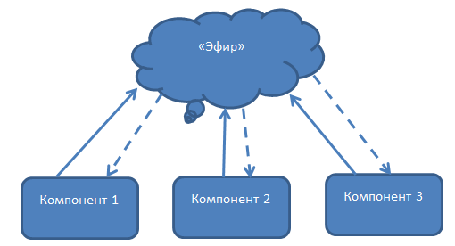
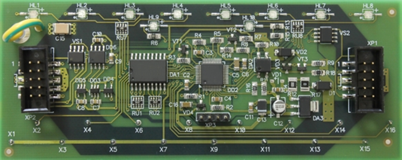

# Lection 24

## Основы TypeScript

### Преобразование типов

**Пример**

```angularjs
class User {
    name: string;

    constructor(userName: string) {
        this.name = userName;
    }
}

class Employee extends User {
    company: string;

    constructor(employeeCompany: string, userName: string) {
        super(userName);
        this.company = employeeCompany;
    }
}

// от призводного типа Employee к базовому типу User
function getUserName(user: User): string {
    return user.name;
}

function userFactory(name: string): User {
    return new Employee("не установлено", name);
}

let alice: Employee = new Employee("Microsoft", "Alice");
let userName = getUserName(alice);
console.log(userName);  // Alice

let tom = userFactory("Tom");
userName = getUserName(tom);
console.log(userName);  // Tom
```

**Тут вроде все ясно?**

```angularjs
let alice: User = new Employee("Microsoft", "Alice");
console.log(alice.company);
```


```angularjs
let alice: User = new Employee("Microsoft", "Alice");

let aliceEmployee: Employee = <Employee>alice; // преобразование к типу Employee
console.log(aliceEmployee.company);

// или так
console.log((<Employee>alice).company);
```

**А интерфейсы?**

```angularjs
interface IUser {
    name: string;
}
class User {
    name: string;
    constructor(userName: string) {
        this.name = userName;
    }
}
class Employee extends User {
    company: string;
    constructor(employeeCompany: string, userName: string) {
        super(userName);
        this.company = employeeCompany;
    }
}

function getUserName(user: IUser): string {
    return user.name;
}

let alice: User = new Employee("Microsoft", "Alice");
console.log(getUserName(alice));

console.log(getUserName({ name: "Tom" }));
console.log(getUserName({ name: "Bob", company:"Microsoft" }));
```

- как решить проблему?

- **instanceOf**

### Обобщения

**TypeScript является строго типизированным языком?**

- не можем использовать результат функции как объект того типа, который передан в функцию

```angularjs
function getId(id: any): any {
    return id;
}

let result = getId(5);
console.log(result);
```

- типизирована определенным типом T

    - при выполнении функции вместо Т будет подставляться конкретный тип

        - на этапе компиляции конкретный тип не известен

```angularjs
function getId<T>(id: T): T {
    return id;
}
```

```angularjs
function getId<T>(id: T): T {

    return id;
}

let result1 = getId<number>(5);
console.log(result1);
let result2 = getId<string>("abc");
console.log(result2);
```

- обобщенные массивы

```angularjs
function getString<T>(arg: Array<T>): string {
    let result = "";
    for (let i = 0; i < arg.length; i++) {
        if (i > 0)
            result += ",";
        result += arg[i].toString();
    }
    console.log(result);
    return result;
}

let result = getString<number>( [1, 2, 34, 5]);
console.log(result);
```

### Обобщенные классы и интерфейсы

```angularjs
class User<T> {
    private _id: T;
    constructor(id:T) {
        this._id=id;
    }
    getId(): T {

        return this._id;
    }
}

let tom = new User<number>(3);
console.log(tom.getId()); // возвращает number

let alice = new User<string>("vsf");
console.log(alice.getId()); // возвращает string

```

## Страница героя

## Angular [event-binding](https://next.angular.io/guide/template-syntax#event-binding)

- **src/app/heroes/heroes.component.html**

```angularjs
...

// onSelect() метод HeroesComponent
<li *ngFor="let hero of heroes" (click)="onSelect(hero)">

...
```

- **src/app/heroes/heroes.component.ts**

```angularjs
...

export class HeroesComponent implements OnInit {
  ...

  selectedHero: Hero;

  onSelect(hero: Hero): void {
    this.selectedHero = hero;
  }

  ...

}

```


- **src/app/heroes/heroes.component.html**

```angularjs
<h2>My Heroes</h2>
<ul class="heroes">
  <li *ngFor="let hero of heroes" (click)="onSelect(hero)">
    <span class="badge">{{hero.id}}</span> {{hero.name}}
  </li>
</ul>

<h2>{{selectedHero.name | uppercase}} Details</h2>
<div><span>id: </span>{{selectedHero.id}}</div>
<div>
  <label>
    name: <input [(ngModel)]="selectedHero.name" placeholder="name">
  </label>
</div>
```

- откроем консоль

- клик на любого героя из списка

**Почему так?**

- на начальном этапе `selectedHero === undefined`

## [NgIf](https://next.angular.io/api/common/NgIf)

**Как пофиксить?**

- показывать `selectedHero` только если он существует

**Решение**

- **src/app/heroes/heroes.component.html**

```angularjs
...

<div *ngIf="selectedHero">

  <h2>{{ selectedHero.name | uppercase }} Details</h2>
  <div><span>id: </span>{{selectedHero.id}}</div>
  <div>
    <label>name:
      <input [(ngModel)]="selectedHero.name" placeholder="name">
    </label>
  </div>

</div>
```

## Angular [class-binding](https://next.angular.io/guide/template-syntax#class-binding)

- выделим выбранного героя

    - класс `.selected`, стили были добавлены ранее

- **src/app/heroes/heroes.component.html**

```angularjs
...

<li *ngFor="let hero of heroes" [class.selected]="hero === selectedHero" (click)="onSelect(hero)">
  ...
</li>

...
```

## Заключение

**Правила хорошего тона!**

- reusable

- строго отвечают своему предназначению

**Что будем делать**

- разделим компонент

    - компонент списка героев

    - компонент описания героя

## Создание HeroDetailComponent

- создадим `hero-detail`

```
ng generate component hero-detail
```

- перенесём с **src/app/heroes/heroes.component.html** в **src/app/heroes/hero-detail.component.html**

```angularjs
<div *ngIf="hero">

  <h2>{{ hero.name | uppercase }} Details</h2>
  <div><span>id: </span>{{hero.id}}</div>
  <div>
    <label>name:
      <input [(ngModel)]="hero.name" placeholder="name"/>
    </label>
  </div>

</div>
```

*selectedHero -> hero

- **src/app/hero-detail/hero-detail.component.ts**

```angularjs
import { Component, OnInit, Input } from '@angular/core';
import { Hero } from '../hero';

@Component({
  selector: 'app-hero-detail',
  templateUrl: './hero-detail.component.html',
  styleUrls: ['./hero-detail.component.css']
})
export class HeroDetailComponent implements OnInit {
  @Input() hero: Hero;

  constructor() { }

  ngOnInit() {
  }

}

```

### [Свойства Input и Output](https://next.angular.io/guide/template-syntax#inputs-outputs)

## Отображение HeroDetailComponent

- **src/app/heroes/heroes.component.html**

```
...

<app-hero-detail [hero]="selectedHero"></app-hero-detail>
```

### [property-binding](https://next.angular.io/guide/template-syntax#property-binding)

## Services

**Что такое services?**

- специальные объекты или функции

    - выполняющие некоторые общие для всего приложения задачи

**Зачем?**

- компоненты не должны работать напрямую с датой

    - представлении данных

    - делегировании доступа к данным

**Что сделаем**

- создадим `HeroService` - все классы приложения имеют доступ к героям

    - будем использовать **[Angular dependency injection](https://next.angular.io/guide/dependency-injection)**

- создадим `MessageService` и добавим его в

    - `HeroService` - отправление сообщения

    - `MessagesComponent` - отображение сообщения

### [Angular dependency injection](https://next.angular.io/guide/dependency-injection)

## Создаем HeroService

- cервис `hero`

```
ng generate serice hero --module=app
```

- добавит `HeroService` в **dependency injection** системы прежде чем **Angular** сможет использовать его в `HeroesComponent`

    - **src/app/app.module.ts**

- **src/app/hero.service.ts**

```angularjs
import { Injectable } from '@angular/core';
import { Hero } from './hero';
import { HEROES } from './mock-heroes';

@Injectable({providedIn: 'root'})
export class HeroService {
  getHeroes(): Hero[] {
    return HEROES;
  }

  constructor() { }

}
```

*`HeroService` может получать дату отовсюду web service, local storage, или data source

### [Providers](https://next.angular.io/guide/providers)

## HeroesComponent

- **src/app/heroes/heroes.component.ts**

```angularjs
import { Component, OnInit } from '@angular/core';
import { Hero } from '../hero';
import { HeroService } from '../hero.service';

@Component({
  selector: 'app-heroes',
  templateUrl: './heroes.component.html',
  styleUrls: ['./heroes.component.css']
})
export class HeroesComponent implements OnInit {
  heroes: Hero[];

  selectedHero: Hero;

  onSelect(hero: Hero): void {
    this.selectedHero = hero;
  }

  constructor() { }

  ngOnInit() {
  }

}

```

- добавим `HeroService` в конструктор класса

    - параметр одновреммено определяет `private heroService` свойство и определяет его как  `HeroService` injection

    - при создании `HeroesComponent`, **Dependency Injection** устанавливает `heroService` как одиночный экземпляр `HeroService`

```angularjs
...

constructor(private heroService: HeroService) { }

...
```

- создадим функцию для получения героев из сервиса

```angularjs
...

getHeroes(): void {
  this.heroes = this.heroService.getHeroes();
}

...
```

- вызовем её на `ngOnInit`

```
...

ngOnInit() {
  this.getHeroes();
}

...
```

## Observable data

**Что не так?**

- `HeroService.getHeroes()` получение данных идет синхронно

```js
this.heroes = this.heroService.getHeroes();
```

- не будет работать в реальном приложении

    - получение данных с сервера операция асинхронная

- `HeroService.getHeroes()` в реальности ждёт ответа от сервера

    - должен быть асинхронным


## [RxJS](http://reactivex.io/rxjs/)

**Способы "общения" компонентов**

Идея предельно простая и давно хорошо себя зарекомендовавшая.

- публикация и подписка на именованные события

    - один из компонентов посылает событие в "эфир"

    - остальные слушают этот "эфир" и ловят те сообщения, которые им нужны



**Плюсы**

- "бесплатно" получить слабое связывание компонентов

**Недостаток**

- при росте числа компонентов и соответственно числа событий становится сложно уследить

    - за именами событий

    - за тем, кому какие события нужны для правильной работы.

- появляются

    - пространства имен

    - имена событий из чего-то типа **Событие1** превращаются в **Состояние_приложения1.Компонент2.Событие1**.

- невозможно делать при такой организации

    - компоновать события.

**Пример**

Требование "сделай что-то когда событие Б возникнет после двух событий A" выливается в тонну локальных переменных, хранящих последние данные из событий и счетчики самих событий.

**Облегчают**

`promise` - позволяют организовать очередность событий и практически являются первым шагом в организации потоков данных


**Ещё способ**

- протянуть между ними "провода"

    - связанны только те компоненты, которым есть что "сказать"



- каждый компонент соединен с другими, "потоками", по которым передается сигнал

- какие данные нужны компоненту для работы

    - от каких компонентов приходят потоки

    - как преобразуются данные по пути

- именовать события при такой организации не нужно

    - в имени нуждается поток, который несет данные

- задача компоновки событий сводится к компоновке содержащих их потоков

**Реализация потоков**

[RxJS](http://reactivex.io/rxjs/) - представляет собой модульную библиотеку, позволяющую создавать и компоновать потоки данных.

**Для общего развития**

> Подход, используемый в **Rx**, появился в **.NET** и оттуда был портирован во многие популярные языки.

**Ключевые понятия**

- создаваемые в **Rx** потоки реализуют паттерн **Observable** и наследуются от одноименного интерфейса

    - каждый поток можно "слушать"

        - при помощи метода **subscribe**, который принимает в качестве аргумента **Observer**

```js
observableStream.subscribe(someObserver);
```

- в самом простом случае **Observer** это функция, которая принимает единственный аргумент – переданное сообщение из потока

```js
function someObserver(streamEvent) {
    console.log('Received ' + streamEvent);
}
```

**Преимущества**

Все, что происходит в приложении, может быть представлено в виде потока данных:

- нажатия клавиш

- движения мыши

- данные с сервера

- сложное логическое что-то, которое случилось в одном из компонентов

Нет разницы откуда приходят события и что это за события, для компонента это просто потоки данных


## Observable HeroService

**Что будем использовать?**

- `Observable` один из ключевых классов **[RxJS](http://reactivex.io/rxjs/)**

- **./src/app/hero.service.ts**, сэмулируем  получение данных от сервера используя **RxJS** `Observable.of()`

```bash
npm install rxjs --save-dev
```

```js
import { Observable } from 'rxjs';

...

  getHeroes(): Observable<Hero[]> {
    return Observable.of(HEROES);
  }

...
```

- `of(HEROES)` возвращает `Observable<Hero[]>` - единственное значение список героев

## Subscribe в HeroesComponent

`HeroService.getHeroes` возвращал `Hero[]` сейчас `Observable<Hero[]>`

- **./src/app/heroes/heroes.component.ts**

```js
...

getHeroes(): void {
  this.heroService.getHeroes()
      .subscribe(heroes => this.heroes = heroes);
}

...
```

## Заключение

- отобразили список героев

- познакомились с event-binding

- ngFor

- ngIf

- class-binding


## ДЗ

**null**

[<< prev](../23.angular--02) | [next >>](../25.angular--04)

## Справочники

- [event-binding](https://next.angular.io/guide/template-syntax#event-binding)

- [class-binding](https://next.angular.io/guide/template-syntax#class-binding)

- [NgIf](https://next.angular.io/api/common/NgIf)

- [Свойства Input и Output](https://next.angular.io/guide/template-syntax#inputs-outputs)

- [property-binding](https://next.angular.io/guide/template-syntax#property-binding)

- [Angular dependency injection](https://next.angular.io/guide/dependency-injection)

- [RxJS](http://reactivex.io/rxjs/)

- [providers](https://next.angular.io/guide/providers)

- [RxJS](http://reactivex.io/rxjs/)