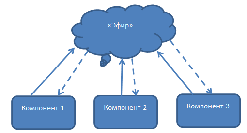
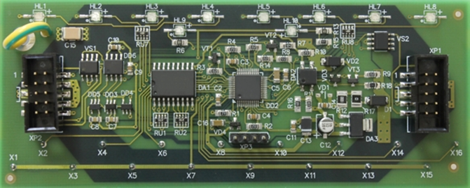
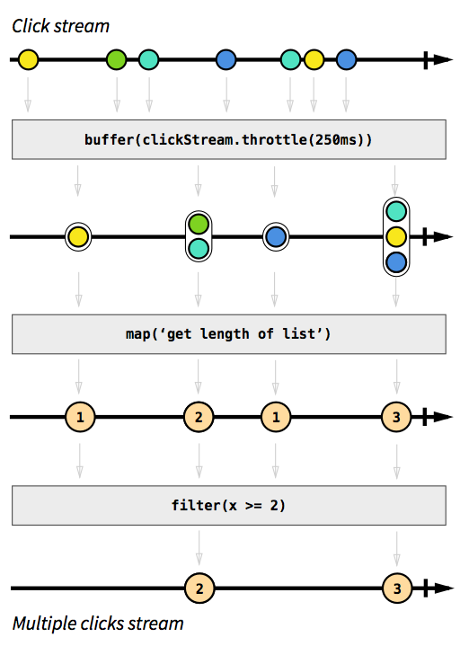

# Lection 25

## Список и детали героев

### Angular [event-binding](https://next.angular.io/guide/template-syntax#event-binding)

- **src/app/heroes/heroes.component.html**

```js
...

// onSelect() метод HeroesComponent
<li *ngFor="let hero of heroes" (click)="onSelect(hero)">

...
```

- **src/app/heroes/heroes.component.ts**

```js
...

export class HeroesComponent implements OnInit {
  ...

  selectedHero: Hero;

  onSelect(hero: Hero): void {
    this.selectedHero = hero;
  }

  ...

}

```

- **src/app/heroes/heroes.component.html**

```html
<h2>My Heroes</h2>
<ul class="heroes">
  <li *ngFor="let hero of heroes" (click)="onSelect(hero)">
    <span class="badge">{hero.id}</span> {hero.name}
  </li>
</ul>

<h2>{selectedHero.name | uppercase} Details</h2>
<div><span>id: </span>{selectedHero.id}</div>
<div>
  <label>
    name: <input [(ngModel)]="selectedHero.name" placeholder="name">
  </label>
</div>
```

- откроем консоль

- клик на любого героя из списка

**Почему так?**

- на начальном этапе `selectedHero === undefined`

### [NgIf](https://next.angular.io/api/common/NgIf)

**Как пофиксить?**

- показывать `selectedHero` только если он существует

**Решение**

- **src/app/heroes/heroes.component.html**

```html
...

<div *ngIf="selectedHero">

  <h2>{ selectedHero.name | uppercase } Details</h2>
  <div><span>id: </span>{selectedHero.id}</div>
  <div>
    <label>name:
      <input [(ngModel)]="selectedHero.name" placeholder="name">
    </label>
  </div>

</div>
```

### Angular [class-binding](https://next.angular.io/guide/template-syntax#class-binding)

- выделим выбранного героя

    - класс `.selected`, стили были добавлены ранее

- **src/app/heroes/heroes.component.html**

```html
...

<li *ngFor="let hero of heroes" [class.selected]="hero === selectedHero" (click)="onSelect(hero)">
  ...
</li>

...
```

## Создание HeroDetailComponent

**Что будем делать**

- разделим компонент

    - компонент списка героев

    - компонент описания героя

**Go go go!**

- создадим `hero-detail`

```bash
ng generate component hero-detail
```

- перенесём с **src/app/heroes/heroes.component.html** в **src/app/heroes/hero-detail.component.html**

```html
<div *ngIf="hero">

  <h2>{ hero.name | uppercase } Details</h2>
  <div><span>id: </span>{hero.id}</div>
  <div>
    <label>name:
      <input [(ngModel)]="hero.name" placeholder="name"/>
    </label>
  </div>

</div>
```

**Note:** selectedHero -> hero

- **src/app/hero-detail/hero-detail.component.ts**

```js
import { Component, OnInit, Input } from '@angular/core';
import { Hero } from '../hero';

@Component({
  selector: 'app-hero-detail',
  templateUrl: './hero-detail.component.html',
  styleUrls: ['./hero-detail.component.css']
})
export class HeroDetailComponent implements OnInit {
  @Input() hero: Hero;

  constructor() { }

  ngOnInit() {
  }

}
```

### [Свойства Input и Output](https://next.angular.io/guide/template-syntax#inputs-outputs)

## Отображение HeroDetailComponent

- **src/app/heroes/heroes.component.html**

```html
...

<app-hero-detail [hero]="selectedHero"></app-hero-detail>
```

### [property-binding](https://next.angular.io/guide/template-syntax#property-binding)

## Services

**Что такое services?**

- специальные объекты или функции

    - выполняющие некоторые общие для всего приложения задачи

**Зачем?**

Компоненты не должны работать напрямую с датой

- а что должны делать компоненты?

    - представление данных

    - делегирование доступа к данным

**Что будем делать?**

- создадим `HeroService`

    - все классы приложения имеют доступ к героям

    - будем использовать **[Angular dependency injection](https://next.angular.io/guide/dependency-injection)**

- создадим `MessageService`, добавим его в

    - `HeroService` - отправление сообщения

    - `MessagesComponent` - отображение сообщения

## Создаем HeroService

- cервис `hero`

```bash
ng generate serice hero --module=app
```

- добавит `HeroService` в **dependency injection** системы

    - прежде чем **Angular** сможет использовать его в `HeroesComponent`

        - **src/app/app.module.ts**

- **src/app/hero.service.ts**

```js
import { Injectable } from '@angular/core';
import { Hero } from './hero';
import { HEROES } from './mock-heroes';

@Injectable({providedIn: 'root'})
export class HeroService {
  getHeroes(): Hero[] {
    return HEROES;
  }

  constructor() { }

}
```

**Note:** `HeroService` может получать дату отовсюду web service, local storage, или data source

### [Providers](https://next.angular.io/guide/providers)

## HeroesComponent

- **src/app/heroes/heroes.component.ts**

```js
import { Component, OnInit } from '@angular/core';
import { Hero } from '../hero';
import { HeroService } from '../hero.service';

@Component({
  selector: 'app-heroes',
  templateUrl: './heroes.component.html',
  styleUrls: ['./heroes.component.css']
})
export class HeroesComponent implements OnInit {
  heroes: Hero[];

  selectedHero: Hero;

  onSelect(hero: Hero): void {
    this.selectedHero = hero;
  }

  constructor() { }

  ngOnInit() {
  }

}

```

- добавим `HeroService` в конструктор класса

    - параметр определяет

        - `private heroService` свойство

        - как внедрение `HeroService`

    - при создании `HeroesComponent`

        - **Dependency Injection** устанавливает `heroService` как одиночный экземпляр `HeroService`

```js
...

constructor(private heroService: HeroService) { }

...
```

- создадим функцию для получения героев из сервиса

```js
...

getHeroes(): void {
  this.heroes = this.heroService.getHeroes();
}

...
```

- вызовем её на `ngOnInit`

```js
...

ngOnInit() {
  this.getHeroes();
}

...
```

## Observable data

**Что не так?**

- `HeroService.getHeroes()` получение данных идет синхронно

```js
...

this.heroes = this.heroService.getHeroes();

...
```

- не будет работать в реальном приложении

    - получение данных с сервера операция асинхронная

- `HeroService.getHeroes()` в реальности ждёт ответа от сервера

    - должен быть асинхронным


## Что такое реактивное программирование, или [RxJS](http://reactivex.io/rxjs/)

**Способы "общения" компонентов**

Идея предельно простая и давно хорошо себя зарекомендовавшая

- публикация и подписка на именованные события

    - один из компонентов посылает событие в "эфир"

    - остальные слушают этот "эфир" и ловят те сообщения, которые им нужны



**Плюсы**

- "бесплатно" получить слабое связывание компонентов

**Недостаток**

- при росте числа компонентов и соответственно числа событий становится сложно уследить

    - за именами событий

    - за тем, кому какие события нужны для правильной работы

- появляются

    - пространства имен

    - имена событий из чего-то типа **Событие1** превращаются в **Состояние_приложения1.Компонент2.Событие1**.

- невозможно делать при такой организации

    - компоновать события

**Пример**

Требование "сделай что-то когда событие Б возникнет после двух событий A" выливается в тонну локальных переменных, хранящих последние данные из событий и счетчики самих событий

**Облегчают**

`promise` - позволяют организовать очередность событий и практически являются первым шагом в организации потоков данных

**Ещё способ**

- протянуть между ними "провода"

    - связанны только те компоненты, которым есть что "сказать"



- каждый компонент соединен с другими, "потоками", по которым передается сигнал

    - какие данные нужны компоненту для работы

        - от каких компонентов приходят потоки

        - как преобразуются данные по пути

- именовать события при такой организации не нужно

    - в имени нуждается поток, который несет данные

- задача компоновки событий сводится к компоновке содержащих их потоков

**Реализация потоков**

[RxJS](http://reactivex.io/rxjs/) - представляет собой модульную библиотеку, позволяющую создавать и компоновать потоки данных.

**Пример**

```js
class Observable {
    constructor(source) {
        this.source = source.split('');
        this.result = this.source;
    }

    subscribe(next) {
        for (let item of this.result) {
            next(item);
        }
    }

    filter(predicate) {
        this.result = this.result.filter(predicate);
        return this;
    }

    map(callback) {
        this.result = this.result.map(callback);
        return this;
    }
}

new Observable('Observable')
    .map(letter => letter.toUpperCase())
    .filter(letter === 'E')
    .subscribe(letter => console.log(letter));
```

```js
import { Observable } from 'rxjs';

new Observable('Observable')
      .map(letter => letter.toUpperCase())
      .filter(letter => letter === 'E')
      .subscribe(letter => console.log(letter));
```

**Для общего развития**

> Подход, используемый в **Rx**, появился в **.NET** и оттуда был портирован во многие популярные языки.

**Ключевые понятия**

- создаваемые в **Rx** потоки реализуют паттерн **Observable** и наследуются от одноименного интерфейса

    - каждый поток можно "слушать"

        - при помощи метода **subscribe**, который принимает в качестве аргумента **Observer**

- в самом простом случае **Observer** это функция, которая принимает единственный аргумент

    - переданное сообщение из потока


**Преимущества**

Все, что происходит в приложении, может быть представлено в виде потока данных:

- нажатия клавиш

- движения мыши

- данные с сервера

- сложное логическое что-то, которое случилось в одном из компонентов

Нет разницы откуда приходят события и что это за события, для компонента это просто потоки данных


Отличие между **Promise** и **Observable**

- **Observable** не совместим с **Promises/A+**

**Что ещё ?**

- **Promise** — это, по сути, **Observable** с одним генерируемым значением

- потоки в **Rx** расширяют промисы, позволяя возвращать множество значений **Promise++/A++**

> Реактивное программирование — это когда ты вместо обработки событий по одному объединяешь их в поток и затем работаешь уже только с ним

Поток — это последовательность событий, упорядоченная по времени. Он может выбрасывать три типа данных:

- значение (определенного типа)

- ошибку

- сигнал завершения

```
--a---b-c---d---X---|->

a, b, c, d - генерируемые значения
X - ошибка
| - сигнал завершения
---> - временная ось
```

**Задача**

Сделать поток счетчиков, который определяет, сколько раз кнопка была нажата 2 и более раза

**Решение**
```bash
npm install rxjs --save-dev
```

```html
<button #button>
    test
</button>
```

```js
import { Observable } from 'rxjs';

@ViewChild("button", {read: ElementRef})
button: ElementRef;

ngAfterViewInit(): void {
  const click$ = Observable.fromEvent(this.button.nativeElement, 'click');

  click$
    .buffer(click$.throttleTime(250))
    .map(a => a.length)
    .filter(x => x >= 2)
    .subscribe(e => console.log(e));
}
```



## Observable HeroService

**Что будем использовать?**

- `Observable` один из ключевых классов **[RxJS](http://reactivex.io/rxjs/)**

- **./src/app/hero.service.ts**, эмулируем получение данных от сервера используя **RxJS** `of()`

```js
import { Observable, of } from 'rxjs';

...

  getHeroes(): Observable<Hero[]> {
    return of(HEROES);
  }

...
```

- `of(HEROES)` возвращает `Observable<Hero[]>` - единственное значение список героев

## Subscribe в HeroesComponent

`HeroService.getHeroes` возвращал `Hero[]` сейчас `Observable<Hero[]>`

- **./src/app/heroes/heroes.component.ts**

```js
...

getHeroes(): void {
  this.heroService.getHeroes()
      .subscribe(heroes => this.heroes = heroes);
}

...
```

## Отображение сообщения

**Что надо сделать?**

Добавить `MessagesComponent`, который отображает сообщения приложения

- создать `MessageService` для отправления сообщений

- добавить `MessageService` в `HeroService`

- отобразить сообщение в случае если `HeroService ` успешно получил список героев

### Создание MessagesComponent

```bash
ng generate component messages
```

- **/src/app/app.component.html**

```html
...

<app-messages></app-messages>

...
```

### Создание MessageService

```bash
ng generate service message
```

- **/src/app/app.module.ts**

```js
...
import { MessageService } from './message.service';
...


  providers: [
    // no need to place any providers due to the `providedIn` flag...
    ...
    MessageService
  ]

...

```

- **/src/app/message.service.ts**

```js
import { Injectable } from '@angular/core';

@Injectable({
  providedIn: 'root',
})
export class MessageService {
  messages: string[] = [];

  add(message: string) {
    this.messages.push(message);
  }

  clear() {
    this.messages = [];
  }
}
```

### Inject в HeroService

- **/src/app/hero.service.ts**

```js
...

import { MessageService } from './message.service';

...

  constructor(private messageService: MessageService) { }

...
```

**Note:** классический "service-in-service" cценарий

### Отправление сообщения с HeroService

- **/src/app/hero.service.ts**

```js
...

getHeroes(): Observable<Hero[]> {
  // Todo: send the message _after_ fetching the heroes
  this.messageService.add('HeroService: fetched heroes');
  return of(HEROES);
}

...
```

### Отображения сообщения

- **/src/app/messages/messages.component.ts**

```js
...

import { MessageService } from '../message.service';

...

  constructor(public messageService: MessageService) {}

...
```

- **/src/app/messages/messages.component.css**

```css
/* MessagesComponent's private CSS styles */
h2 {
  color: red;
  font-family: Arial, Helvetica, sans-serif;
  font-weight: lighter;
}
body {
  margin: 2em;
}
body, input[text], button {
  color: crimson;
  font-family: Cambria, Georgia;
}

button.clear {
  font-family: Arial;
  background-color: #eee;
  border: none;
  padding: 5px 10px;
  border-radius: 4px;
  cursor: pointer;
  cursor: hand;
}
button:hover {
  background-color: #cfd8dc;
}
button:disabled {
  background-color: #eee;
  color: #aaa;
  cursor: auto;
}
button.clear {
  color: #888;
  margin-bottom: 12px;
}

```

### Привязка к MessageService

- **/src/app/messages/messages.component.html**

```html
<div *ngIf="messageService.messages.length">

  <h2>Messages</h2>
  <button class="clear" (click)="messageService.clear()">clear</button>
  <div *ngFor='let message of messageService.messages'> {{message}} </div>

</div>
```

**Разберём**

- template привязывается напрямую к `messageService`

- `*ngIf` показывает сообщения только если они есть

- `*ngFor` выводит блок для каждого сообщения

- привязываем событие `click` для кнопки

    - вызов метода `MessageService.clear()`

## ДЗ

**null**

[<< prev](../24.angular--03) | [next >>](../26.angular--05)

## Справочники

- [event-binding](https://next.angular.io/guide/template-syntax#event-binding)

- [class-binding](https://next.angular.io/guide/template-syntax#class-binding)

- [NgIf](https://next.angular.io/api/common/NgIf)

- [Свойства Input и Output](https://next.angular.io/guide/template-syntax#inputs-outputs)

- [property-binding](https://next.angular.io/guide/template-syntax#property-binding)

- [Angular dependency injection](https://next.angular.io/guide/dependency-injection)

- [RxJS](http://reactivex.io/rxjs/)

- [providers](https://next.angular.io/guide/providers)

- [RxJS](http://reactivex.io/rxjs/)

