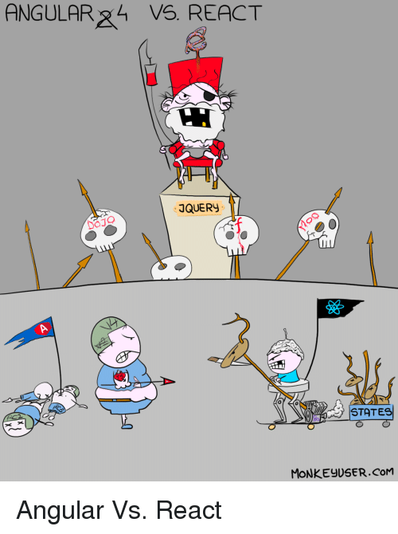
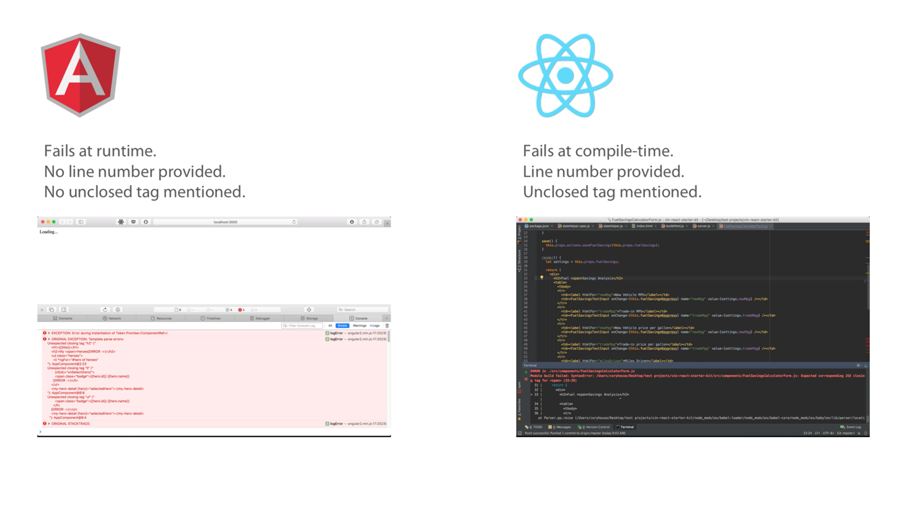
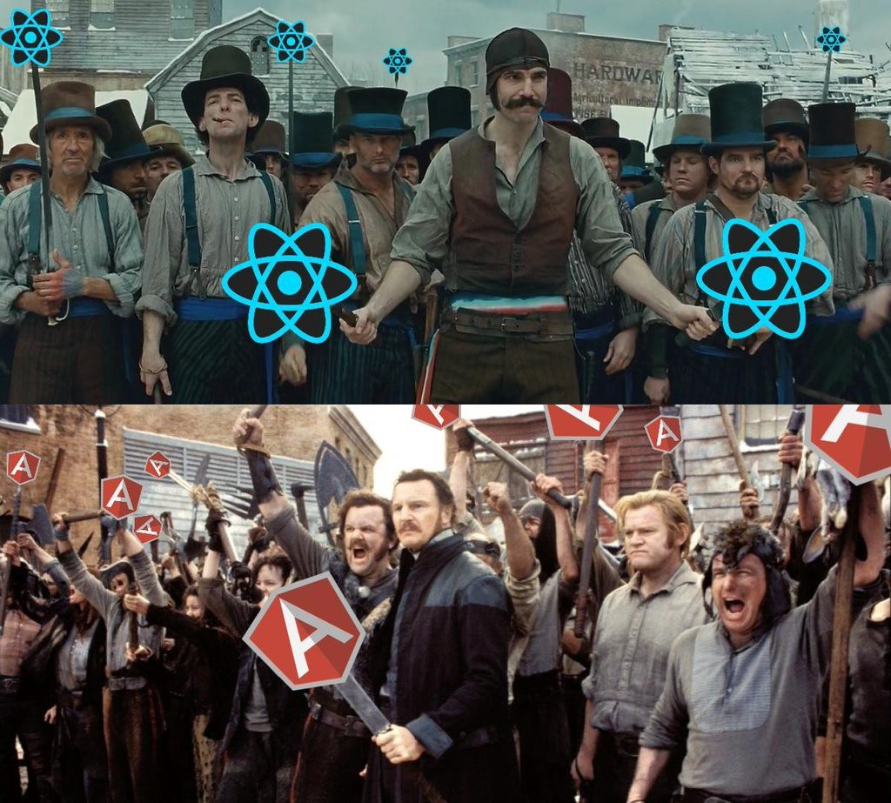

## Немного лирики React vs Angular



- нельзя сравнить круглое и мягкое

- **Angular** это фреймворк, а **React** — библиотека

>Выбор между **Angular** и **React** это как выбор между собранным десктопным ПК и сбором своего из отдельных комплектующих

Попробуем сравнить синтаксис и компонентную модель **React** и **Angular**, это как сравнить мягкое с мягким.

### Преимущества Angular

- быстрый старт(QuickStart)

    - предоставляет гораздо больше возможностей и функциональности из коробки
     
    - с **React**, придется тянуть пул библиотек сторонних разработчиков для построения приложения

    - **Angular** предлагает множество решений из коробки, которые помогают сразу стартовать без страха перед принятием большого количества решений
    
    - единые решения, также помогают разработчикам менять проекты без необходимости заново вникать в процесс разработки

- стабильность **Angular**

    - экосистема **React** развивается дикими темпами, скорее все то что вы пишите сегодня скорее всего устареет при выходе следующей версии

- хранилище шаблонов разметки **Angular** в строках или отдельных файлах HTML не требуют отдельных инструментов поддержки

- **[TypeScript](https://ru.wikipedia.org/wiki/TypeScript)**

### Преимущества React

- **JSX**

    - компоненты в одном файле с проверкой синтаксиса, это одна из важнейших причин превосходства **JSX**
   
- **React** ошибки — быстро и четко 



- **React** центричен 

>Angular, Ember and Knockout put "JS" in your HTML.
>React puts "HTML" in your JS. **@[React’s JSX: The Other Side of the Coin](https://medium.freecodecamp.org/react-s-jsx-the-other-side-of-the-coin-2ace7ab62b98)**

- **JS** ориентированный **React** = простота

    - для чтения **Angular** выучи длинный список спицифичного для **Angular** синтаксиса
    
    - для чтения **React** выучи **JS**

```angularjs
<ul>
  <li *ngFor="#hero of heroes">
    {{hero.name}}
  </li>
</ul>
```

```js
<ul>
  {heroes.map(hero =>
    <li key={hero.id}>{hero.name}</li>
  )}
</ul>
```

- **React** включает **Философию UNIX**

>**React** это библиотека. Это точно противостоит философии комплексных фреймворков, таких как **Angular** и **Ember**. Итак когда вы выбираете **React**, вы вольны выбирать современные, лучшие в своем классе, библиотеки. Вы сможете решить вашу проблему лучшим путем. **JavaScript** развивается очень быстро, и вы вольны включать в ваше **React** приложение лучшие библиотеки вместо ожидания обновления фреймворка.


 
### Заключение

### ДЗ

## Справочники

- [React’s JSX: The Other Side of the Coin](https://medium.freecodecamp.org/react-s-jsx-the-other-side-of-the-coin-2ace7ab62b98)