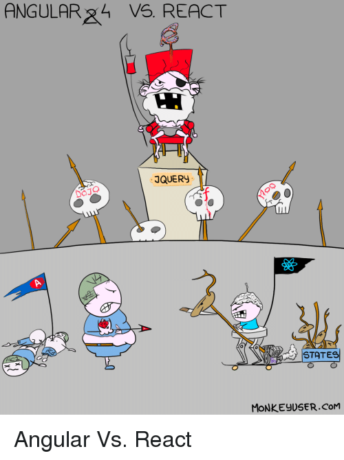
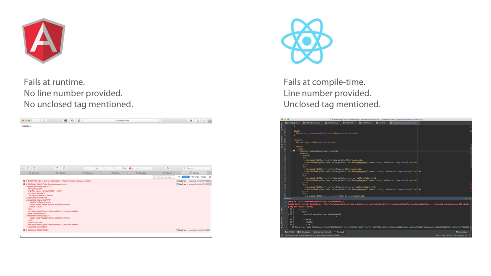

# Lection 27

## HTTP

**Что будем делать ?**

- познакомимся с [HttpClient](https://next.angular.io/api/common/http/HttpClient)

- `HeroService` получит данные используя **HTTP** запрос

- все действия добавить/редактировать/удалить через **HTTP**

- поиск героя по имени

### Включим HTTP сервисы

[HttpClient](https://next.angular.io/api/common/http/HttpClient)

> [HttpClient](https://next.angular.io/api/common/http/HttpClient) - **Angular's** механизм взаимодействия с сервером посредством **HTTP**

**Что бы включить HttpClient, необходимо**

- открыть корневой `AppModule`

- сделать импорт `HttpClientModule` из `@angular/common/http`

- добавить его в массив `@NgModule.imports`

```js
...

import { HttpClientModule } from '@angular/common/http';
...

@NgModule({
  ...

  imports: [
    ...
    HttpClientModule,
    ...
  ],

  ...
})

...
```

### Имитируем сервер данных

- установим [In-memory Web API module](https://github.com/angular/in-memory-web-api)

- после установки модуля будем делать реальные запросы используя **HttpClient**

- обычно применяется когда **API** еще не готово

**Поехали**

- установим модуль

```bash
npm install angular-in-memory-web-api@0.5.4 --save
```

- **src/app/app.module.ts**, импорт класса

```js
...


import { HttpClientInMemoryWebApiModule } from 'angular-in-memory-web-api';
import { InMemoryDataService }  from './in-memory-data.service';

@NgModule({
  ...
  imports: [
    ...

    // The HttpClientInMemoryWebApiModule module intercepts HTTP requests
    // and returns simulated server responses.
    // Remove it when a real server is ready to receive requests.
    HttpClientInMemoryWebApiModule.forRoot(
      InMemoryDataService, { dataEncapsulation: false }
    )
  ],

...
```

- создадим **src/app/in-memory-data.service.ts**

```js
import { InMemoryDbService } from 'angular-in-memory-web-api';

export class InMemoryDataService implements InMemoryDbService {
  createDb() {
    const heroes = [
      { id: 11, name: 'Mr. Nice' },
      { id: 12, name: 'Narco' },
      { id: 13, name: 'Bombasto' },
      { id: 14, name: 'Celeritas' },
      { id: 15, name: 'Magneta' },
      { id: 16, name: 'RubberMan' },
      { id: 17, name: 'Dynama' },
      { id: 18, name: 'Dr IQ' },
      { id: 19, name: 'Magma' },
      { id: 20, name: 'Tornado' }
    ];
    return {heroes};
  }
}
```

- удалим **src/app/mock-heroes.ts**

### Импорт HTTP символов

- **src/app/hero.service.ts**

```js
...

import { HttpClient, HttpHeaders } from '@angular/common/http';

...
export class HeroService {

  constructor(
    /* Inject HttpClient into the constructor in a private property called http */
    private http: HttpClient,
    private messageService: MessageService) { }

  /* Define the heroesUrl with the address of the heroes resource on the server */
  private heroesUrl = 'api/heroes';  // URL to web api

  /** Log a HeroService message with the MessageService */
  private log(message: string) {
    this.messageService.add('HeroService: ' + message);
  }

  ...
}
```

### Получение списка героев используя HttpClient

- **src/app/hero.service.ts**

```js
/** GET heroes from the server */
getHeroes (): Observable<Hero[]> {
  return this.http.get<Hero[]>(this.heroesUrl)
}
```

### Обработка ошибок

**Зачем?**

- сервер не всегда работает так как нам надо

**Что делать?**

- ловить ошибки в `HeroService.getHeroes()`

    - делать что-то с ними

- **src/app/hero.service.ts**

```js
import { Injectable } from '@angular/core';

import { Observable } from 'rxjs';
import { catchError, map, tap } from 'rxjs/operators';
import { Hero } from './hero';
import { HEROES } from './mock-heroes';
import { MessageService } from './message.service';

import { HttpClient, HttpHeaders } from '@angular/common/http';

@Injectable({
  providedIn: 'root',
})
export class HeroService {
  private heroesUrl = 'api/heroes';  // URL to web api

  constructor(
    private http: HttpClient,
    private messageService: MessageService) { }

  /** Log a HeroService message with the MessageService */
  private log(message: string) {
    this.messageService.add('HeroService: ' + message);
  }

  /** GET heroes from the server */
  getHeroes (): Observable<Hero[]> {
    return this.http.get<Hero[]>(this.heroesUrl)
      .pipe(
        tap(heroes => this.log(`fetched heroes`)),
        /* handleError - reports the error and then returns an innocuous result */
        catchError(this.handleError('getHeroes', []))
      );
  }

  /** GET hero by id. Will 404 if id not found */
  getHero(id: number): Observable<Hero> {
    const url = `${this.heroesUrl}/${id}`;
    return this.http.get<Hero>(url).pipe(
      tap(_ => this.log(`fetched hero id=${id}`)),
      catchError(this.handleError<Hero>(`getHero id=${id}`))
    );
  }

  /**
   * Handle Http operation that failed.
   * Let the app continue.
   * @param operation - name of the operation that failed
   * @param result - optional value to return as the observable result
   */
  private handleError<T> (operation = 'operation', result?: T) {
    return (error: any): Observable<T> => {

      // TODO: send the error to remote logging infrastructure
      console.error(error); // log to console instead

      // TODO: better job of transforming error for user consumption
      this.log(`${operation} failed: ${error.message}`);

      // Let the app keep running by returning an empty result.
      return Observable.of(result as T);
    };
  }
}

```

**Что изменилось?**

- создаёт **URL** запроса с желаемым **id** героя

- получаем данные о герое

    - наблюдаемый из объектов `Hero`, а не наблюдаемый массив героев

### Редактирование героя

- нет сохранения при редактировании

**Добавим**

- **src/app/hero-detail/hero-detail.component.html**

```js

...

<button (click)="save()">save</button>

...

```

- **src/app/hero-detail/hero-detail.component.ts**

```js

...

save(): void {
   this.heroService.updateHero(this.hero)
     .subscribe(() => this.goBack());
}

...

```

- **src/app/hero.service.ts**

```js

...

const httpOptions = {
  headers: new HttpHeaders({ 'Content-Type': 'application/json' })
};

...

/** PUT: update the hero on the server */
updateHero (hero: Hero): Observable<any> {
  return this.http.put(this.heroesUrl, hero, httpOptions).pipe(
    tap(_ => this.log(`updated hero id=${hero.id}`)),
    catchError(this.handleError<any>('updateHero'))
  );
}

...

```

### Добавление нового героя

- **src/app/heroes/heroes.component.html**

```js

...

<div>
  <label>Hero name:
    <input #heroName />
  </label>
  <!-- (click) passes input value to add() and then clears the input -->
  <button (click)="add(heroName.value); heroName.value=''">
    add
  </button>
</div>

...

```

- **src/app/heroes/heroes.component.ts**

```js

...

add(name: string): void {
  name = name.trim();
  if (!name) { return; }
  this.heroService.addHero({ name } as Hero)
    .subscribe(hero => {
      this.heroes.push(hero);
    });
}

...

```

- **src/app/hero.service.ts**

```js

...

/** POST: add a new hero to the server */
addHero (hero: Hero): Observable<Hero> {
  return this.http.post<Hero>(this.heroesUrl, hero, httpOptions).pipe(
    tap((hero: Hero) => this.log(`added hero w/ id=${hero.id}`)),
    catchError(this.handleError<Hero>('addHero'))
  );
}

...

```

**Note:** ожидаем что **id** сгенерируется на сервере

### Удаление героя

- **src/app/heroes/heroes.component.html**

```js

...

<ul class="heroes">
  <li *ngFor="let hero of heroes">
    <a routerLink="/detail/{{hero.id}}">
      <span class="badge">{{hero.id}}</span> {{hero.name}}
    </a>
    <button class="delete" title="delete hero"
    (click)="delete(hero)">x</button>
  </li>
</ul>

...
```

- **src/app/heroes/heroes.component.ts**

```js

...

delete(hero: Hero): void {
  this.heroes = this.heroes.filter(h => h !== hero);
  this.heroService.deleteHero(hero).subscribe();
}

...

```

- **src/app/hero.service.ts**

```js

...

/** DELETE: delete the hero from the server */
deleteHero (hero: Hero | number): Observable<Hero> {
  const id = typeof hero === 'number' ? hero : hero.id;
  const url = `${this.heroesUrl}/${id}`;

  return this.http.delete<Hero>(url, httpOptions).pipe(
    tap(_ => this.log(`deleted hero id=${id}`)),
    catchError(this.handleError<Hero>('deleteHero'))
  );
}

...

```

- **src/app/heroes/heroes.component.css**

```css
/* HeroesComponent's private CSS styles */
.heroes {
  margin: 0 0 2em 0;
  list-style-type: none;
  padding: 0;
  width: 15em;
}
.heroes li {
  position: relative;
  cursor: pointer;
  background-color: #EEE;
  margin: .5em;
  padding: .3em 0;
  height: 1.6em;
  border-radius: 4px;
}

.heroes li:hover {
  color: #607D8B;
  background-color: #DDD;
  left: .1em;
}

.heroes a {
  color: #888;
  text-decoration: none;
  position: relative;
  display: block;
  width: 250px;
}

.heroes a:hover {
  color:#607D8B;
}

.heroes .badge {
  display: inline-block;
  font-size: small;
  color: white;
  padding: 0.8em 0.7em 0 0.7em;
  background-color: #607D8B;
  line-height: 1em;
  position: relative;
  left: -1px;
  top: -4px;
  height: 1.8em;
  min-width: 16px;
  text-align: right;
  margin-right: .8em;
  border-radius: 4px 0 0 4px;
}

button {
  background-color: #eee;
  border: none;
  padding: 5px 10px;
  border-radius: 4px;
  cursor: pointer;
  cursor: hand;
  font-family: Arial;
}

button:hover {
  background-color: #cfd8dc;
}

button.delete {
  position: relative;
  left: 194px;
  top: -32px;
  background-color: gray !important;
  color: white;
}
```

## Поиск

**Чему научимся?**

Собирать **Observable** операции в цепочки

**Зачем?**

- уменьшит кол-во сервер запросов

**Что будем делать**

Добавим в **Dashboard** поиск по героям

- при вводе имени в поле

    - отправляем запрос

        - кол-во запросов столько - сколько необходимо

**Добавим сервис метод**

- **src/app/hero.service.ts**

```js

...

  /* GET heroes whose name contains search term */
  searchHeroes(term: string): Observable<Hero[]> {
    if (!term.trim()) {
      // if not search term, return empty hero array.
      return of([]);
    }
    return this.http.get<Hero[]>(`${this.heroesUrl}/?name=${term}`).pipe(
      tap(_ => this.log(`found heroes matching "${term}"`)),
      catchError(this.handleError<Hero[]>('searchHeroes', []))
    );
  }

...

```

**Добавим на страницу Dashboard**

- создадим **HeroSearchComponent**

```bash
ng generate component hero-search
```

- **src/app/dashboard/dashboard.component.html**

```js

...
<app-hero-search></app-hero-search>
...


```

- **src/app/hero-search/hero-search.component.html**

```html
<div id="search-component">
  <h4>Hero Search</h4>

  <input #searchBox id="search-box" (keyup)="search(searchBox.value)" />

  <ul class="search-result">
    <li *ngFor="let hero of heroes$ | async" >
      <a routerLink="/detail/{{hero.id}}">
        {hero.name}
      </a>
    </li>
  </ul>
</div>
```

- разберем `<li *ngFor="let hero of heroes$ | async" >`

    - `$` определяет `heroes$` как `Observable`

    - `*ngFor` не работает с `Observable`

        - pipe символ `|` потом `async`, определяет как **Angular's AsyncPipe**

    - **AsyncPipe** подписывается на `Observable` автоматическм

- **src/app/hero-search/hero-search.component.html**

```css
/* HeroSearch private styles */
.search-result li {
  border-bottom: 1px solid gray;
  border-left: 1px solid gray;
  border-right: 1px solid gray;
  width:195px;
  height: 16px;
  padding: 5px;
  background-color: white;
  cursor: pointer;
  list-style-type: none;
}

.search-result li:hover {
  background-color: #607D8B;
}

.search-result li a {
  color: #888;
  display: block;
  text-decoration: none;
}

.search-result li a:hover {
  color: white;
}
.search-result li a:active {
  color: white;
}
#search-box {
  width: 200px;
  height: 20px;
}


ul.search-result {
  margin-top: 0;
  padding-left: 0;
}
```

- **src/app/hero-search/hero-search.component.ts**

```js
import { Component, OnInit } from '@angular/core';

import { Observable, Subject } from 'rxjs';

import {
  debounceTime, distinctUntilChanged, switchMap
} from 'rxjs/operators';

import { Hero } from '../hero';
import { HeroService } from '../hero.service';

@Component({
  selector: 'app-hero-search',
  templateUrl: './hero-search.component.html',
  styleUrls: [ './hero-search.component.css' ]
})
export class HeroSearchComponent implements OnInit {
  heroes$: Observable<Hero[]>;
  private searchTerms = new Subject<string>();

  constructor(private heroService: HeroService) {}

  // Push a search term into the observable stream.
  search(term: string): void {
    this.searchTerms.next(term);
  }

  ngOnInit(): void {
    this.heroes$ = this.searchTerms.pipe(
      // wait 300ms after each keystroke before considering the term
      debounceTime(300),

      // ignore new term if same as previous term
      distinctUntilChanged(),

      // switch to new search observable each time the term changes
      switchMap((term: string) => this.heroService.searchHeroes(term)),
    );
  }
}
```

- взгянем на **src/app/hero-search/hero-search.component.html**

### Цепочки RxJS

- добавление значения в поток на каждое нажатие кнопки

    - куча HTTP запросов

- `ngOnInit()` проводит `searchTerms` через очередь **RxJS** операторов

    - уменьшают кол-во запросов к `searchHeroes()`

**Где это в коде?**

```js
this.heroes$ = this.searchTerms.pipe(
  // wait 300ms after each keystroke before considering the term
  debounceTime(300),

  // ignore new term if same as previous term
  distinctUntilChanged(),

  // switch to new search observable each time the term changes
  switchMap((term: string) => this.heroService.searchHeroes(term)),
);
```

## Подключаем MongoDB

- узнаем/вспомним [NodeJS](https://zlodej43sm.github.io/lections/28.node--01/)

- узнаем/вспомним [MongoDB](https://zlodej43sm.github.io/lections/31.node--04/)

- запустим сервер с API

- **server/app.js**

```js
const express = require("express");
const bodyParser = require("body-parser");
const { MongoClient, ObjectId } = require("mongodb");

const app = express();
const jsonParser = bodyParser.json();
const url = "mongodb://localhost:27017/";

app.use(express.static(__dirname + "/public"));
// Add headers
app.use(function (req, res, next) {
    // Website you wish to allow to connect
    res.setHeader('Access-Control-Allow-Origin', '*');

    // Request methods you wish to allow
    // res.setHeader('Access-Control-Allow-Methods', 'GET, POST, OPTIONS, PUT, PATCH, DELETE');

    // Request headers you wish to allow
    // res.setHeader('Access-Control-Allow-Headers', 'X-Requested-With,content-type');

    // Set to true if you need the website to include cookies in the requests sent
    // to the API (e.g. in case you use sessions)
    // res.setHeader('Access-Control-Allow-Credentials', true);

    // Pass to next layer of middleware
    next();
});


app.get("/api/users", function(req, res) {
    MongoClient.connect(url, { useNewUrlParser: true }, function(err, client) {
        client.db("usersdb")
            .collection("users")
            .find()
            .toArray(function(err, users) {
                res.send(users);
                client.close();
            });
    });
});

app.get("/api/users/:id", function(req, res){
    const id = new ObjectId(req.params.id);

    MongoClient.connect(url, { useNewUrlParser: true }, function(err, client) {
        client.db("usersdb")
            .collection("users")
            .findOne(
                {_id: id},
                function(err, user){
                    if(err) return res.status(400).send();

                    res.send(user);
                    client.close();
                }
            );
    });
});

app.post("/api/users", jsonParser, function (req, res) {
    if(!req.body) return res.sendStatus(400);

    const userName = req.body.name;
    const userAge = req.body.age;
    const user = {name: userName, age: userAge};

    MongoClient.connect(url, { useNewUrlParser: true }, function(err, client) {
        client.db("usersdb")
            .collection("users")
            .insertOne(
                user,
                function(err, result) {
                    if(err) return res.status(400).send();

                    res.send(user);
                    client.close();
                }
            );
    });
});

app.delete("/api/users/:id", function(req, res){
    const id = new ObjectId(req.params.id);

    MongoClient.connect(url, { useNewUrlParser: true },  function(err, client){
        client.db("usersdb")
            .collection("users")
            .findOneAndDelete(
                {_id: id},
                function(err, result) {
                    if(err) return res.status(400).send();

                    const user = result.value;

                    res.send(user);
                    client.close();
                }
            );
    });
});

app.put("/api/users", jsonParser, function(req, res){
    if(!req.body) return res.sendStatus(400);

    const id = new ObjectId(req.body.id);
    const userName = req.body.name;
    const userAge = req.body.age;

    MongoClient.connect(url, { useNewUrlParser: true }, function(err, client){
        client.db("usersdb")
            .collection("users")
            .findOneAndUpdate(
                {_id: id},
                {
                    $set: {
                        age: userAge,
                        name: userName
                    }
                },
                {
                    returnOriginal: false
                },
                function(err, result){

                    if(err) return res.status(400).send();

                    const user = result.value;

                    res.send(user);
                    client.close();
                }
            );
    });
});

app.listen(3000, function(){
    console.log("Сервер ожидает подключения...");
});
```

- **server/public/index.html**

```html
<!DOCTYPE html>
<html>
<head>
    <meta charset="utf-8" />
    <meta name="viewport" content="width=device-width" />
    <title>Список пользователей</title>
    <link href="https://maxcdn.bootstrapcdn.com/bootstrap/3.3.7/css/bootstrap.min.css" rel="stylesheet" />
</head>
<body>

<main class="container">
    <h2>Список пользователей</h2>

    <form name="userForm" id="form">
        <input type="hidden" name="id" value="0" />

        <p class="form-group">
            <input class="form-control" name="name" placeholder="Имя" />
        </p>

        <p class="form-group">
            <input class="form-control" name="age" placeholder="Возраст" />
        </p>

        <p class="panel-body">
            <button type="submit" class="btn btn-sm btn-primary">Сохранить</button>
            <button type="reset" id="resetBtn" class="btn btn-sm btn-primary">Сбросить</button>
        </p>
    </form>

    <table class="table table-condensed table-striped table-bordered">
        <thead>
        <tr>
            <th>Id</th>
            <th>Имя</th>
            <th>возраст</th>
            <th></th>
        </tr>
        </thead>
        <tbody id="tableBody">
        </tbody>
    </table>
</main>

<script>
    // Получение всех пользователей
    function GetUsers() {
        fetch('/api/users', {
            method: 'GET',
            headers: {
                'Accept': 'application/json',
                'Content-Type': 'application/json'
            }
        })
            .then((res) => res.json())
            .then((users) => tableBody.innerHTML = users.reduce((rows, user) => rows + row(user), ''))
            .catch((res) => console.log(res));
    }

    // Получение одного пользователя
    function GetUser(id) {
        fetch(`/api/users/${id}`, {
            method: 'GET',
            headers: {
                'Accept': 'application/json',
                'Content-Type': 'application/json'
            }
        })
            .then((res) => res.json())
            .then((user) => {
                form.elements["id"].value = user._id;
                form.elements["name"].value = user.name;
                form.elements["age"].value = user.age;
            })
            .catch((res) => console.log(res));
    }

    // Добавление пользователя
    function CreateUser(userName, userAge) {
        fetch('/api/users/', {
            method: 'POST',
            headers: {
                'Accept': 'application/json',
                'Content-Type': 'application/json'
            },
            body: JSON.stringify({
                name: userName,
                age: userAge
            })
        })
            .then((res) => res.json())
            .then((user) => {
                form.elements["id"].value = 0;
                tableBody.innerHTML += row(user);
            })
            .catch((res) => console.log(res));
    }

    // Изменение пользователя
    function EditUser(userId, userName, userAge) {
        fetch('/api/users/', {
            method: 'PUT',
            headers: {
                'Accept': 'application/json',
                'Content-Type': 'application/json'
            },
            body: JSON.stringify({
                id: userId,
                name: userName,
                age: userAge
            })
        })
            .then((res) => res.json())
            .then((user) => {
                const childsTD = document.querySelector(`tr[data-rowid='${user._id}']`).children;

                childsTD[1].innerHTML = user.name;
                childsTD[2].innerHTML = user.age;

                reset();
            })
            .catch((res) => console.log(res));
    }

    // Удаление пользователя
    function DeleteUser(id) {
        fetch(`api/users/${id}`, {
            method: 'DELETE',
            headers: {
                'Accept': 'application/json',
                'Content-Type': 'application/json'
            }
        })
            .then((res) => res.json())
            .then((user) => document.querySelector(`tr[data-rowid='${user._id}']`).remove())
            .catch((res) => console.log(res));
    }

    // создание строки для таблицы
    function row(user) {
        return `<tr data-rowid='${user._id}'><td>${user._id}</td><td>${user.name}</td><td>${user.age
        }</td><td><a class='editLink' data-id='${user._id}'>Изменить</a> | <a class='removeLink' data-id='${user._id}'>Удалить</a></td></tr>`;
    }

    // сброс значений формы
    resetBtn.click(() => reset());

    function reset() {
        form.elements["id"].value = 0;
    }

    // отправка формы
    form.addEventListener('submit', function(e) {
        e.preventDefault();

        const id = this.elements["id"].value;
        const name = this.elements["name"].value;
        const age = this.elements["age"].value;

        (+id === 0) ? CreateUser(name, age) : EditUser(id, name, age);
    });

    tableBody.addEventListener('click', function(e) {
        e.preventDefault();

        const targetBtn = e.target;

        // нажимаем на ссылку Изменить
        targetBtn.className === "editLink" && GetUser(targetBtn.getAttribute('data-id'));

        // нажимаем на ссылку Удалить
        targetBtn.className === "removeLink" && DeleteUser(targetBtn.getAttribute('data-id'));
    });

    // загрузка пользователей
    GetUsers();
</script>
</body>
</html>
```

- обновим **src/app/hero.service.ts**

```js
...

const httpOptions = {
  headers: new HttpHeaders({
      'Content-Type': 'application/json',
      'Accept': 'application/json'
  }),
};

...
export class HeroService {
  private heroesUrl = 'http://localhost:3000/api/users';  // URL to web api

  ...

  /** GET heroes from the server */
  getHeroes (): Observable<Hero[]> {
    return this.http.get<Hero[]>(this.heroesUrl)
      .pipe(
        tap(heroes => this.log(`fetched heroes`)),
        /* handleError - reports the error and then returns an innocuous result */
        catchError(this.handleError('getHeroes', []))
      );
  }

 ...
}

```

- отключим **src/app/app.module.ts**

```js
...

HttpClientInMemoryWebApiModule.forRoot(
   InMemoryDataService, { dataEncapsulation: false }
)

...
```

- больше магии и все получиться

## А что дальше?

- [Angular architecture](https://next.angular.io/guide/architecture)

## Немного лирики React vs Angular



- нельзя сравнить круглое и мягкое

- **Angular** это фреймворк, а **React** — библиотека

>Выбор между **Angular** и **React** это как выбор между собранным десктопным ПК и сбором своего из отдельных комплектующих

Сравним синтаксис и компонентную модель **React** и **Angular**

**Note:** это как сравнить мягкое с мягким

### Преимущества Angular

- быстрый старт

    - предоставляет гораздо больше возможностей и функциональности из коробки

        - с **React**, придется тянуть пул библиотек сторонних разработчиков для построения приложения

    - **Angular** предлагает множество решений из коробки, которые помогают сразу стартовать без страха перед принятием большого количества решений

    - единые решения, также помогают разработчикам менять проекты без необходимости заново вникать в процесс разработки

- стабильность **Angular**

    - экосистема **React** развивается дикими темпами, скорее все то что вы пишите сегодня скорее всего устареет при выходе следующей версии

- хранилище шаблонов разметки **Angular** в строках или отдельных файлах HTML не требуют отдельных инструментов поддержки

- **[TypeScript](https://ru.wikipedia.org/wiki/TypeScript)**

### Преимущества React

- **JSX**

    - компоненты в одном файле с проверкой синтаксиса, это одна из важнейших причин превосходства **JSX**

- **React** ошибки — быстро и четко



- **React** центричен

>Angular, Ember, Knockout & etc. put "JS" in your HTML.
>React puts "HTML" in your JS. **@[React’s JSX: The Other Side of the Coin](https://medium.freecodecamp.org/react-s-jsx-the-other-side-of-the-coin-2ace7ab62b98)**

- **JS** ориентированный **React** = простота

    - для чтения **Angular** выучи длинный список спицифичного для **Angular** синтаксиса

    - для чтения **React** выучи **JS**

```js
<ul>
  <li *ngFor="#hero of heroes">
    {{hero.name}}
  </li>
</ul>
```

```js
<ul>
  {heroes.map(hero =>
    <li key={hero.id}>{hero.name}</li>
  )}
</ul>
```

- **React** включает **Философию UNIX**

**React** это библиотека

- противостоит философии комплексных фреймворков, таких как **Angular** и **Ember**

Итак когда вы выбираете **React**, вы

- вольны выбирать современные, лучшие в своем классе, библиотеки

- сможете решить вашу проблему лучшим путем

- **JavaScript** развивается очень быстро

    - вы вольны включать в ваше **React** приложение лучшие библиотеки, вместо ожидания обновления фреймворка


## Заключение

[<< prev](../26.angular--05)

## Справочники
- [React’s JSX: The Other Side of the Coin](https://medium.freecodecamp.org/react-s-jsx-the-other-side-of-the-coin-2ace7ab62b98)