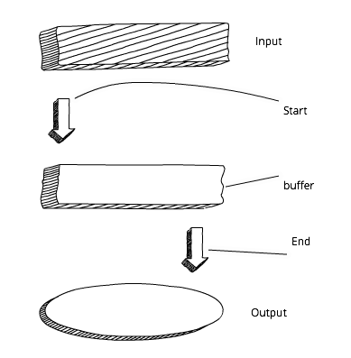

# Lection 28. Node p.01.

## Введение в Node JS

- среда выполнения кода на **JavaScript**

- основа движка **JavaScript Chrome V8**

- предназначен для серверных приложений на **JavaScript**

- кроссплатформенный

    - неважно какая платформа

- осонова **JavaScript Chrome V8**

    - скорость

    - работа с памятью

    - тот же **JS**

**Note:** **Node.js** является открытым проектом, исходники которого можно посмотреть на [github.com](https://github.com/nodejs)

### Особенности или под капотом

**JS не работает с?**

- FS

- Сетью

- I/O

**Что за сервер такой?**

- библиотеки + экстра код(на C++ и не только)


**Где хорош?**

много соединений -> что-то онлайн -> много юзеров/задач

**Note:** не вычисления


**Итого**

- клиент **JS**

- сервер **JS**

    - полноценный сервер

- расширяемость

- менеджер пакетов

- сообщество

### Окружение, установка

- [Node JS download](https://nodejs.org)

- PhpStorm

    - плагины (Node JS)

- [Node JS dev version](https://nodejs.org/uk/download/current/)

    - С++ как база

    - реализация модулей

- [Node JS api](https://nodejs.org/dist/latest-v10.x/docs/api/)

**После установки REPL(Read Eval Print Loop)**

- выполнить js

```bash
node
```

- либо файл js

```bash
node file.js
```


## Цикл событий


**Цикл позволяет**

- работать с другими задачами

    - параллельно с выполнение операций ввода/вывода

**Благодаря циклу событий**

- работает очень быстро и эффективно

```js
console.log('Step: 1');
setTimeout(function () {
  console.log('Step: 3');
  console.log('Step 5');
}, 0);
console.log('Step: 2');
console.log('Step 4');
```

**Более полный цикл**


**Note:** задействуются thread’ы операционной системы

## Глобальный объект

**Вопросы при переходе**

- где хранить пароли?

- как создавать глобальные переменные (в **Node** нет **window**)?

- как обращаться к входным данным CLI, ОС, платформе, памяти, версиям и т.д.?

**Встречайте**

- **global.process**

    - процесс, система, информация об окружении (вы можете обратиться к входным данным CLI, к переменным окружения с паролями, к памяти т.д.)

- **global.__filename**

    - имя файла и путь к выполняемому в данный момент скрипту, в котором находится это выражение

- **global.__dirname**

    - полный путь к выполняемому в данный момент скрипту

- **global.module**

    - объект для экспорта кода, создающего модуль из этого файла

- **global.require()**

    - метод для импорта модулей, JSON-файлов и папок

- **global.console()**

- **global.setInterval()**

- **global.setTimeout()**

## Процесс

**Почему отдельно?**

**Свойства**

- **process.pid** ID процесса этого экземпляра Node

- **process.versions** разные версии Node, V8 и других компонентов

- **process.arch** архитектура системы

- **process.argv** аргументы CLI

- **process.env** переменные окружения

**Методы**

- **process.uptime()** получает время работы

- **process.memoryUsage()**  получает объём потребляемой памяти

- **process.cwd()** получает текущую рабочую папку

- **process.exit()** выходит из текущего процесс

- **process.on()** прикрепляет на событие, например, `on('uncaughtException')`

## Эмиттеры событий

> **[Эмиттер событий](https://nodejs.org/api/events.html)** — это триггер для события, которое может прослушать кто угодно.

- за каждым событием закреплено строковое имя

    - на которое эмиттером может быть повешен **callback**

**Цель**

- чтобы справиться с [адом callback’ов](http://callbackhell.com/)

**Как?**

- события обрабатываются с использованием шаблона **observer**

- событие отслеживает все связанные с ним функции

- эти функции — observer’ы— исполняются при активизации данного события

**Для использования эмиттеров нужно импортировать модуль и создать экземпляр объекта:**

```js
let events  = require('events');
let emitter = new events.EventEmitter();
```

**Далее можно прикрепить получателей событий и активировать/передавать события:**

```js
emitter.on('knock', function() {
  console.log('Who\'s there?')
})

emitter.on('knock', function() {
  console.log('Go away!')
})

emitter.emit('knock')
```

**Что есть ещё**

- **emitter.listeners(eventName)**

    - формирует список всех получателей для данного события

- **emitter.once(eventName, listener)**

    - прикрепляет одноразового получателя событий

- **emitter.removeListener(eventName, listener)**

    - удаляет получателя событий.


# COFFEE BREAK


## Stream’ы

**Зачем**

При работе с большими объёмами данных(**Node**):

- низкая производительность

- ограничен размер буфера примерно 1 Гб


**Стандартный подход к буферизации**



**Note:** ждём полной загрузки буфера

**Поточный подход к буферизации**


> **Stream’ы** в **Node** являются абстракцией, обозначающей непрерывное разбиение данных на фрагменты

**Типы stream’ов**

- **readable**

- **writable**

- **duplex**

- **transform**

**Наиболее востребованные реализации stream’ов**

- HTTP-запросы и отклики

- стандартные операции ввода/вывода

- чтение из файлов и запись в них

**Note:** **stream** события — наследуют от объекта "эмиттер событий"

### Пример читаемого stream’а

**За основу**

- возьмём **process.stdin**

    - стандартный **stream** ввода

        - содержит данные, которые поступают в приложение(с клавиатуры, для запуска)

**За считывания данных**

- события **data** и **end**

    - **callback** события **data** в качестве аргумента будет иметь **chunk**


```js
// stdin по умолчанию ставится на паузу
// из которой его надо вывести прежде, чем считывать из него данные
process.stdin.resume()
process.stdin.setEncoding('utf8')

process.stdin.on('data', function (chunk) {
  console.log('chunk: ', chunk);
});

process.stdin.on('end', function () {
  console.log('--- END ---');
});
```

**Ещё пример**

```js
// есть синхронно работающий интерфейс read()
// возвращает chunk или null
let readable = getReadableStreamSomehow();

readable.on('readable', () => {
  let chunk;

  while (null !== (chunk = readable.read())) {
    console.log('got %d bytes of data', chunk.length);
  }
})
```

### Пример записываемого stream’а

```js
// записывать в stream можно с помощью операции write
process.stdout.write('A simple message\n');
```

### Pipe

```js
let r = fs.createReadStream('file.txt');
let z = zlib.createGzip();
let w = fs.createWriteStream('file.txt.gz');

// берёт поток данных и пропускает через все stream’ы
r.pipe(z).pipe(w);
```

### HTTP-stream’ы

**HTTP-запросы можно стримить**

- запросы/отклики читаемые и записываемые **stream’ы**

    - наследуются от эмиттеров событий

**Вывод**

- прикрепить получателя событий **data**

    - принимать **chunk** в его **callback**

        - сразу преобразовывать

            - не дожидаясь получения всего отклика

```js
const http = require('http');

let server = http.createServer((req, res) => {
    let body = ''

    req.setEncoding('utf8');
    req.on('data', (chunk) => {
        body += chunk;
    });
    req.on('end', () => {
        let data = JSON.parse(body);
        res.write(typeof data);
        res.end();
    });
});

server.listen(1337);
```


# COFFEE BREAK


## Буферы

- бинарный тип данных

    - глобальный объект

**[Для создания бинарного типа](https://nodejs.org/api/buffer.html#buffer_buffer)**

```js
// Создадим буфер с алфавитом с помощью цикла for:
let buf = new Buffer.alloc(26);

for (var i = 0 ; i < 26 ; i++) {
  buf[i] = i + 97; // 97 is ASCII a
}

console.log(buf);
buf.toString('utf8');
buf.toString('ascii');
```

**Помните fs?**

```js
// По умолчанию значение data тоже является буфером
fs.readFile('/etc/passwd', function (err, data) {
  if (err) return console.error(err)
  console.log(data)
});
```


**Note:** **data** выполняет роль буфера при работе с файлами

## Кластеры


## Заключение

## Справочники

- [Github Node.js](https://github.com/nodejs)

- [Node JS download](https://nodejs.org)

- [Node JS dev version](https://nodejs.org/uk/download/current/)

- [Node JS api](https://nodejs.org/dist/latest-v10.x/docs/api/)

- [Ад callback’ов](http://callbackhell.com/)

- [документации по буферу](https://nodejs.org/api/buffer.html#buffer_buffer)